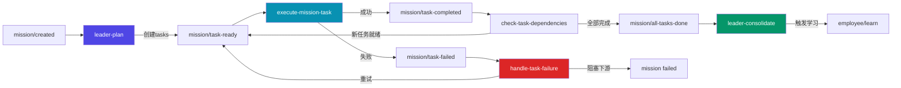
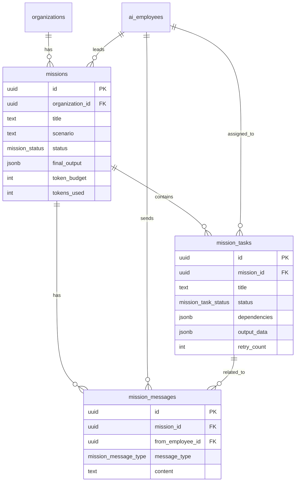
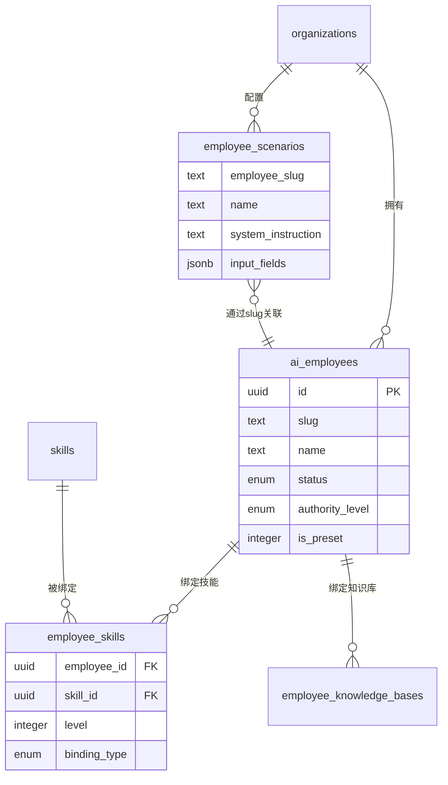
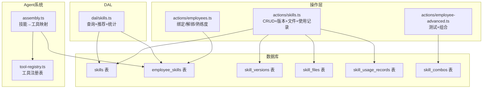
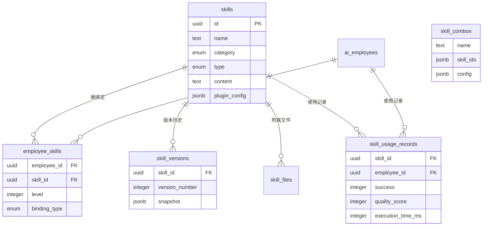

# Vibetide 核心模块技术方案文档

> 版本：v1.0 | 日期：2026-03-22
> 分析范围：任务中心（Missions）、AI员工市场（Employee Marketplace）、技能管理（Skills Management）

---

## 一、系统整体架构

### 1.1 架构风格

Vibetide 采用 **事件驱动的多智能体协作架构**，基于 Next.js 16 App Router 的 Server Component / Client Component 分离模式，结合 Inngest 实现后台任务编排。

### 1.2 分层结构

| 层级 | 职责 | 技术 |
|------|------|------|
| 展示层 (Page) | Server Component，数据获取 | Next.js 16 RSC |
| 交互层 (Client) | Client Component，状态管理 | React 19, Framer Motion |
| 操作层 (Actions) | Server Actions，数据变更 | `"use server"`, `revalidatePath` |
| API 路由层 | SSE 流式响应 | Next.js Route Handlers |
| 数据访问层 (DAL) | 只读查询，DB行→UI类型转换 | Drizzle ORM |
| 执行引擎层 | 后台任务编排 | Inngest + 直连执行器 |
| Agent 层 | AI 能力组装与执行 | AI SDK v6 |
| 数据层 (Schema) | PostgreSQL 表定义 | Drizzle ORM + Supabase |

### 1.3 技术栈选型

| 技术 | 版本 | 选型理由 |
|------|------|---------|
| Next.js | 16.1.6 | RSC 天然适合数据密集型页面，SSR+Streaming |
| React | 19 | Server Component 支持 |
| Drizzle ORM | 0.45.1 | 类型安全 SQL，`prepare: false` 适配 PgBouncer |
| Supabase | PostgreSQL | 托管数据库+Auth+实时能力 |
| AI SDK | v6 | `generateText`+`stopWhen: stepCountIs(N)` |
| Inngest | - | 事件驱动后台任务，支持 cancelOn/retries/step |
| DeepSeek | OpenAI兼容 | 通过 `@ai-sdk/openai` 连接 |
| shadcn/ui | - | Glass UI 毛玻璃设计系统 |
| Framer Motion | - | 动画过渡 |

### 1.4 系统架构图

```mermaid
graph TB
    subgraph 用户界面
        MP[员工市场页]
        ML[任务列表页]
        MD[任务详情页]
        EP[员工详情页]
        SW[场景工作台]
    end

    subgraph 操作层
        SA_M[missions.ts<br>Server Actions]
        SA_E[employees.ts<br>Server Actions]
        SA_S[skills.ts<br>Server Actions]
        SA_EA[employee-advanced.ts<br>Server Actions]
        API[/api/scenarios/execute<br>SSE]
    end

    subgraph 数据访问层
        DAL_M[dal/missions.ts]
        DAL_E[dal/employees.ts]
        DAL_S[dal/skills.ts]
        DAL_SC[dal/scenarios.ts]
    end

    subgraph 执行引擎
        ME[MissionExecutor<br>直连执行器]
        LP[leader-plan]
        ET[execute-mission-task]
        CD[check-task-dependencies]
        HF[handle-task-failure]
        LC[leader-consolidate]
    end

    subgraph Agent系统
        ASM[assembly.ts]
        TR[tool-registry.ts]
        MR[model-router.ts]
        PT[prompt-templates.ts]
    end

    subgraph 数据层
        DB[(PostgreSQL / Supabase)]
    end

    MP --> DAL_E --> DB
    ML --> DAL_M --> DB
    MD --> DAL_M
    EP --> DAL_E
    EP --> DAL_S --> DB
    EP --> DAL_SC --> DB

    SA_M --> ME
    SA_E --> DB
    SA_S --> DB
    SA_EA --> ASM
    API --> ASM

    ME --> LP
    LP --> ET
    ET --> CD
    CD --> LC
    ET --> HF

    ASM --> TR
    ASM --> MR
    ASM --> PT

    ME --> DB
    LP --> DB
    ET --> DB
```

---

## 二、任务中心模块（Missions）

### 2.1 模块概述

任务中心是取代旧"团队工作台+线性工作流"的新一代多智能体协作引擎，实现"队长拆解任务→多员工并行执行→队长汇总交付"的 DAG 任务流。

### 2.2 核心架构



### 2.3 核心功能

#### 2.3.1 任务创建（startMission）

- 用户选择场景（突发新闻/深度报道等10个模板）+ 填写标题和指令
- 自动查找或创建 leader 员工（任务总监）
- 插入 missions 记录（status=planning）
- 异步触发 `executeMissionDirect()` 后台执行

#### 2.3.2 Leader 规划（leaderPlan）

- 加载组织下所有可用员工及其技能
- 组装 Leader Agent（7层系统提示词）
- 向 Leader 发送结构化 prompt，要求输出 JSON 格式的任务列表
- 解析 JSON，创建 missionTasks 记录
- 解析 `dependsOn` 索引为实际 taskId，构建 DAG
- 标记零依赖任务为 ready，触发执行

#### 2.3.3 任务执行（executeMissionTask）

完整闭环11步：
1. 加载任务并验证 status=ready
2. 标记为 in_progress，更新员工状态为 working
3. 加载依赖任务的 outputData 作为上下文
4. 组装员工 Agent（assembleAgent）
5. 调用 executeAgent() 执行
6. 保存 output，标记 completed
7. 重置员工状态，触发 task-completed 事件

#### 2.3.4 依赖检查与传播（checkTaskDependencies）

- 每当任务完成，检查下游任务的依赖是否全部满足
- 聚合依赖任务的 outputData 写入 inputContext
- 将新就绪任务标记为 ready 并触发执行
- 检查是否所有任务都已完成，触发 all-tasks-done

#### 2.3.5 失败处理与重试（handleTaskFailure）

- MAX_RETRIES = 2
- 未超限：重置为 ready，递增 retryCount，重新触发
- 已超限：评估下游影响，阻塞关键下游则标记 mission 为 failed

#### 2.3.6 成果汇总（leaderConsolidate）

- Leader Agent 汇总所有子任务产出，生成最终交付物
- 保存 finalOutput，标记 mission completed
- 重置团队成员状态，触发员工学习事件

### 2.4 数据库设计

#### missions 表

| 字段 | 类型 | 含义 | 约束 |
|------|------|------|------|
| id | uuid | 主键 | PK, defaultRandom |
| organization_id | uuid | 所属组织 | FK → organizations, NOT NULL |
| title | text | 任务标题 | NOT NULL |
| scenario | text | 场景类型 | NOT NULL |
| user_instruction | text | 用户指令 | NOT NULL |
| leader_employee_id | uuid | 队长 | FK → ai_employees, NOT NULL |
| team_members | jsonb | 团队成员ID数组 | default [] |
| status | mission_status | 状态 | planning/executing/consolidating/completed/failed/cancelled |
| final_output | jsonb | 最终交付物 | nullable |
| token_budget | integer | Token预算 | default 200000 |
| tokens_used | integer | 已使用Token | default 0 |
| created_at | timestamptz | 创建时间 | NOT NULL |
| completed_at | timestamptz | 完成时间 | nullable |

#### mission_tasks 表

| 字段 | 类型 | 含义 | 约束 |
|------|------|------|------|
| id | uuid | 主键 | PK |
| mission_id | uuid | 所属任务 | FK → missions(CASCADE) |
| title | text | 子任务标题 | NOT NULL |
| description | text | 详细描述 | NOT NULL |
| expected_output | text | 期望输出 | nullable |
| assigned_employee_id | uuid | 执行人 | FK → ai_employees |
| status | mission_task_status | 状态 | pending/ready/claimed/in_progress/completed/failed |
| dependencies | jsonb | DAG依赖ID数组 | default [] |
| priority | integer | 优先级 | default 0 |
| input_context | jsonb | 上游输出聚合 | nullable |
| output_data | jsonb | 执行结果 | nullable |
| error_message | text | 错误信息 | nullable |
| retry_count | integer | 重试次数 | default 0 |

#### mission_messages 表

| 字段 | 类型 | 含义 | 约束 |
|------|------|------|------|
| id | uuid | 主键 | PK |
| mission_id | uuid | 所属任务 | FK → missions(CASCADE) |
| from_employee_id | uuid | 发送者 | FK → ai_employees |
| to_employee_id | uuid | 接收者 | FK, nullable |
| message_type | enum | 类型 | question/answer/status_update/result/coordination |
| content | text | 内容 | NOT NULL |
| related_task_id | uuid | 关联子任务 | FK, nullable |

#### ER 图



### 2.5 接口文档

#### Server Actions

| Action | 签名 | 描述 |
|--------|------|------|
| `startMission` | `(data: {title, scenario, userInstruction}) → MissionRow` | 创建任务并异步触发执行管线 |
| `cancelMission` | `(missionId: string) → void` | 取消运行中的任务 |

#### DAL 查询

| 函数 | 返回值 | 描述 |
|------|--------|------|
| `getMissions` | `Mission[]` | 获取组织所有任务 |
| `getMissionById` | `MissionWithDetails` | 任务详情（含tasks/messages/team） |
| `getMissionsWithActiveTasks` | `MissionSummary[]` | 富化查询，含进度/活跃任务/最新动态 |
| `getReadyTasks` | `MissionTask[]` | 就绪待执行的子任务 |
| `getMissionMessages` | `MissionMessage[]` | 消息（可按接收者过滤） |
| `getEmployeeTaskLoad` | `EmployeeLoad[]` | 员工活跃任务数 |
| `getEmployeeActivitySummary` | `EmployeeActivity[]` | 员工活动状态 |

### 2.6 Inngest 事件与重试策略

| 事件 | 消费者 | retries | cancelOn |
|------|--------|---------|----------|
| `mission/created` | leader-plan | 1 | mission/cancelled |
| `mission/task-ready` | execute-mission-task | 0 | mission/cancelled |
| `mission/task-completed` | check-task-dependencies | 2 | 无 |
| `mission/task-failed` | handle-task-failure | 1 | 无 |
| `mission/all-tasks-done` | leader-consolidate | 1 | 无 |

### 2.7 页面功能

**任务列表页 (`/missions`)**
- 5个统计指标卡片（总任务/执行中/已完成/异常/排队中）
- 状态筛选 + 关键词搜索 + 场景过滤
- 表格布局含9列，行展开显示阶段流水线和子任务分布
- IntersectionObserver 无限滚动，活跃任务5秒轮询刷新
- Sheet 表单创建新任务（场景卡片选择→填写详情→提交）

**任务详情页 (`/missions/[id]`)**
- PhaseBar（4阶段：规划/执行/汇总/完成）
- 三标签页：任务看板（三列Kanban）、协作消息、最终输出
- 取消按钮（仅活跃任务可见）

### 2.8 关键文件索引

| 文件 | 路径 |
|------|------|
| Schema | `src/db/schema/missions.ts` |
| DAL | `src/lib/dal/missions.ts` |
| Server Actions | `src/app/actions/missions.ts` |
| 直连执行器 | `src/lib/mission-executor.ts` |
| 列表页 | `src/app/(dashboard)/missions/page.tsx` + `missions-client.tsx` |
| 详情页 | `src/app/(dashboard)/missions/[id]/page.tsx` + `mission-console-client.tsx` |
| Inngest 函数 | `src/inngest/functions/leader-plan.ts`, `execute-mission-task.ts`, `check-task-dependencies.ts`, `handle-task-failure.ts`, `leader-consolidate.ts` |

---

## 三、AI员工市场模块（Employee Marketplace）

### 3.1 模块概述

AI员工市场是管理 AI 智能员工的核心界面，涵盖员工浏览、创建、配置、克隆、场景测试等全生命周期管理。

### 3.2 核心架构

```mermaid
graph TD
    subgraph 页面层
        MP[employee-marketplace/page.tsx]
        EP[employee/[id]/page.tsx]
    end

    subgraph 交互层
        MPC[EmployeeMarketplaceClient]
        EPC[EmployeeProfileClient]
        SW[ScenarioWorkbench]
        SCS[ScenarioChatSheet]
        ECD[EmployeeCreateDialog]
        STD[SkillTestDialog]
    end

    subgraph 操作层
        AE[actions/employees.ts]
        AAD[actions/employee-advanced.ts]
    end

    subgraph API层
        API[api/scenarios/execute SSE]
    end

    subgraph Agent层
        ASM[assembly.ts]
        TR[tool-registry.ts]
    end

    MP --> MPC --> AE
    EP --> EPC --> AE
    EP --> EPC --> AAD
    EPC --> SW --> SCS -->|fetch SSE| API --> ASM --> TR
```

### 3.3 核心功能

#### 3.3.1 员工市场浏览

- 卡片网格展示所有AI员工，支持状态筛选
- 15秒超时降级，SSR空数据时自动客户端重试3次
- 支持创建自定义员工和删除非预置员工

#### 3.3.2 员工详情与配置管理

8个Tab面板：
- **技能配置**：绑定/解绑技能，含兼容性校验，核心技能保护，熟练度0-100调整
- **知识库**：绑定/解绑知识库（防重复）
- **工作偏好**：主动性/汇报频率/自主等级/沟通风格/工作时间
- **权限设置**：observer/advisor/executor/coordinator 四级权限
- **绩效看板**：任务完成数/准确率/响应时长/满意度 + 30天趋势图
- **进化学习**：进化曲线、反馈统计、学习模式管理
- **版本历史**：配置版本快照与回滚
- **场景工作台**：预设场景卡片，与AI员工实时对话

#### 3.3.3 场景工作台

- 场景数据存储在 `employee_scenarios` 表
- 支持 `{{var}}` 变量模板替换
- SSE 流式执行：thinking→source→text-delta→done
- 保留最近10条对话历史支持追问

#### 3.3.4 员工生命周期管理

- 创建：自定义 slug/名称/角色/权限
- 克隆：复制员工配置+技能绑定
- 启停：toggle disabled
- 导出/导入：JSON 格式，技能按名称匹配

### 3.4 数据库设计

#### ai_employees 表（核心字段）

| 字段 | 类型 | 含义 |
|------|------|------|
| id | uuid | 主键 |
| organization_id | uuid | 所属组织 |
| slug | text | 标识符（如 xiaolei） |
| name | text | 角色名 |
| nickname | text | 昵称 |
| role_type | text | 角色类型 |
| authority_level | enum | 权限等级 |
| status | enum | working/idle/learning/reviewing |
| work_preferences | jsonb | 工作偏好 |
| learned_patterns | jsonb | 学习模式 |
| is_preset | integer | 1=预置, 0=自定义 |
| disabled | integer | 1=停用 |

#### employee_scenarios 表

| 字段 | 类型 | 含义 |
|------|------|------|
| id | uuid | 主键 |
| employee_slug | text | 员工标识 |
| name | text | 场景名称 |
| system_instruction | text | 系统指令模板 |
| input_fields | jsonb | 输入字段定义 |
| tools_hint | jsonb | 工具提示列表 |

#### ER 图



### 3.5 8个AI员工定义

| Slug | 角色 | 昵称 | 默认权限 | 核心技能类别 |
|------|------|------|---------|-------------|
| xiaolei | 热点猎手 | 小雷 | advisor | perception |
| xiaoce | 选题策划师 | 小策 | advisor | generation+analysis |
| xiaozi | 素材管家 | 小资 | executor | knowledge |
| xiaowen | 内容创作师 | 小文 | executor | generation |
| xiaojian | 视频制片人 | 小剪 | executor | production |
| xiaoshen | 质量审核官 | 小审 | advisor | analysis+management |
| xiaofa | 渠道运营师 | 小发 | executor | management |
| xiaoshu | 数据分析师 | 小数 | advisor | analysis |

### 3.6 Agent 组装管线

```
assembleAgent(employeeId)
 ├─ 1. 加载员工档案 → ai_employees
 ├─ 2. 加载技能 → employee_skills JOIN skills
 ├─ 3. 加载上下文 → 知识库 + top-10记忆 + 平均熟练度
 ├─ 4. 构建工具 → resolveTools() → 按权限过滤
 │    observer: 无工具 | advisor: 只读 | executor: 全部
 ├─ 5. 路由模型 → resolveModelConfig(skillCategories)
 └─ 6. 构建系统提示词 → 7层
      L1: 身份 → L2: 技能+熟练度 → L3: 权限
      L4: 敏感话题 → L5: 知识 → L6: 记忆 → L7: 输出+质量自评
```

### 3.7 接口文档

#### Server Actions（employees.ts - 16个函数）

| Action | 描述 |
|--------|------|
| `createEmployee` | 创建自定义员工 |
| `deleteEmployee` | 删除员工（预置不可删） |
| `cloneEmployee` | 克隆员工含技能 |
| `bindSkillToEmployee` | 绑定技能（含兼容性检查） |
| `unbindSkillFromEmployee` | 解绑技能（核心不可解绑） |
| `updateSkillLevel` | 调整熟练度0-100 |
| `updateEmployeeProfile` | 更新基本信息 |
| `updateWorkPreferences` | 更新工作偏好 |
| `updateAuthorityLevel` | 更新权限等级 |
| `updateAutoActions` | 更新操作权限 |
| `updateEmployeeStatus` | 切换状态 |
| `toggleEmployeeDisabled` | 启停 |
| `exportEmployee` / `importEmployee` | 导出/导入 |
| `bindKnowledgeBaseToEmployee` / `unbindKnowledgeBaseFromEmployee` | 知识库管理 |

#### Server Actions（employee-advanced.ts - 8个函数）

| Action | 描述 |
|--------|------|
| `testSkillExecution` | 真实LLM测试技能 |
| `previewSystemPrompt` | 预览Agent系统提示词 |
| `adjustAuthorityByPerformance` | 绩效自动升降级 |
| `rollbackEmployeeConfig` | 回滚配置版本 |
| `createSkillCombo` / `deleteSkillCombo` / `applySkillCombo` | 技能组合管理 |
| `saveEmployeeConfigVersion` | 保存配置快照 |

#### API 路由

| 路由 | 方法 | 描述 |
|------|------|------|
| `/api/scenarios/execute` | POST | SSE流式场景执行 |

SSE 事件类型：`thinking` / `source` / `text-delta` / `done` / `error`

### 3.8 关键文件索引

| 文件 | 路径 |
|------|------|
| 市场页 | `src/app/(dashboard)/employee-marketplace/` |
| 详情页 | `src/app/(dashboard)/employee/[id]/` |
| Server Actions | `src/app/actions/employees.ts`, `employee-advanced.ts` |
| DAL | `src/lib/dal/employees.ts`, `scenarios.ts` |
| Schema | `src/db/schema/ai-employees.ts`, `employee-scenarios.ts` |
| 场景API | `src/app/api/scenarios/execute/route.ts` |
| Agent | `src/lib/agent/assembly.ts`, `tool-registry.ts`, `model-router.ts` |

---

## 四、技能管理模块（Skills Management）

### 4.1 模块概述

技能管理涵盖技能库 CRUD、版本管理、插件接入、技能组合、使用记录与评估等完整的技能生命周期管理。

### 4.2 核心架构



### 4.3 核心功能

#### 4.3.1 技能 CRUD

- **创建**：支持 custom（自定义）和 plugin（插件）两种类型
- **更新**：事务中先创建版本快照，再更新技能表
- **删除**：内置技能(builtin)不可删除，级联删除关联数据

#### 4.3.2 技能分类体系

| 分类 | 枚举值 | 内置技能数 | 代表技能 |
|------|--------|------------|----------|
| 感知 | perception | 6 | 全网搜索、热榜聚合、趋势监控 |
| 分析 | analysis | 6 | 情感分析、竞品分析、事实核查 |
| 生成 | generation | 7 | 内容生成、标题生成、脚本生成 |
| 制作 | production | 4 | 视频剪辑方案、缩略图生成 |
| 管理 | management | 4 | 质量审核、合规检查、发布策略 |
| 知识 | knowledge | 4 | 知识检索、媒资搜索、数据报告 |

共 **29 个内置技能**，每个包含完整的 SKILL.md 文档、inputSchema、outputSchema、runtimeConfig。

#### 4.3.3 技能与员工关联

绑定类型：
| 类型 | 含义 | 可否解绑 |
|------|------|----------|
| core | 角色定义技能 | 不可解绑 |
| extended | 手动绑定 | 可解绑 |
| knowledge | 知识库驱动 | 可解绑 |

兼容性检查：`skill.compatibleRoles` 包含员工 `roleType` 才可绑定。

推荐算法：基于角色兼容匹配(+40)、能力范围扩展(+20)、内置优先(+10)评分，Top 10。

#### 4.3.4 版本管理

- 每次 updateSkill 自动创建版本快照
- 快照包含完整 Schema（name, description, content, category, schemas, config, roles）
- 支持回滚到指定版本（事务：创建当前快照→用目标快照覆盖）

#### 4.3.5 插件技能

- `pluginConfig` 定义 HTTP API 调用（endpoint, method, headers, auth）
- 支持 none/api_key/bearer 认证
- `createPluginTool()` 在 Agent 执行时发起实际 HTTP 调用

#### 4.3.6 技能组合（Combo）

- 选择 ≥2 个技能，排列执行顺序
- 配置：sequential（顺序/并行）、passOutput（传递输出）
- `applySkillCombo` 一键批量绑定到员工

#### 4.3.7 使用记录

- 记录每次执行：成功/失败、质量分、执行时间、token用量
- 按技能维度和员工维度聚合统计

#### 4.3.8 工具注册表

技能执行引擎通过 `resolveTools(skillNames)` 将技能名映射为 AI SDK tool 实例：

| 工具名 | 技能 | 能力 |
|--------|------|------|
| web_search | 全网搜索 | Tavily + Google/Bing RSS |
| deep_read | 深度阅读 | Jina Reader + Cheerio |
| trending_topics | 全网热榜 | TopHub API 三模式 |
| media_search | 媒资检索 | DB模糊搜索 |
| data_report | 数据报告 | 格式化报告生成 |
| content_generate | 内容生成 | LLM文案生成 |
| fact_check | 事实核查 | 信息验证 |

### 4.4 数据库设计

#### skills 表

| 字段 | 类型 | 含义 |
|------|------|------|
| id | uuid | 主键 |
| organization_id | uuid | 所属组织（NULL=全局内置） |
| name | text | 技能名称 |
| category | enum | perception/analysis/generation/production/management/knowledge |
| type | enum | builtin/custom/plugin |
| content | text | SKILL.md 文档 |
| input_schema | jsonb | 输入参数定义 |
| output_schema | jsonb | 输出结构定义 |
| runtime_config | jsonb | 运行时配置 |
| compatible_roles | jsonb | 兼容角色列表 |
| plugin_config | jsonb | 插件配置（仅plugin类型） |

#### ER 图



### 4.5 接口文档

#### Server Actions（skills.ts）

| Action | 描述 |
|--------|------|
| `createSkill` | 创建自定义技能 |
| `registerPluginSkill` | 注册插件技能 |
| `updateSkill` | 更新技能（自动版本快照） |
| `updatePluginConfig` | 更新插件配置 |
| `deleteSkill` | 删除技能（内置不可删） |
| `rollbackSkillVersion` | 回滚到指定版本 |
| `importSkillPackage` | 导入技能包 |
| `addSkillFile` / `updateSkillFile` / `deleteSkillFile` | 技能文件管理 |
| `recordSkillUsage` | 记录使用数据 |
| `getSkillUsageStats` / `getEmployeeSkillUsageStats` | 使用统计 |

#### DAL 查询

| 函数 | 描述 |
|------|------|
| `getSkills` | 技能列表（支持分类过滤，组织覆盖全局） |
| `getSkillsWithBindCount` | 含绑定员工计数 |
| `getSkillDetail` / `getSkillDetailWithFiles` | 技能详情 |
| `getSkillDetailPageData` | 详情页一次性查询 |
| `getSkillsNotBoundToEmployee` | 未绑定技能 |
| `getSkillRecommendations` | 智能推荐 |
| `getSkillVersionHistory` | 版本历史 |

### 4.6 关键文件索引

| 文件 | 路径 |
|------|------|
| Server Actions | `src/app/actions/skills.ts` |
| DAL | `src/lib/dal/skills.ts` |
| Schema | `src/db/schema/skills.ts`, `skill-versions.ts`, `skill-files.ts`, `skill-usage-records.ts`, `skill-combos.ts` |
| 测试脚本 | `scripts/test-skills.ts` |
| 工具注册 | `src/lib/agent/tool-registry.ts` |

---

## 五、风险点与优化建议

### 5.1 高优先级

| 风险 | 模块 | 描述 | 建议 |
|------|------|------|------|
| 进程保活 | 任务中心 | `executeMissionDirect()` 通过 `.then()` 异步执行，Next.js 可能提前终止 | 使用 `after()` API 或切回 Inngest |
| 跨组织校验 | 员工市场 | API Route 缺少 employeeDbId 的组织归属校验 | 增加 WHERE organization_id = orgId |
| 代码重复 | 任务中心 | Inngest 函数和直连执行器约150行重复 | 提取共享核心逻辑为纯函数 |
| JSON解析脆弱 | 任务中心 | Leader 输出通过正则提取JSON | 使用 AI SDK 结构化输出 |

### 5.2 中优先级

| 风险 | 模块 | 描述 | 建议 |
|------|------|------|------|
| Token预算 | 任务中心 | tokenBudget 仅记录不检查 | 添加执行前预算检查 |
| DAG循环 | 任务中心 | 依赖关系无图论验证 | 添加拓扑排序验证 |
| 悬空引用 | 技能管理 | skill_combos.skill_ids 无FK约束 | 删技能时清理组合 |
| 插件安全 | 技能管理 | pluginConfig authKey明文，无域名限制 | 加密存储+URL白名单 |
| 使用记录断层 | 技能管理 | recordSkillUsage 需用户session但Agent执行无session | 改为内部函数 |

### 5.3 低优先级

| 风险 | 模块 | 描述 | 建议 |
|------|------|------|------|
| 轮询刷新 | 任务中心 | 5秒 router.refresh() | 改用 SSE/WebSocket |
| 大文件组件 | 员工市场 | scenario-chat-sheet ~900行 | 拆分为 hook+动画+消息组件 |
| slug关联 | 员工市场 | employee_scenarios 用TEXT非FK | 添加约束或改用UUID FK |
| 类型重复 | 技能管理 | SkillUsageStats 在两个文件定义 | 提取到 types.ts |
