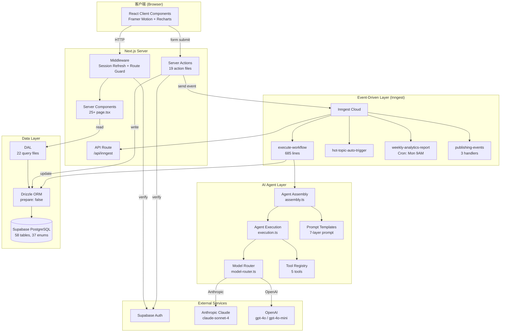
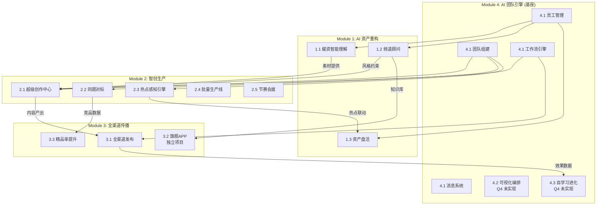
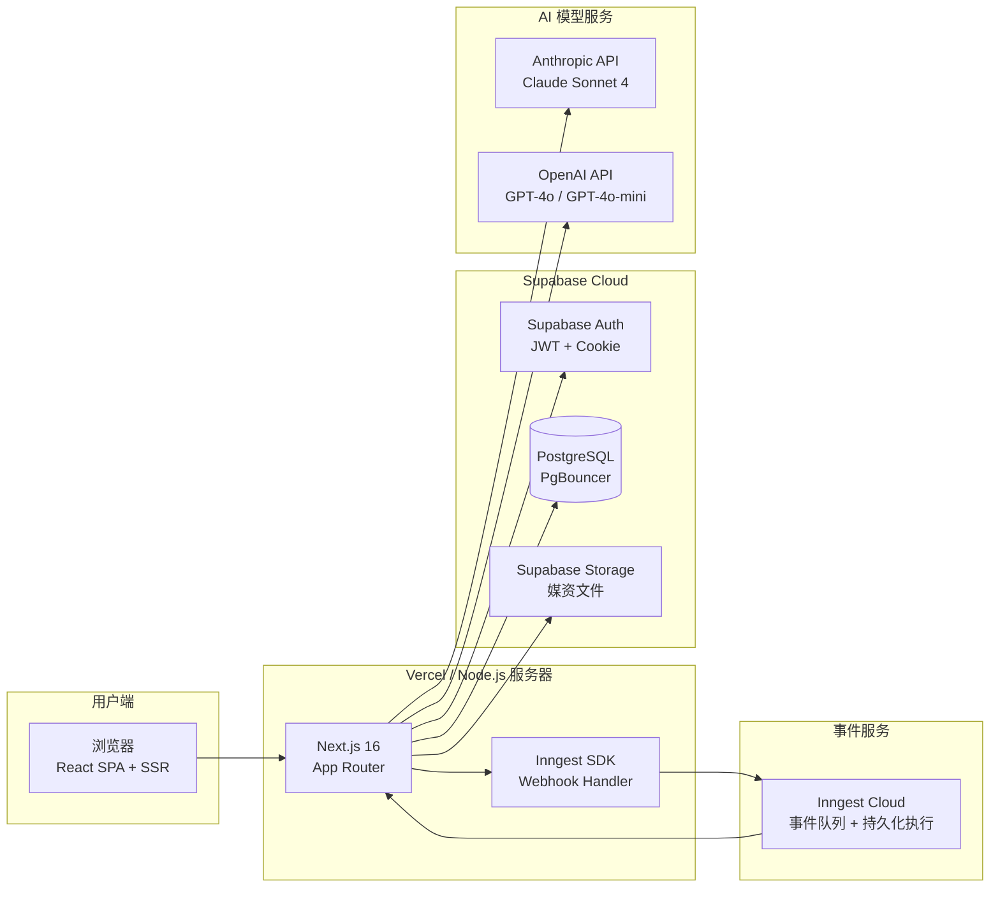
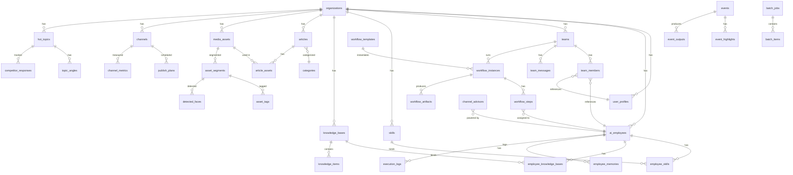
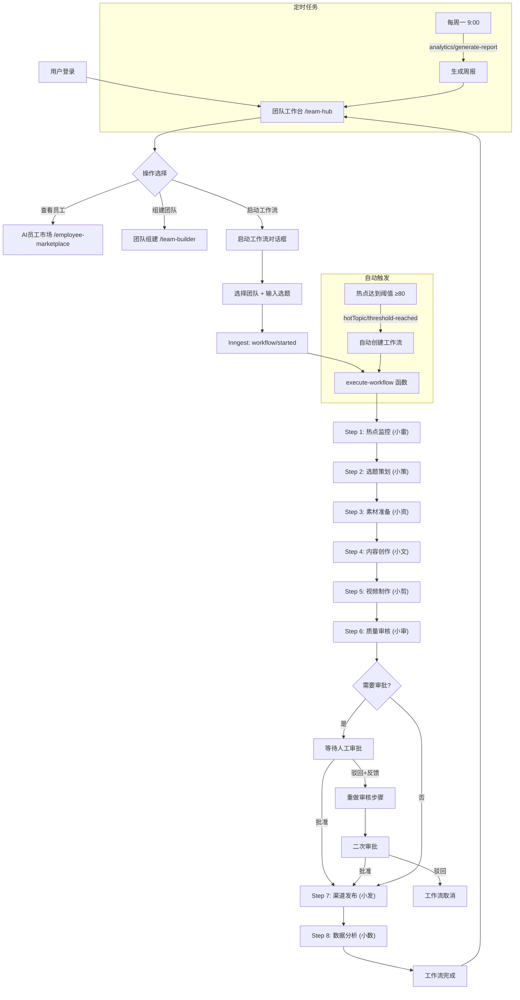

# Vibetide (数智全媒平台) 工程代码交付文档

> **文档版本：** v2.0 | **分析日期：** 2026-03-07 | **基于分支：** `master`
>
> 本文档由高级架构分析工具对项目全部 160+ 源代码文件、26 个数据库 Schema 文件、22 个 DAL 文件、19 个 Server Action 文件、6 个 Inngest 函数、12 个 Agent 模块文件以及全部需求/设计文档进行深度扫描后自动生成。

---

## 一、系统架构设计文档

### 1.1 系统整体架构

#### 架构风格

采用 **分层模块化单体架构（Modular Monolith）**，理由如下：

1. **业务域清晰**：四大功能模块（AI团队引擎、AI资产重构、智创生产、全渠道传播）以目录结构和 schema 文件自然隔离，具备模块化特征
2. **单一部署单元**：所有代码部署为一个 Next.js 应用，降低运维复杂度
3. **共享基础设施**：所有模块共享 Supabase 数据库、认证系统和 Inngest 事件引擎
4. **演进准备**：模块间通过 Inngest 事件进行异步通信，为未来微服务拆分预留通道

#### 分层结构

```
┌─────────────────────────────────────────────────────────────┐
│  表现层 (Presentation)                                       │
│  Client Components (*-client.tsx) + shadcn/ui + Recharts     │
├─────────────────────────────────────────────────────────────┤
│  页面层 (Page Layer)                                         │
│  Server Components (page.tsx) — 数据编排与 SSR 渲染           │
├─────────────────────────────────────────────────────────────┤
│  接口层 (Interface Layer)                                    │
│  Server Actions (src/app/actions/) — 变更操作 + 认证守卫      │
│  API Route (/api/inngest) — Inngest webhook 端点             │
├─────────────────────────────────────────────────────────────┤
│  数据访问层 (DAL - Data Access Layer)                        │
│  只读查询函数 (src/lib/dal/) — 组织级数据隔离                  │
├─────────────────────────────────────────────────────────────┤
│  AI Agent 层 (Agent Infrastructure)                          │
│  装配 → 提示词构建 → 模型路由 → 工具调用 → 执行               │
├─────────────────────────────────────────────────────────────┤
│  事件驱动层 (Event-Driven Layer)                             │
│  Inngest 函数 — 工作流引擎 + 定时任务 + 事件处理              │
├─────────────────────────────────────────────────────────────┤
│  持久化层 (Persistence)                                      │
│  Drizzle ORM → PostgreSQL (Supabase) — 58 张表              │
└─────────────────────────────────────────────────────────────┘
```

#### 组件交互

- **Browser → Middleware**：Session Cookie 刷新 + 路由守卫
- **Page (Server) → DAL**：只读数据查询，返回 UI 类型
- **Client → Server Action**：变更操作（创建、更新、删除），含认证检查
- **Server Action → Inngest**：异步事件发送（工作流启动、审批等）
- **Inngest → Agent**：Agent 装配 + LLM 执行 + 结果持久化
- **Inngest → Database**：工作流状态更新、执行日志写入

#### 技术栈选型

| 层级 | 技术 | 版本 | 选型理由 |
|------|------|------|----------|
| **框架** | Next.js (App Router) | 16.1.6 | SSR + Server Components 天然适合数据密集型仪表盘；Server Actions 取代 REST API |
| **运行时** | React | 19.2.3 | 最新并发特性；Server/Client 组件分离 |
| **语言** | TypeScript | 5.x (strict) | 类型安全保障；InferSelectModel 全链路类型推导 |
| **数据库** | PostgreSQL (Supabase) | — | 高度结构化数据；多租户 JOIN 查询；开箱即用 Auth/Storage/Realtime |
| **ORM** | Drizzle ORM | 0.45.1 | 轻量无 generate 步骤；类型推断直接；兼容 PgBouncer (`prepare: false`) |
| **认证** | Supabase Auth | @supabase/ssr 0.8.0 | SSR Cookie 管理；邮箱/密码认证 |
| **UI** | shadcn/ui + Radix UI | radix-ui 1.4.3 | New York 主题风格；无锁定组件库；Tailwind 原生集成 |
| **样式** | Tailwind CSS | v4 | PostCSS 集成；自定义玻璃拟态主题 |
| **图表** | Recharts | 3.7 | React 原生；6 种图表类型封装 |
| **动画** | Framer Motion | 12.34.3 | 声明式动画；SVG 路径动画 |
| **AI SDK** | Vercel AI SDK | 6.0.116 | 统一多模型调用接口；流式输出；Tool 系统集成 |
| **AI 模型** | Anthropic + OpenAI | claude-sonnet-4, gpt-4o | 按技能类别路由选模型 |
| **后台任务** | Inngest | 3.52.6 | 事件驱动 + waitForEvent 审批机制 + 定时触发 + 持久化执行 |
| **验证** | Zod | 4.3.6 | Schema 验证（用于 AI 输出解析） |
| **日期** | date-fns | 4.1.0 | 轻量级日期格式化 |
| **图标** | Lucide React | 0.575.0 | SVG 图标库 |

### 1.2 架构视图

#### 系统架构图



#### 模块交互图



#### 部署架构图



#### 核心业务时序图：工作流执行

```mermaid
sequenceDiagram
    participant User as 用户
    participant SA as Server Action
    participant IG as Inngest
    participant WFE as execute-workflow
    participant ASM as assembleAgent()
    participant LLM as Claude/GPT
    participant DB as PostgreSQL

    User->>SA: startWorkflow(topicTitle, teamId)
    SA->>DB: INSERT workflow_instances + workflow_steps
    SA->>IG: send("workflow/started")
    IG->>WFE: trigger function

    WFE->>DB: 加载 workflow + steps + team config

    loop 每个步骤 (1-8)
        WFE->>DB: UPDATE step → active; 发送状态消息
        WFE->>DB: UPDATE employee → working
        WFE->>ASM: assembleAgent(employeeSlug)
        ASM->>DB: 加载员工 + 技能 + 知识库 + 记忆
        ASM->>ASM: 构建7层系统提示词 + 匹配工具 + 路由模型
        ASM-->>WFE: AssembledAgent

        WFE->>LLM: generateText(systemPrompt + userMessage + tools)
        LLM-->>WFE: 输出文本 + 工具调用结果

        WFE->>DB: INSERT execution_logs (token/耗时/工具调用)
        WFE->>DB: INSERT workflow_artifacts (产出物)
        WFE->>DB: UPDATE employee_skills (绩效更新)

        alt 需要审批
            WFE->>DB: 发送 decision_request 消息
            WFE->>IG: waitForEvent("workflow/step-approved", 24h)
            alt 批准
                WFE->>DB: step → completed
            else 驳回 + 反馈 (首次)
                WFE->>DB: 存储反馈到 employee_memories
                WFE->>LLM: 重新执行 (注入反馈)
                WFE->>IG: waitForEvent (二次审批, 24h)
            else 超时
                Note over WFE: 根据 escalationPolicy 处理<br/>auto_approve / auto_reject / escalate
            end
        end
    end

    WFE->>DB: UPDATE workflow → completed; 所有员工 → idle
```

---

## 二、模块/功能说明文档

### 2.1 模块四：AI 团队引擎（基座层）

**职责边界：** 管理 8 个 AI 数字员工的完整生命周期、技能系统、团队组建、工作流执行与审批流程。是整个平台的核心引擎，所有其他模块依赖此模块。

**核心逻辑：**

1. **AI 员工管理**
   - 8 个预置员工 + 支持自定义创建/克隆/导入导出
   - 4 级权限体系：`observer` → `advisor` → `executor` → `coordinator`
   - 4 种状态：`working` | `idle` | `learning` | `reviewing`
   - 28 个内置技能分 6 类：perception(4), analysis(6), generation(7), production(4), management(4), knowledge(4)
   - 工作偏好配置：主动性、汇报频率、自主度(0-100)、沟通风格、工作时段
   - 性能指标自动更新：tasksCompleted, accuracy, avgResponseTime, satisfaction

2. **团队组建**
   - 支持 AI + 人类混合团队
   - 可配置审批规则（approvalRequired, approvalSteps, sensitiveTopics）
   - 可配置升级策略（qualityThreshold, sensitivityThreshold, timeoutAction）
   - 预设团队场景：breaking_news, deep_report, social_media, custom

3. **工作流引擎（Inngest）**
   - 8 步标准工作流：热点监控→选题策划→素材准备→内容创作→视频制作→质量审核→渠道发布→数据分析
   - Agent 装配：动态加载员工配置 → 构建 7 层系统提示词 → 匹配工具 → 路由模型
   - 审批门：可配置每步是否需要审批，支持超时策略和驳回重做
   - 执行日志：记录每步的 token 消耗、耗时、工具调用次数、完整输出
   - 性能自动演进：质量分≥90加技能+2，80-89加+1，<60减-1

4. **消息系统**
   - 4 种消息类型：`alert`（告警）、`decision_request`（审批请求）、`status_update`（状态更新）、`work_output`（工作产出）
   - 支持 action 按钮（批准/驳回）和附件
   - 工作流每步自动推送状态消息

**关键文件/类：**

| 文件路径 | 职责 |
|----------|------|
| `src/lib/constants.ts` | EMPLOYEE_META 元数据、WORKFLOW_STEPS 步骤定义、BUILTIN_SKILLS 技能表 |
| `src/lib/agent/assembly.ts` | Agent 动态装配（从 DB 加载→构建提示词→匹配工具→路由模型） |
| `src/lib/agent/execution.ts` | Agent 执行（Vercel AI SDK generateText） |
| `src/lib/agent/prompt-templates.ts` | 7 层系统提示词模板构建器 |
| `src/lib/agent/model-router.ts` | 技能类别→模型映射（6种路由策略） |
| `src/lib/agent/tool-registry.ts` | 5 个工具定义（web_search, content_generate, fact_check, media_search, data_report） |
| `src/lib/agent/intent-parser.ts` | 用户意图解析→自动推荐工作流步骤 |
| `src/lib/agent/step-io.ts` | 步骤输入/输出解析与序列化 |
| `src/inngest/functions/execute-workflow.ts` | 核心工作流引擎（~685行） |
| `src/inngest/functions/hot-topic-auto-trigger.ts` | 热点自动触发工作流 |
| `src/app/actions/employees.ts` | 14 个员工管理 Server Actions |
| `src/app/actions/teams.ts` | 9 个团队管理 Server Actions |
| `src/app/actions/workflow-engine.ts` | 7 个工作流引擎 Server Actions |
| `src/lib/dal/employees.ts` | 员工查询（getEmployees, getEmployee, getEmployeeFullProfile） |
| `src/lib/dal/teams.ts` | 团队查询（getTeams, getTeam, getTeamWithMembers, getWorkflowTemplates） |
| `src/db/schema/ai-employees.ts` | AI 员工表 + 员工记忆表 |
| `src/db/schema/skills.ts` | 技能表 + 员工技能绑定表 |
| `src/db/schema/teams.ts` | 团队表 + 团队成员表 |
| `src/db/schema/workflows.ts` | 工作流模板/实例/步骤/产出物表 |
| `src/db/schema/execution-logs.ts` | 执行日志表 |

**依赖关系：** 被所有其他模块依赖；外部依赖 Vercel AI SDK（Anthropic/OpenAI）+ Inngest

---

### 2.2 模块一：AI 资产重构

**职责边界：** 智能媒资理解、频道顾问个性化训练、存量资产盘活复用。

**核心逻辑：**

1. **媒资智能理解 (1.1)**
   - 视频分段分析：按镜头切割，提取转录文字、OCR 文字、NLU 摘要
   - AI 自动标签：9 类标签（topic, event, emotion, person, location, shotType, quality, object, action）
   - 人脸检测：出现人物识别与标注
   - 知识图谱构建：实体节点 + 关系边（5 类实体：topic, person, event, location, organization）
   - 处理队列管理：queued → processing → completed/failed

2. **频道顾问 (1.2)**
   - 创建频道专属 AI 顾问（个性、风格、优势、口头禅）
   - 频道 DNA 分析（6 维度可视化）
   - 知识库管理：上传/CMS/订阅三种来源
   - 知识同步日志跟踪

3. **资产盘活 (1.3)**
   - 5 种盘活场景：topic_match, hot_match, daily_push, intl_broadcast, style_adapt
   - 每日推荐：基于热点匹配存量素材
   - 风格改写：同一素材多种风格变体
   - 国际化适配：多语言内容改写

**关键文件/类：**

| 文件路径 | 职责 |
|----------|------|
| `src/db/schema/media-assets.ts` | 媒资表 + 分段表 + 标签表 + 人脸表 |
| `src/db/schema/knowledge-graph.ts` | 知识图谱节点表 + 关系表 |
| `src/db/schema/channel-advisors.ts` | 频道顾问表 + DNA 分析表 |
| `src/db/schema/asset-revive.ts` | 盘活推荐表 + 风格适配表 + 国际化适配表 |
| `src/lib/dal/assets.ts` | 媒资查询（10+函数） |
| `src/lib/dal/channel-advisors.ts` | 顾问查询（6 函数） |
| `src/lib/dal/asset-revive.ts` | 盘活查询（6 函数） |
| `src/app/actions/assets.ts` | 媒资 CRUD + 触发理解 + 标签校正 |
| `src/app/actions/channel-advisors.ts` | 顾问 CRUD + 知识库管理 + DNA 分析 |
| `src/app/actions/asset-revive.ts` | 推荐响应 + 风格变体 + 国际化适配 |

**依赖关系：** 依赖模块四的员工管理；为模块二提供素材和频道风格能力

---

### 2.3 模块二：智创生产

**职责边界：** 从热点发现到内容生产的全链条自动化。

**核心逻辑：**

1. **热点感知引擎 (2.3)**
   - 热度评分 0-100，P0/P1/P2 分级
   - 趋势追踪：rising, surging, plateau, declining
   - AI 角度生成（topic_angles）
   - 竞品响应追踪
   - 舆情分析（正/中/负面 + 热评）
   - 热点阈值自动触发工作流（heatScore ≥ 80）

2. **超级创作中心 (2.1)**
   - 创作会话管理（支持多格式：article, video, audio, H5）
   - AI 协作创作（创作聊天消息）
   - 内容版本追踪
   - 爆款模板系统
   - 工作流管线可视化

3. **同题对标 (2.2)**
   - 竞品对比分析（多维评分）
   - 漏报话题发现与追踪（breaking/trending/analysis）
   - 周报自动生成

4. **批量生产线 (2.4)**
   - 批量视频任务管理
   - 画幅转换（16:9 → 9:16 等）
   - 数字人驱动（Mock）
   - 渠道适配网格

5. **节赛会展 (2.5)**
   - 4 类事件：sport, conference, festival, exhibition
   - 赛事高光自动检测（7 种类型）
   - 会议实时转录 + 金句提取
   - 活动产出自动化（clip, summary, graphic, flash, quote_card）

**关键文件/类：**

| 文件路径 | 职责 |
|----------|------|
| `src/db/schema/hot-topics.ts` | 热点表 + 角度表 + 竞品响应表 + 舆情表 |
| `src/db/schema/creation.ts` | 创作会话表 + 版本表 + 聊天表 |
| `src/db/schema/benchmarking.ts` | 竞品表 + 分析表 + 漏报表 + 周报表 |
| `src/db/schema/batch-production.ts` | 批量任务表 + 批量条目表 + 转换任务表 |
| `src/db/schema/events.ts` | 事件表 + 高光表 + 产出表 + 转录表 |
| `src/lib/dal/hot-topics.ts` | 热点查询（5 函数） |
| `src/lib/dal/creation.ts` | 创作查询（7 函数） |
| `src/lib/dal/benchmarking.ts` | 对标查询（5 函数） |
| `src/lib/dal/batch.ts` | 批量查询（5 函数） |
| `src/lib/dal/events.ts` | 事件查询（4 函数） |
| `src/app/actions/hot-topics.ts` | 热点 CRUD + 阈值触发 |
| `src/app/actions/creation.ts` | 创作会话 + 版本管理 |
| `src/app/actions/benchmarking.ts` | 对标分析 + 漏报追踪 |
| `src/app/actions/batch.ts` | 批量任务管理 |
| `src/app/actions/events.ts` | 事件管理 |

**依赖关系：** 依赖模块四的工作流引擎；依赖模块一的素材管理和频道风格；内容产出流入模块三

---

### 2.4 模块三：全渠道传播

**职责边界：** 内容审核、多渠道分发、数据分析和精品率提升。

**核心逻辑：**

1. **全渠道发布 (3.1)**
   - 渠道管理（platform, apiConfig, followers）
   - 发布计划：定时发布 + 条件触发
   - 内容适配（headline, body, coverImage, tags, format）
   - 渠道指标追踪（views, likes, shares, comments, engagement）

2. **数据分析**
   - 周度/日度分析汇总（7天 vs 14天对比）
   - 6 维度评分：传播广度、互动深度、情感共鸣、时效性、精品率、粉丝增长
   - 数据异常检测（阅读量暴跌>50%、互动率下降>40%、阅读量飙升>200%）
   - 定时周报（Inngest Cron：每周一 9:00）

3. **质量审核**
   - 审核结果管理（score 0-100, issues 列表）
   - 4 种审核状态：pending → approved/rejected/escalated
   - 审核完成自动推送团队消息

4. **精品率提升**
   - 爆品预测（predicted_score vs actual_score）
   - 竞品爆款分析
   - 优秀案例库（score ≥ 80 自动收录）

**关键文件/类：**

| 文件路径 | 职责 |
|----------|------|
| `src/db/schema/publishing.ts` | 渠道表 + 发布计划表 + 渠道指标表 |
| `src/db/schema/reviews.ts` | 审核结果表 |
| `src/db/schema/content-excellence.ts` | 案例库表 + 爆品预测表 + 竞品爆款表 |
| `src/lib/dal/publishing.ts` | 发布查询（3 函数） |
| `src/lib/dal/analytics.ts` | 分析查询（6 函数，含异常检测） |
| `src/lib/dal/reviews.ts` | 审核查询（2 函数） |
| `src/lib/dal/content-excellence.ts` | 精品查询（3 函数） |
| `src/app/actions/publishing.ts` | 渠道 CRUD + 发布计划管理 |
| `src/app/actions/reviews.ts` | 审核状态管理 + 问题解决 |
| `src/app/actions/content-excellence.ts` | 案例库 + 爆品预测 |
| `src/inngest/functions/analytics-report.ts` | 定时分析报告 |
| `src/inngest/functions/publishing-events.ts` | 发布事件处理（3 个 handler） |

**依赖关系：** 依赖模块二的内容产出；效果数据回流至模块四的自学习基座

---

### 2.5 CMS 内容管理

**职责边界：** 基础内容管理（媒资、稿件、栏目）。

**核心逻辑：**

- 稿件生命周期：`draft` → `reviewing` → `approved` → `published` → `archived`
- 栏目树形管理（自引用 parentId）
- 稿件-媒资关联（article_assets 多对多）
- 批量状态变更

**关键文件/类：**

| 文件路径 | 职责 |
|----------|------|
| `src/db/schema/articles.ts` | 稿件表 + 稿件资产关联表 |
| `src/db/schema/categories.ts` | 栏目表（自引用树形） |
| `src/lib/dal/articles.ts` | 稿件查询（4 函数 + 统计） |
| `src/lib/dal/categories.ts` | 栏目查询（含树形构建） |
| `src/app/actions/articles.ts` | 稿件 CRUD + 批量操作 |
| `src/app/actions/categories.ts` | 栏目 CRUD + 排序 |

---

### 2.6 认证与多租户

**职责边界：** 用户认证、会话管理、组织级数据隔离。

**核心逻辑：**

- 邮箱/密码认证（Supabase Auth）
- Middleware 层 Cookie 刷新 + 路由守卫
- Dashboard 布局层二次认证
- `getCurrentUserOrg()` 提供组织 ID 用于 DAL 查询
- 所有核心表含 `organization_id` 外键

**关键文件/类：**

| 文件路径 | 职责 |
|----------|------|
| `src/middleware.ts` | 路由匹配 + 调用 updateSession |
| `src/lib/supabase/middleware.ts` | Session Cookie 刷新 + 路由守卫逻辑 |
| `src/lib/supabase/server.ts` | 服务端 Supabase 客户端 |
| `src/lib/supabase/client.ts` | 浏览器端 Supabase 客户端 |
| `src/lib/dal/auth.ts` | getCurrentUserOrg() |
| `src/app/actions/auth.ts` | signIn / signUp / signOut |

---

## 三、代码注释规范与说明

### 3.1 现有规范分析

**文件头注释：** 项目无统一文件头注释规范。大部分文件无注释直接进入代码。

**类/方法注释：** 极少使用注释。代码通过清晰的函数名和 TypeScript 类型签名实现自文档化。

**命名规则：**

| 维度 | 规范 | 示例 |
|------|------|------|
| **文件名** | kebab-case | `asset-revive.ts`, `employee-create-dialog.tsx` |
| **函数名** | camelCase | `getEmployeeFullProfile()`, `bindSkillToEmployee()` |
| **组件名** | PascalCase | `TeamHubClient`, `EmployeeAvatar` |
| **常量** | UPPER_SNAKE_CASE | `EMPLOYEE_META`, `WORKFLOW_STEPS` |
| **类型/接口** | PascalCase | `AIEmployee`, `WorkflowStepState` |
| **DB Schema** | 表名 camelCase（Drizzle），列名 camelCase（自动映射 snake_case） | `aiEmployees`, `organizationId` |
| **路由** | kebab-case | `/team-builder`, `/asset-intelligence` |

**Server/Client 分离规范：**
- 页面 Server Component：`page.tsx`
- 对应 Client Component：`*-client.tsx`（如 `team-hub-client.tsx`）

### 3.2 优化建议

1. **建议添加 JSDoc**：对 DAL 导出函数和 Server Actions 添加 JSDoc 注释，说明参数含义、返回值和副作用（如 revalidatePath）
2. **建议统一 Schema 注释**：在 Drizzle Schema 中使用 `.comment()` 方法为关键字段添加数据库级注释
3. **建议代码分区注释**：对于超过 200 行的文件（如 `execute-workflow.ts`），使用 `// region` 风格的分区注释

---

## 四、数据库设计文档

### 4.1 概览

| 维度 | 值 |
|------|------|
| **数据库类型** | PostgreSQL（Supabase 托管） |
| **ORM 框架** | Drizzle ORM 0.45.1 |
| **驱动** | postgres (porsager) 3.4.8，`{ prepare: false }` 适配 PgBouncer |
| **连接配置** | `src/db/index.ts` |
| **Schema 定义** | `src/db/schema/`（26 个文件） |
| **迁移输出** | `supabase/migrations/` |
| **总表数** | 约 58 张表 |
| **总枚举数** | 37 个 PostgreSQL 枚举 |

### 4.2 表结构设计

#### 核心基础表

**Table: `organizations`** — 多租户根表

| 字段 | 类型 | 约束 | 说明 |
|------|------|------|------|
| id | uuid | PK, default gen_random_uuid() | 组织 ID |
| name | text | NOT NULL | 组织名称 |
| slug | text | UNIQUE | URL slug |
| settings | jsonb | | 组织设置 |
| created_at, updated_at | timestamp | | 时间戳 |

**Table: `user_profiles`** — 用户档案

| 字段 | 类型 | 约束 | 说明 |
|------|------|------|------|
| id | uuid | PK | = Supabase auth.users.id |
| organization_id | uuid | FK → organizations | 所属组织 |
| display_name | text | | 显示名称 |
| role | text | | admin / editor / viewer |
| avatar_url | text | | 头像 URL |

#### AI 员工表

**Table: `ai_employees`** — AI 员工主表

| 字段 | 类型 | 约束 | 说明 |
|------|------|------|------|
| id | uuid | PK | |
| organization_id | uuid | FK | |
| slug | text | NOT NULL | 唯一标识（xiaolei, xiaoce...） |
| name | text | NOT NULL | 角色名 |
| nickname | text | | 昵称 |
| title | text | | 职位头衔 |
| motto | text | | 座右铭 |
| role_type | text | | 角色类型 |
| authority_level | enum | observer/advisor/executor/coordinator | 权限等级 |
| status | enum | working/idle/learning/reviewing | 当前状态 |
| current_task | text | | 当前任务描述 |
| work_preferences | jsonb | | 工作偏好 |
| learned_patterns | jsonb | | 学习到的模式 |
| auto_actions | jsonb | | 可自动执行的动作 |
| need_approval_actions | jsonb | | 需要审批的动作 |
| tasks_completed | integer | default 0 | 已完成任务数 |
| accuracy | real | default 0.95 | 准确率 |
| avg_response_time | text | | 平均响应时间 |
| satisfaction | real | default 0.9 | 满意度 |
| is_preset | integer | default 0 | 1=预置员工 |
| disabled | integer | default 0 | 1=已禁用 |

**Table: `employee_memories`** — 员工记忆

| 字段 | 类型 | 约束 | 说明 |
|------|------|------|------|
| id | uuid | PK | |
| employee_id | uuid | FK CASCADE → ai_employees | |
| memory_type | enum | feedback/pattern/preference | 记忆类型 |
| content | text | NOT NULL | 记忆内容 |
| importance | real | default 0.5 | 重要度 0-1 |
| access_count | integer | default 0 | 访问次数 |

#### 技能系统表

**Table: `skills`** — 技能定义

| 字段 | 类型 | 说明 |
|------|------|------|
| id | uuid PK | |
| name | text | 技能名（映射到 tool_registry） |
| category | enum | perception/analysis/generation/production/management/knowledge |
| type | enum | builtin/custom/plugin |
| version | text | 版本号 |
| input_schema | jsonb | 输入定义 |
| output_schema | jsonb | 输出定义 |
| compatible_roles | jsonb | 兼容角色列表 |

**Table: `employee_skills`** — 员工-技能绑定（多对多）

| 字段 | 类型 | 说明 |
|------|------|------|
| employee_id | uuid FK CASCADE | |
| skill_id | uuid FK CASCADE | |
| level | integer | 熟练度 0-100 |
| binding_type | enum | core/extended/knowledge |

#### 团队与工作流表

**Table: `teams`**

| 字段 | 类型 | 说明 |
|------|------|------|
| id | uuid PK | |
| name | text | 团队名称 |
| scenario | text | 场景：breaking_news/deep_report/... |
| rules | jsonb | {approvalRequired, reportFrequency, sensitiveTopics, approvalSteps} |
| workflow_template_id | uuid FK | 关联工作流模板 |
| escalation_policy | jsonb | {sensitivityThreshold, qualityThreshold, timeoutAction, escalateToUserId} |

**Table: `workflow_instances`**

| 字段 | 类型 | 说明 |
|------|------|------|
| id | uuid PK | |
| team_id | uuid FK | |
| template_id | uuid FK | |
| topic_title | text | 选题标题 |
| status | text | active/completed/cancelled |
| inngest_run_id | text | Inngest 运行 ID |
| current_step_key | text | 当前执行步骤 |
| token_budget | integer | Token 预算 |
| tokens_used | integer | 已用 Token |

**Table: `workflow_steps`**

| 字段 | 类型 | 说明 |
|------|------|------|
| id | uuid PK | |
| workflow_instance_id | uuid FK CASCADE | |
| key | text | 步骤键（monitor, plan, create...） |
| employee_id | uuid FK | 执行者 |
| step_order | integer | 执行顺序 |
| status | enum | completed/active/pending/skipped/waiting_approval/failed |
| progress | integer 0-100 | 进度 |
| output | text | 输出摘要 |
| structured_output | jsonb | StepOutput 完整结构 |
| retry_count | integer | 重试次数 |

**Table: `workflow_artifacts`** — 工作流产出物

| 字段 | 类型 | 说明 |
|------|------|------|
| artifact_type | enum | topic_brief/angle_list/material_pack/article_draft/video_plan/review_report/publish_plan/analytics_report/generic |
| title | text | 产出物标题 |
| content | jsonb | 结构化内容 |
| text_content | text | 纯文本内容 |
| producer_employee_id | uuid FK | 生产者 |
| producer_step_key | text | 生产步骤 |

**Table: `execution_logs`** — 执行日志

| 字段 | 类型 | 说明 |
|------|------|------|
| tokens_input | integer | 输入 token |
| tokens_output | integer | 输出 token |
| duration_ms | integer | 执行耗时 |
| tool_call_count | integer | 工具调用次数 |
| model_id | text | 使用的模型 |
| status | text | success/failed/needs_approval |

> 完整 58 张表结构详见 `src/db/schema/` 目录下各 schema 文件。模块一涵盖 10 张表（媒资/知识图谱/频道顾问/资产盘活），模块二涵盖 13 张表（热点/创作/对标/批量/事件），模块三涵盖 6 张表（渠道/发布/指标/审核/案例/预测），CMS 涵盖 2 张表（稿件/稿件资产）。

### 4.3 数据关系 (ER 图)



### 4.4 核心数据流

```
数据产生                    写入模块                         读取模块
────────                   ────────                        ────────
Supabase Auth           → user_profiles                 → DAL auth.ts → 所有页面
管理员操作              → ai_employees, skills           → DAL employees.ts → team-hub, employee
管理员操作              → teams, team_members            → DAL teams.ts → team-hub, team-builder
工作流引擎 (Inngest)    → workflow_steps, team_messages  → DAL workflows.ts → team-hub
Agent 执行              → execution_logs, artifacts      → （调试/分析用）
Server Actions          → articles, hot_topics, etc.     → 各对应 DAL → 各对应页面
定时任务 (Cron)         → team_messages (周报)           → DAL messages.ts → team-hub
异常检测                → team_messages (告警)           → DAL messages.ts → team-hub
```

---

## 五、接口文档 (API Reference)

### 5.1 接口概览

**URL 前缀：** 本项目大量使用 Next.js Server Actions 替代传统 REST API，仅有 1 个 API Route。

**鉴权方式：**
- Server Actions：通过 `requireAuth()` 函数调用 Supabase Auth 验证 Cookie Session
- API Route：Inngest 签名验证（`INNGEST_SIGNING_KEY`）

### 5.2 API Route 详情

**[GET/POST/PUT] `/api/inngest`**
- **功能：** Inngest 事件处理入口（webhook）
- **参数：** Inngest 框架自动管理
- **返回：** Inngest 框架自动管理
- **代码位置：** `src/app/api/inngest/route.ts`
- **注册函数：** executeWorkflow, weeklyAnalyticsReport, hotTopicAutoTrigger, onReviewCompleted, onPlanStatusChanged, onAnomalyDetected

### 5.3 Server Actions 汇总

共 **19 个 Server Action 文件**，导出约 **80+ 个 mutation 函数**。所有 Action 文件位于 `src/app/actions/`，使用 `"use server"` 指令，调用 `requireAuth()` 进行认证。

| 文件 | 函数数 | 核心功能 |
|------|--------|----------|
| `auth.ts` | 3 | signIn, signUp, signOut |
| `employees.ts` | 14 | 员工 CRUD + 配置 + 克隆 + 导入导出 |
| `teams.ts` | 9 | 团队 CRUD + 规则 + 升级策略 |
| `workflow-engine.ts` | 7 | 工作流启动/审批/批量审批/取消/模板 CRUD |
| `workflows.ts` | 2 | 工作流实例创建 + 步骤更新 |
| `messages.ts` | 1 | 发送团队消息 |
| `articles.ts` | 5 | 稿件 CRUD + 批量状态变更 |
| `categories.ts` | 4 | 栏目 CRUD + 排序 |
| `assets.ts` | 6 | 媒资 CRUD + 触发理解 + 标签校正 |
| `hot-topics.ts` | 6 | 热点 CRUD + 阈值触发 |
| `creation.ts` | 6 | 创作会话 + 版本 + 管线步骤 |
| `benchmarking.ts` | 5 | 对标分析 + 漏报追踪 + 周报 |
| `batch.ts` | 4 | 批量任务 + 转换任务 |
| `events.ts` | 6 | 事件 CRUD + 高光 + 产出 + 转录 |
| `channel-advisors.ts` | 8 | 顾问 CRUD + 知识库 + DNA 分析 |
| `publishing.ts` | 7 | 渠道 + 发布计划 CRUD |
| `reviews.ts` | 3 | 审核 CRUD + 问题解决 |
| `content-excellence.ts` | 4 | 案例库 + 爆品预测 |
| `asset-revive.ts` | 4 | 推荐响应 + 风格变体 + 国际化适配 |

### 5.4 Inngest 事件接口

| 事件名 | 触发条件 | 数据 |
|--------|----------|------|
| `workflow/started` | startWorkflow() | workflowInstanceId, teamId, orgId, topicTitle, scenario |
| `workflow/step-approved` | approveWorkflowStep() | workflowInstanceId, stepId, approved, feedback |
| `workflow/cancelled` | cancelWorkflow() | workflowInstanceId, cancelledBy |
| `hotTopic/threshold-reached` | 热点 heatScore ≥ 80 | orgId, hotTopicId, topicTitle, heatScore, teamId |
| `publishing/review-completed` | 审核完成 | reviewId, contentId, status, score |
| `publishing/plan-status-changed` | 发布状态变更 | planId, title, channelName, status |
| `analytics/generate-report` | Cron 每周一 9:00 | period |
| `analytics/anomaly-detected` | 数据异常 | channel, metric, severity, message |

---

## 六、配置说明文档

### 6.1 配置文件列表

| 文件 | 作用 |
|------|------|
| `.env.local` | 环境变量（Supabase URL/Key、数据库连接、AI API Key） |
| `.env.example` | 环境变量模板 |
| `next.config.ts` | Next.js 配置（目前为空） |
| `tsconfig.json` | TypeScript 配置（strict mode, `@/*` → `./src/*`） |
| `drizzle.config.ts` | Drizzle ORM 配置（schema 路径 + 迁移输出） |
| `postcss.config.mjs` | PostCSS 配置（Tailwind CSS） |
| `eslint.config.mjs` | ESLint 配置 |
| `components.json` | shadcn/ui 组件配置（new-york 主题） |

### 6.2 关键配置项

| 配置项 | 作用 | 默认值 | 生产环境建议 |
|--------|------|--------|-------------|
| `NEXT_PUBLIC_SUPABASE_URL` | Supabase 项目 URL | — | 必填，使用正式项目 |
| `NEXT_PUBLIC_SUPABASE_ANON_KEY` | Supabase 匿名 Key | — | 必填，限制 RLS 策略 |
| `SUPABASE_SERVICE_ROLE_KEY` | Supabase 服务角色 Key | — | 必填，仅服务端使用 |
| `DATABASE_URL` | PostgreSQL 直连 URL | — | 必填，使用连接池 |
| `ANTHROPIC_API_KEY` | Claude API Key | — | Agent 功能必需 |
| `OPENAI_API_KEY` | GPT API Key | — | Agent 功能必需 |
| `INNGEST_EVENT_KEY` | Inngest 事件 Key | — | 生产环境必需 |
| `INNGEST_SIGNING_KEY` | Inngest 签名 Key | — | 生产环境必需 |

### 6.3 外部依赖与密钥

| 服务 | 用途 | 密钥配置 |
|------|------|----------|
| Supabase | PostgreSQL + Auth + Storage | `NEXT_PUBLIC_SUPABASE_URL`, `NEXT_PUBLIC_SUPABASE_ANON_KEY`, `SUPABASE_SERVICE_ROLE_KEY`, `DATABASE_URL` |
| Anthropic | Claude Sonnet 4 模型调用 | `ANTHROPIC_API_KEY` = `******` |
| OpenAI | GPT-4o / GPT-4o-mini 模型调用 | `OPENAI_API_KEY` = `******` |
| Inngest | 事件驱动工作流引擎 | `INNGEST_EVENT_KEY` = `******`, `INNGEST_SIGNING_KEY` = `******` |

---

## 七、编译/部署文档

### 7.1 环境要求

| 依赖 | 最低版本 | 说明 |
|------|----------|------|
| Node.js | 18.x+ | Next.js 16 要求 |
| npm/pnpm | npm 9+ 或 pnpm 8+ | 项目同时存在 package-lock.json 和 pnpm-lock.yaml |
| PostgreSQL | 14+ | Supabase 托管或本地实例 |

### 7.2 构建与打包

**构建命令：**
```bash
npm run build        # 或 pnpm build
```

**打包产物：** `.next/` 目录（Next.js 自动生成的优化构建产物）

**类型检查：**
```bash
npx tsc --noEmit     # 独立类型检查（不生成文件）
```

### 7.3 部署流程

**本地启动：**
```bash
# 1. 安装依赖
npm install  # 或 pnpm install

# 2. 配置环境变量
cp .env.example .env.local
# 编辑 .env.local 填入真实值

# 3. 推送数据库 Schema
npm run db:push

# 4. 种子数据
npm run db:seed

# 5. 启动开发服务器
npm run dev  # → localhost:3000
```

**Docker 部署：** 项目当前无 Dockerfile。建议创建基于 Node.js 18 Alpine 的多阶段构建：

```dockerfile
# 建议 Dockerfile（项目中暂未提供）
FROM node:18-alpine AS builder
WORKDIR /app
COPY package*.json ./
RUN npm ci
COPY . .
RUN npm run build

FROM node:18-alpine AS runner
WORKDIR /app
COPY --from=builder /app/.next ./.next
COPY --from=builder /app/node_modules ./node_modules
COPY --from=builder /app/package.json ./
EXPOSE 3000
CMD ["npm", "start"]
```

**服务器部署建议：**
- **推荐方案：** Vercel（Next.js 原生支持，Serverless 部署，自动 CDN）
- **替代方案：** Docker 容器部署到 AWS ECS / Google Cloud Run / 自建 K8s
- **数据库：** 继续使用 Supabase 托管 PostgreSQL（已内置连接池）
- **Inngest：** 使用 Inngest Cloud（Serverless 原生，无基础设施开销）

---

## 八、测试文档

### 8.1 当前测试覆盖

**当前项目无任何测试文件。** 无单元测试、集成测试或端到端测试。

### 8.2 建议测试计划

#### 单元测试（优先级高）

| 测试目标 | 文件 | 测试要点 |
|----------|------|----------|
| Agent 装配 | `src/lib/agent/assembly.ts` | 员工加载、技能解析、权限过滤、提示词构建 |
| 模型路由 | `src/lib/agent/model-router.ts` | 技能类别→模型映射正确性 |
| 提示词构建 | `src/lib/agent/prompt-templates.ts` | 7 层结构完整性、敏感话题注入、工作偏好注入 |
| 步骤 I/O | `src/lib/agent/step-io.ts` | 输出解析、质量分提取、序列化/反序列化 |
| 意图解析 | `src/lib/agent/intent-parser.ts` | 意图分类、步骤推荐 |

#### 集成测试（优先级中）

| 测试目标 | 依赖 | 测试要点 |
|----------|------|----------|
| Server Actions | 测试数据库 | 认证守卫、数据写入正确性、revalidatePath |
| DAL 查询 | 测试数据库 | 多租户过滤、关系查询、数据转换 |
| 工作流引擎 | Inngest Dev Server | 完整 8 步执行、审批/驳回/超时 |

### 8.3 风险点与边界条件

| 风险 | 代码位置 | 当前处理 |
|------|----------|----------|
| 工作流步骤无 employeeId | `execute-workflow.ts` | 步骤标记为 skipped |
| 审批超时 (24h) | `execute-workflow.ts` | 根据 escalationPolicy.timeoutAction 处理 |
| 二次驳回 | `execute-workflow.ts` | retryCount > 0 → 直接 fail + cancel |
| Agent 员工不存在 | `assembly.ts` | throw Error |
| 预置员工删除 | `employees.ts` | isPreset === 1 时 throw Error |
| 技能不兼容 | `employees.ts` | compatibleRoles 检查 → throw Error |
| 跨租户数据泄露 | DAL 各文件 | getCurrentUserOrg() 过滤（部分函数降级为无过滤） |
| Token 预算耗尽 | `execute-workflow.ts` | 检查 tokensUsed > tokenBudget |

---

## 九、辅助理解材料

### 9.1 核心业务流程图



**对应代码文件：**
- 工作流启动：`src/app/actions/workflow-engine.ts` → `startWorkflow()`
- 工作流执行：`src/inngest/functions/execute-workflow.ts`
- Agent 装配：`src/lib/agent/assembly.ts`
- 热点触发：`src/inngest/functions/hot-topic-auto-trigger.ts`
- 周报生成：`src/inngest/functions/analytics-report.ts`

### 9.2 版本与分支策略

- **主分支：** `main`（用于 PR 合并目标）
- **开发分支：** `master`（当前活跃开发分支）
- **提交历史：** 1 个初始提交（`8d32328 initial commit`），大量未提交修改
- **建议：** 当前开发处于早期阶段，建议建立 `main` ← `develop` ← `feature/*` 的分支策略

### 9.3 第三方依赖清单

#### 生产依赖

| 库名 | 版本 | 用途 | License |
|------|------|------|---------|
| next | 16.1.6 | React 全栈框架 | MIT |
| react / react-dom | 19.2.3 | UI 运行时 | MIT |
| @ai-sdk/anthropic | ^3.0.58 | Anthropic 模型适配器 | Apache-2.0 |
| @ai-sdk/openai | ^3.0.41 | OpenAI 模型适配器 | Apache-2.0 |
| ai | ^6.0.116 | Vercel AI SDK 核心 | Apache-2.0 |
| @supabase/ssr | ^0.8.0 | Supabase SSR Cookie 管理 | MIT |
| @supabase/supabase-js | ^2.98.0 | Supabase JavaScript 客户端 | MIT |
| drizzle-orm | ^0.45.1 | PostgreSQL ORM | Apache-2.0 |
| postgres | ^3.4.8 | PostgreSQL 原生驱动 | Unlicense |
| inngest | ^3.52.6 | 事件驱动工作流引擎 | Apache-2.0 |
| zod | ^4.3.6 | Schema 验证 | MIT |
| recharts | ^3.7.0 | React 图表库 | MIT |
| framer-motion | ^12.34.3 | React 动画库 | MIT |
| radix-ui | ^1.4.3 | 无头 UI 组件 | MIT |
| class-variance-authority | ^0.7.1 | 组件变体管理 | Apache-2.0 |
| clsx | ^2.1.1 | 条件类名拼接 | MIT |
| tailwind-merge | ^3.5.0 | Tailwind 类名合并 | MIT |
| lucide-react | ^0.575.0 | SVG 图标库 | ISC |
| date-fns | ^4.1.0 | 日期处理 | MIT |

#### 开发依赖

| 库名 | 版本 | 用途 |
|------|------|------|
| typescript | ^5 | 类型系统 |
| tailwindcss | ^4 | CSS 框架 |
| @tailwindcss/postcss | ^4 | PostCSS 集成 |
| drizzle-kit | ^0.31.9 | Drizzle 迁移工具 |
| eslint + eslint-config-next | ^9 / 16.1.6 | 代码规范 |
| shadcn | ^3.8.5 | 组件生成 CLI |
| tsx | ^4.21.0 | TypeScript 直接执行 |
| tw-animate-css | ^1.4.0 | Tailwind 动画 |
| dotenv | ^17.3.1 | 环境变量加载 |

> License 风险：所有依赖均为 MIT / Apache-2.0 / ISC / Unlicense，无 GPL 或其他 copyleft 许可证风险。

### 9.4 FAQ / 开发者指南

**Q1：如何添加新的 AI 员工工具？**

1. 在 `src/lib/agent/tool-registry.ts` 中使用 Vercel AI SDK 的 `tool()` 函数定义工具
2. 在 `TOOLS` 常量中注册工具名映射
3. 在 `src/lib/constants.ts` 的 `BUILTIN_SKILLS` 中添加对应技能
4. 运行 `db:seed` 将技能写入数据库

**Q2：如何将 Mock 页面迁移到真实数据库？**

遵循 6 步迁移模式：
1. 在 `src/db/schema/` 中定义/扩展表 Schema
2. 在 `src/lib/dal/` 中创建查询函数
3. 在 `src/app/actions/` 中创建 Server Actions
4. 重写 `page.tsx` 为 Server Component（调用 DAL）
5. 提取 Client Component 逻辑到 `*-client.tsx`
6. 移除 `src/data/` 中的 Mock 文件导入
7. 运行 `npx tsc --noEmit` 验证类型安全

**Q3：Inngest 本地开发如何调试？**

```bash
npx inngest-cli@latest dev  # 启动 Inngest Dev Server
```
Dev Server 会在 `http://localhost:8288` 提供可视化调试面板，可查看事件流、函数执行状态和日志。

**Q4：数据库 Schema 变更流程？**

```bash
# 1. 修改 src/db/schema/ 中的表定义
# 2. 生成迁移文件
npm run db:generate

# 3. 应用迁移（生产环境）
npm run db:migrate

# 或直接推送（开发环境，会覆盖）
npm run db:push
```

**Q5：`prepare: false` 为什么是必需的？**

Supabase 使用 PgBouncer 进行连接池管理。PgBouncer 的 Transaction 模式不支持 Prepared Statements，因此 Drizzle ORM 连接配置中必须设置 `{ prepare: false }`。

---

## 十、交付总结与建议

### 10.1 代码质量评价

| 维度 | 评分 | 说明 |
|------|------|------|
| **架构设计** | A | 分层清晰，模块化良好；Server/Client 分离规范；事件驱动工作流设计合理 |
| **类型安全** | A | TypeScript strict mode；Drizzle InferSelectModel 全链路推导；100+ UI 接口定义 |
| **代码组织** | A- | 目录结构规范，文件命名一致；DAL/Action 职责分离清晰 |
| **数据模型** | A | 58 张表覆盖完整业务域；37 个枚举类型约束值域；多租户隔离设计合理 |
| **Agent 架构** | A | 7 层提示词设计专业；权限驱动工具过滤；模型路由策略合理；驳回学习机制创新 |
| **测试覆盖** | F | 零测试文件，核心引擎（工作流执行、Agent 装配）亟需测试 |
| **安全性** | B- | 认证层完整；部分 DAL 缺少 org 过滤；Server Actions 缺少运行时输入验证 |
| **文档** | B+ | CLAUDE.md 完善；需求文档体系完整；但实现状态矩阵滞后于代码实际进度 |
| **可维护性** | B | 代码注释极少；部分超长文件（execute-workflow.ts ~685行）应拆分 |

### 10.2 关键发现：文档与代码实际状态差异

**重要发现：** 需求文档中的《附录A-实现状态矩阵》记录的状态与代码实际进度存在显著差异：

| 维度 | 文档记录 | 代码实际 | 差距 |
|------|----------|----------|------|
| DB Schema | 14 表（仅模块四） | 58 表（覆盖全部模块） | **44 表已建但未记录** |
| DAL 文件 | 7 个 | 22 个 | **15 个已建但未记录** |
| Server Actions | 5 个文件 / 23 个函数 | 19 个文件 / 80+ 个函数 | **14 个文件已建但未记录** |
| 页面状态 | 5 个 DB 连接 / 16 个 Mock | 所有页面已连接 DAL | **实际已全面迁移** |

**建议：** 立即更新附录A状态矩阵，反映代码真实进度。

### 10.3 后续改进建议

#### 紧急（P0）

1. **添加测试**：至少覆盖 Agent 装配、工作流引擎、DAL 查询的单元测试
2. **安全加固**：为所有 Server Actions 添加 Zod 运行时输入验证；确保所有 DAL 函数有 org 过滤
3. **更新文档**：同步实现状态矩阵与代码实际进度

#### 重要（P1）

4. **性能优化**：
   - DAL N+1 查询重构（使用 Drizzle `with` 关系查询）
   - 添加数据库索引（organization_id, slug, status）
   - 大表添加分页支持
   - 利用 Next.js `cache()` 减少数据库查询
5. **Agent 工具实现**：替换 mock 工具实现为真实 API（web_search → Tavily/SerpAPI; content_generate → 专用模型）
6. **错误处理**：添加 `error.tsx` 和 `loading.tsx` 到所有路由

#### 未来（P2）

7. **RAG 集成**：接入 Supabase pgvector 实现语义搜索
8. **实时更新**：使用 Supabase Realtime 推送工作流进度
9. **可视化工作流编辑器**：使用 React Flow 实现拖拽式工作流设计（模块 4.2）
10. **容器化**：添加 Dockerfile + docker-compose 支持本地全栈开发
11. **监控**：添加 OpenTelemetry 追踪 Agent 执行性能

---

> **文档完毕。** 本文档基于代码仓库 `master` 分支全部 160+ 源文件、26 个 DB Schema 文件、22 个 DAL 文件、19 个 Server Action 文件、12 个 Agent 模块文件、6 个 Inngest 函数以及全部需求/设计文档进行深度分析后生成。
