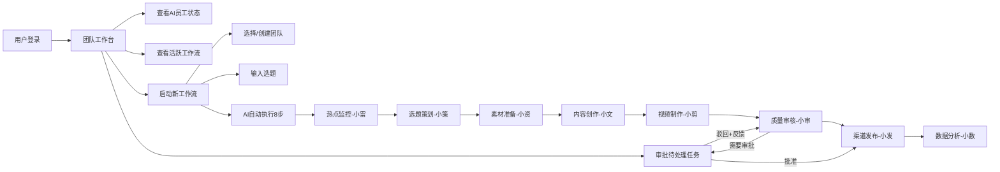
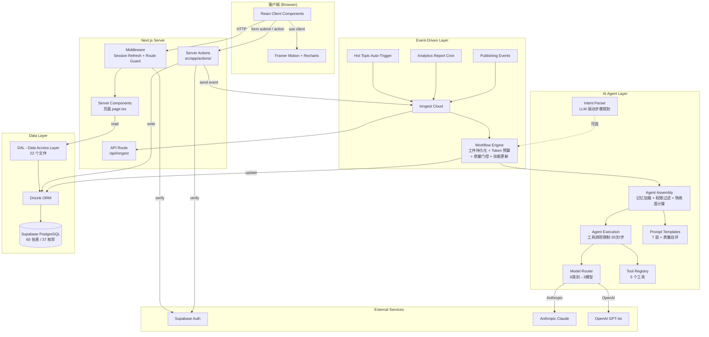
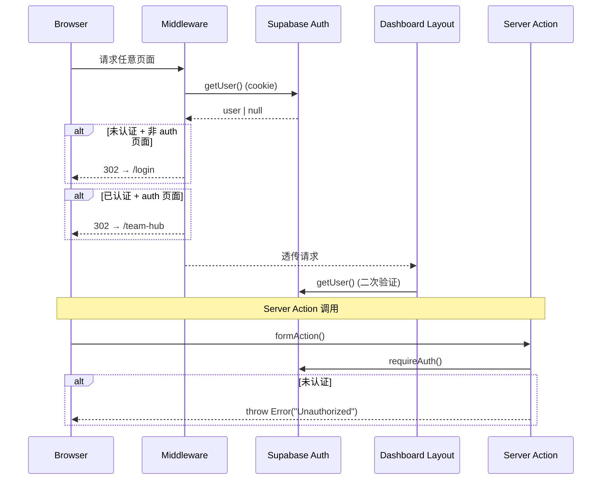
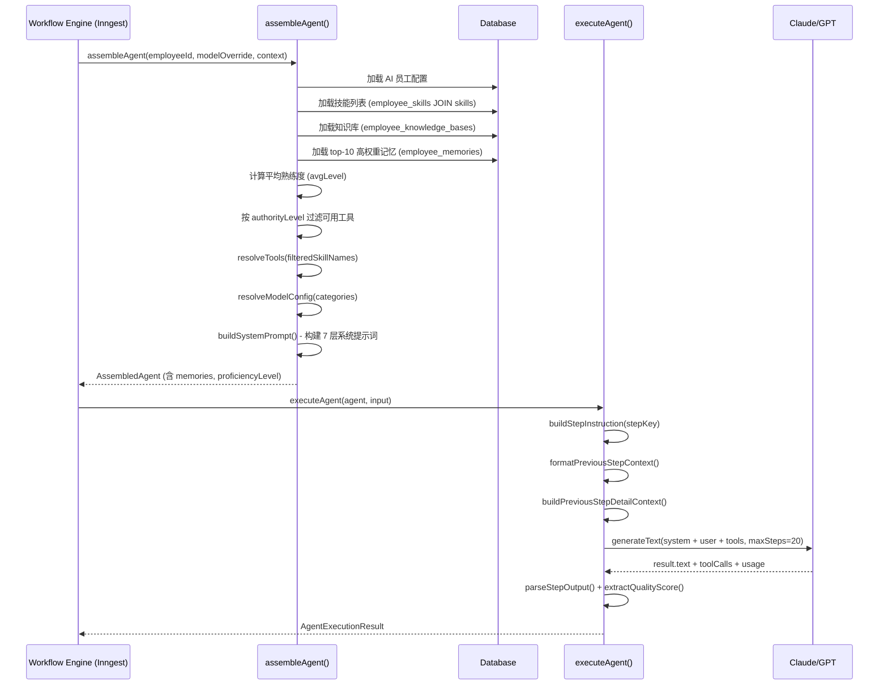
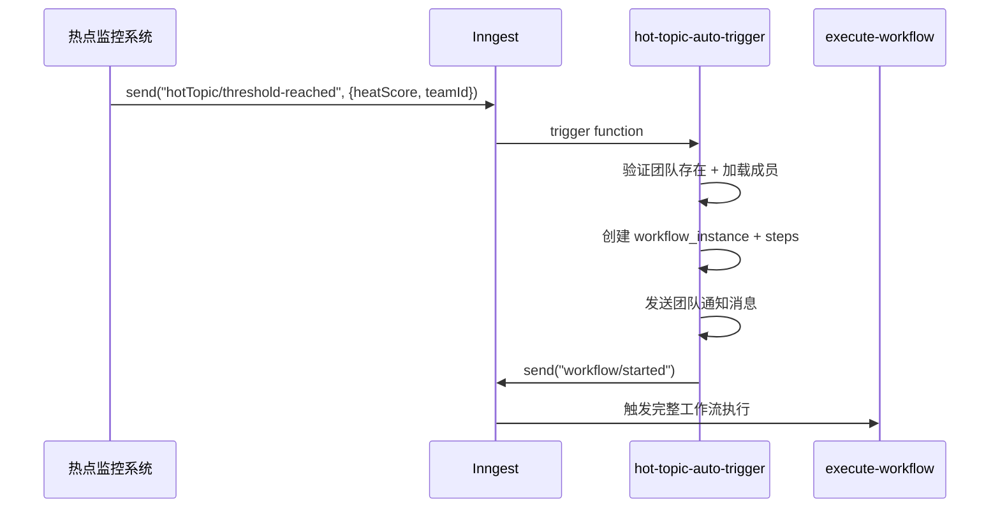

# Vibetide (Vibe Media) — 项目技术架构与实现文档

> 文档版本：v2.0 | 更新日期：2026-03-07 | 基于代码仓库 `master` 分支
>
> **v2.0 变更摘要：** 新增 Agent 架构 10 项优化特性（技能体系重构、记忆系统、工件系统、质量自评、意图拆解、安全权限、技能学习），更新实际代码统计（60 张表、22 个 DAL、19 个 Server Actions），补充完整 Agent 执行流程和数据模型。

---

## 1. 项目概览 (Project Overview)

### 1.1 核心功能

**Vibetide（数智全媒平台）** 是一个面向中国媒体机构的 AI 驱动内容管理与生产平台。核心理念是 **"2个编辑 + 1支AI团队 = 全能新媒体军团"**——通过 8 个专业化 AI 数字员工组成的虚拟团队，自动化完成从热点发现、选题策划、内容创作、视频制作、质量审核到全渠道分发的完整内容生产链条。

### 1.2 业务价值

- **人力放大器**：将传统需要 20+ 人的媒体团队能力压缩到 2 个人类编辑 + 8 个 AI 员工
- **全流程自动化**：热点监控 → 选题 → 创作 → 审核 → 发布 → 数据分析的 8 步工作流可完全自动执行
- **多模态内容生产**：支持文章、短视频、音频、H5 等多种内容形态
- **全渠道分发**：一键适配微信、抖音、微博、百度、B站、小红书、知乎等主流平台

### 1.3 核心用户旅程



---

## 2. 技术栈与选型分析 (Tech Stack & Rationale)

### 2.1 技术栈全景

| 层级 | 技术 | 版本 | 说明 |
|------|------|------|------|
| **框架** | Next.js | 16.1.6 | App Router, RSC, Server Actions |
| **运行时** | React | 19.2.3 | 服务器组件 + 客户端组件分离 |
| **语言** | TypeScript | 5.x | strict mode 启用 |
| **数据库** | PostgreSQL (Supabase) | — | 托管 PostgreSQL + Auth + Storage |
| **ORM** | Drizzle ORM | 0.45.1 | 类型安全、轻量级 |
| **数据库驱动** | postgres (porsager) | 3.4.8 | 原生 PostgreSQL 驱动，兼容 PgBouncer |
| **认证** | Supabase Auth | @supabase/ssr 0.8.0 | SSR Cookie 管理 |
| **UI 组件库** | shadcn/ui + Radix UI | radix-ui 1.4.3 | New York 主题风格 |
| **样式** | Tailwind CSS | v4 | PostCSS 集成 |
| **图表** | Recharts | 3.7 | 6 种图表类型封装 |
| **动画** | Framer Motion | 12.34.3 | 页面切换/组件动画 |
| **AI SDK** | Vercel AI SDK | 6.0.116 | 统一 LLM 调用接口 |
| **AI 模型** | Anthropic + OpenAI | claude-sonnet-4, gpt-4o | 按技能类别路由 |
| **后台任务** | Inngest | 3.52.6 | 事件驱动工作流引擎 |
| **表单验证** | Zod | 4.3.6 | Schema 验证 |
| **日期处理** | date-fns | 4.1.0 | 日期格式化 |
| **图标** | Lucide React | 0.575.0 | SVG 图标库 |

### 2.2 关键选型分析

**为什么选 Next.js App Router 而非 React SPA？**
- 平台需要 SEO 和首屏性能（Dashboard 虽不需 SEO，但 Auth 页面需要）
- Server Components 天然适合数据密集型仪表盘——服务端直连数据库，无需 API 中间层
- Server Actions 取代传统 REST API，减少样板代码
- 中间件可优雅处理认证路由守卫

**为什么选 Supabase PostgreSQL 而非 MongoDB？**
- 内容管理平台的数据高度结构化（组织→团队→员工→工作流→步骤），关系型数据库更自然
- 多租户需求（所有表都有 `organization_id`），SQL 的 JOIN 和约束更高效
- Supabase 提供开箱即用的 Auth、Storage、Realtime

**为什么选 Drizzle ORM 而非 Prisma？**
- Drizzle 更轻量、启动更快（无需 generate 步骤）
- 类型推断更直接（`InferSelectModel`）
- 与 Supabase PgBouncer 兼容良好（`{ prepare: false }`）

**为什么选 Inngest 而非自建队列？**
- 工作流需要 `waitForEvent`（等待人工审批）、定时触发、超时处理
- Inngest 提供事件驱动 + 持久化执行 + 可视化调试面板
- 零基础设施开销（Serverless 原生）

---

## 3. 系统架构设计 (System Architecture)

### 3.1 架构模式

采用 **分层模块化单体架构**（Modular Monolith），按功能职责分层，按业务领域分模块。

### 3.2 目录结构

```
src/
├── app/                          # Next.js App Router（路由、页面、API）
│   ├── (auth)/                   # 认证路由组（不受仪表盘布局保护）
│   │   ├── login/page.tsx        # 登录页
│   │   ├── register/page.tsx     # 注册页
│   │   └── auth/callback/route.ts # OAuth 回调
│   ├── (dashboard)/              # 仪表盘路由组（需认证，layout.tsx 中守卫）
│   │   ├── layout.tsx            # Dashboard 公共布局：Sidebar + Topbar
│   │   ├── team-hub/             # 团队工作台（主页）
│   │   ├── team-builder/         # 团队组建
│   │   ├── employee/[id]/        # AI 员工详情（动态路由）
│   │   ├── employee-marketplace/ # AI 员工市场
│   │   ├── channel-advisor/      # 频道顾问
│   │   ├── media-assets/         # 媒资管理（CMS）
│   │   ├── articles/             # 稿件管理（CMS）
│   │   ├── categories/           # 栏目管理（CMS）
│   │   ├── asset-intelligence/   # 媒资智能理解
│   │   ├── channel-knowledge/    # 频道知识库
│   │   ├── asset-revive/         # 资产盘活中心
│   │   ├── inspiration/          # 灵感池（热点监控）
│   │   ├── benchmarking/         # 同题对标
│   │   ├── super-creation/       # 超级创作中心
│   │   ├── premium-content/      # 精品聚合
│   │   ├── video-batch/          # 短视频工厂
│   │   ├── event-auto/           # 节赛会展自动化
│   │   ├── publishing/           # 全渠道发布
│   │   ├── analytics/            # 数据分析
│   │   ├── content-excellence/   # 精品率提升
│   │   └── case-library/         # 优秀案例库
│   ├── actions/                  # Server Actions（19 个文件，按业务域划分）
│   ├── api/inngest/route.ts      # Inngest webhook 端点
│   ├── layout.tsx                # 根布局（字体、TooltipProvider）
│   ├── page.tsx                  # 根页面（重定向逻辑）
│   └── globals.css               # 全局样式
│
├── components/
│   ├── ui/                       # shadcn/ui 基础组件（25+）
│   ├── shared/                   # 业务共享组件（20+）
│   ├── charts/                   # Recharts 图表封装（6 种）
│   └── layout/                   # 布局组件（Sidebar, Topbar）
│
├── lib/
│   ├── agent/                    # AI Agent 基础设施（8 个文件）
│   │   ├── assembly.ts           # Agent 装配（从 DB 加载配置、记忆、熟练度）
│   │   ├── execution.ts          # Agent 执行（调用 LLM，工具调用限制 20 次/步）
│   │   ├── model-router.ts       # 模型路由（按技能类别选模型）
│   │   ├── prompt-templates.ts   # 7 层系统提示词 + 质量自评 + 工件上下文
│   │   ├── tool-registry.ts      # 工具注册表（5 个已实现工具）
│   │   ├── step-io.ts            # 步骤 I/O 解析 + 质量分数提取
│   │   ├── intent-parser.ts      # 用户意图解析（LLM 驱动的动态步骤规划）
│   │   └── types.ts              # Agent 类型定义（含记忆、熟练度）
│   ├── dal/                      # 数据访问层（22 个文件，只读查询）
│   ├── supabase/                 # Supabase 客户端（browser / server / middleware）
│   ├── constants.ts              # AI 员工元数据 + BUILTIN_SKILLS (28) + EMPLOYEE_CORE_SKILLS
│   ├── types.ts                  # 前端 UI 类型接口（~100+ 接口）
│   └── utils.ts                  # 工具函数（cn()）
│
├── db/
│   ├── schema/                   # Drizzle 表定义（27 个 schema 文件，60 张表）
│   │   └── index.ts              # 统一导出
│   ├── index.ts                  # 数据库连接（postgres + drizzle）
│   ├── types.ts                  # InferSelectModel / InferInsertModel 类型
│   └── seed.ts                   # 数据库种子脚本
│
├── inngest/
│   ├── client.ts                 # Inngest 客户端
│   ├── events.ts                 # 事件类型定义（8 个事件）
│   └── functions/                # Inngest 函数（6 个）
│       ├── execute-workflow.ts   # 核心工作流引擎（~685 行）
│       ├── hot-topic-auto-trigger.ts # 热点自动触发
│       ├── analytics-report.ts   # 定时分析报告
│       ├── publishing-events.ts  # 发布事件处理
│       └── index.ts              # 函数注册
│
├── data/                         # 静态 Mock 数据（19 个文件）
└── hooks/                        # React Hooks
    └── use-mobile.ts
```

### 3.3 系统架构图



### 3.4 路由系统

#### HTTP 路由映射（共 25+ 页面）

| 路径 | 类型 | 功能 |
|------|------|------|
| `/` | Server Component | 根重定向（登录→`/login`，已认证→`/team-hub`） |
| `/login` | Client Component | 登录表单 |
| `/register` | Client Component | 注册表单 |
| `/auth/callback` | API Route | OAuth 回调处理 |
| `/team-hub` | Server→Client | **主页**：AI 员工状态、工作流进度、团队消息 |
| `/team-builder` | Server→Client | 团队创建与管理 |
| `/team-builder/[id]` | Server→Client | 团队详情（成员管理、审批配置） |
| `/employee/[id]` | Server→Client | AI 员工详细档案 |
| `/employee-marketplace` | Server→Client | AI 员工市场（创建/克隆/导入导出） |
| `/channel-advisor` | Server→Client | 频道顾问列表 |
| `/channel-advisor/create` | Server→Client | 创建频道顾问 |
| `/media-assets` | Server→Client | CMS 媒资管理 |
| `/articles` | Server→Client | CMS 稿件列表 |
| `/articles/[id]` | Server→Client | 稿件编辑 |
| `/articles/create` | Server→Client | 新建稿件 |
| `/categories` | Server→Client | CMS 栏目管理 |
| `/asset-intelligence` | Server→Client | 媒资智能理解（AI标签/分割） |
| `/channel-knowledge` | Server→Client | 频道知识库 |
| `/asset-revive` | Server→Client | 资产盘活中心 |
| `/inspiration` | Server→Client | 灵感池/热点监控 |
| `/benchmarking` | Server→Client | 同题对标分析 |
| `/super-creation` | Server→Client | 超级创作中心 |
| `/premium-content` | Server→Client | 精品聚合流水线 |
| `/video-batch` | Server→Client | 短视频批量生产 |
| `/event-auto` | Server→Client | 节赛会展自动化 |
| `/publishing` | Server→Client | 全渠道发布管理 |
| `/analytics` | Server→Client | 数据分析仪表盘 |
| `/content-excellence` | Server→Client | 精品率提升 |
| `/case-library` | Server→Client | 优秀案例库 |
| `/api/inngest` | API Route | Inngest webhook（GET/POST/PUT） |

#### API 端点

| 端点 | 方法 | 功能 |
|------|------|------|
| `/api/inngest` | GET/POST/PUT | Inngest 事件处理入口 |

> 注：本项目大量使用 Server Actions 替代传统 REST API，无独立 API 路由层。

### 3.5 认证架构



**关键文件：**
- `src/middleware.ts` → 调用 `updateSession()` 刷新 cookie
- `src/lib/supabase/middleware.ts` → 实际的 session 刷新与路由守卫
- `src/lib/supabase/server.ts` → 服务端 Supabase 客户端（RSC / Server Actions）
- `src/lib/supabase/client.ts` → 浏览器端 Supabase 客户端
- `src/lib/dal/auth.ts` → `getCurrentUserOrg()` 获取当前用户组织 ID
- `src/app/actions/auth.ts` → `signIn` / `signUp` / `signOut`

---

## 4. 核心模块与实现逻辑 (Core Modules & Implementation)

### 4.1 模块一：AI 团队引擎（Module 4 - AI Team Engine）

**功能描述：** 管理 8 个 AI 数字员工的生命周期、技能系统、团队组建、工作流执行、审批流程。这是整个平台的核心引擎。

**关键文件：**
- `src/lib/constants.ts` — AI 员工元数据 + BUILTIN_SKILLS + EMPLOYEE_CORE_SKILLS
- `src/lib/agent/` — Agent 基础设施（8 个文件）
- `src/inngest/functions/execute-workflow.ts` — 核心工作流执行引擎（685 行）
- `src/app/actions/employees.ts` — 员工管理 mutations
- `src/app/actions/teams.ts` — 团队管理 mutations
- `src/app/actions/workflow-engine.ts` — 工作流控制 mutations
- `src/lib/dal/employees.ts` — 员工数据查询
- `src/lib/dal/teams.ts` — 团队数据查询

#### 4.1.1 AI 员工系统

8 个预置 AI 员工，每个有唯一 `slug` 和专业角色：

| slug | 昵称 | 角色 | 职能 | 核心技能 |
|------|------|------|------|---------|
| `xiaolei` | 小雷 | 热点猎手 | 热点监控、趋势分析 | web_search, trend_monitor, social_listening, heat_scoring |
| `xiaoce` | 小策 | 选题策划师 | 选题策划、角度设计 | topic_extraction, angle_design, audience_analysis, task_planning |
| `xiaozi` | 小资 | 素材管家 | 素材整理、资料准备 | media_search, knowledge_retrieval, news_aggregation, case_reference |
| `xiaowen` | 小文 | 内容创作师 | 文章/脚本创作 | content_generate, headline_generate, style_rewrite, script_generate |
| `xiaojian` | 小剪 | 视频制片人 | 视频制作方案 | video_edit_plan, thumbnail_generate, layout_design, audio_plan |
| `xiaoshen` | 小审 | 质量审核官 | 内容审核、合规检查 | quality_review, compliance_check, fact_check, sentiment_analysis |
| `xiaofa` | 小发 | 渠道运营师 | 多渠道分发策略 | publish_strategy, style_rewrite, translation, audience_analysis |
| `xiaoshu` | 小数 | 数据分析师 | 数据分析报告 | data_report, competitor_analysis, audience_analysis, heat_scoring |
| `advisor` | 顾问 | 频道顾问 | 频道风格定制 | — |

#### 4.1.2 Agent 装配与执行流程



**7 层系统提示词结构：**

| 层 | 内容 | 来源 |
|----|------|------|
| 1 | 身份（名字、昵称、职位） | `ai_employees` 表 |
| 2 | 技能（工具列表）+ **熟练度指导** | `employee_skills` + `skills` + 平均 level |
| 3 | 权限（authority_level） | `ai_employees.authority_level` |
| 3.5 | 敏感话题规范 | `teams.rules.sensitiveTopics` |
| 4 | 知识背景（知识库描述） | `employee_knowledge_bases` |
| 5 | 工作风格（偏好设置） | `ai_employees.work_preferences` |
| 6 | **经验记忆** | `employee_memories` top-10 高权重 |
| 7 | 输出规范 + **质量自评指令** | 固定模板 |

**熟练度指导策略（Layer 2）：**

| 熟练度 | 提示词风格 |
|--------|-----------|
| 0-30 | 严格按步骤执行，每步自检，避免跳步或发挥 |
| 31-70 | 适当发挥，关键判断需说明依据 |
| 71-100 | 自由发挥，鼓励创新和独到见解 |

**质量自评指令（Layer 7）：**
Agent 被要求在输出末尾附带 `【质量自评：XX/100】` 格式的评分，评分标准为完整性(30%)、准确性(30%)、创意性(20%)、格式规范(20%)。

**模型路由策略：**

| 技能类别 | 模型 | Temperature | 说明 |
|----------|------|-------------|------|
| `perception` | gpt-4o-mini | 0.3 | 感知类：低创造性，快速响应 |
| `analysis` | claude-sonnet-4 | 0.4 | 分析类：中等推理 |
| `generation` | claude-sonnet-4 | 0.7 | 生成类：高创造性 |
| `production` | gpt-4o | 0.3 | 制作类：精确执行 |
| `management` | claude-sonnet-4 | 0.3 | 管理类：结构化输出 |
| `knowledge` | gpt-4o-mini | 0.2 | 知识类：事实检索 |

#### 4.1.3 工作流引擎核心流程

```mermaid
sequenceDiagram
    participant User
    participant SA as Server Action
    participant IG as Inngest
    participant WFE as execute-workflow
    participant Agent as AI Agent
    participant DB as Database

    User->>SA: startWorkflow(topicTitle, teamId, steps)
    SA->>DB: INSERT workflow_instances + workflow_steps
    SA->>IG: send("workflow/started")

    IG->>WFE: trigger function
    WFE->>DB: load workflow instance + steps + team config

    loop 每个步骤
        WFE->>WFE: 检查人工干预消息 (team_messages: human+alert)
        WFE->>DB: UPDATE step → active; INSERT 状态消息
        WFE->>DB: UPDATE employee → working
        WFE->>Agent: assembleAgent() + executeAgent()
        Agent-->>WFE: AgentExecutionResult (含 qualityScore)

        WFE->>DB: INSERT execution_logs
        WFE->>DB: Token 预算检查 (tokensUsed vs tokenBudget)
        WFE->>DB: 持久化工件 → workflow_artifacts
        WFE->>DB: 技能熟练度更新 (基于 qualityScore)

        WFE->>WFE: 三层质量门控判断
        Note over WFE: score>=80 正常 / 60-80 流程 / <60 强制审批

        alt 需要审批
            WFE->>IG: waitForEvent("workflow/step-approved", timeout: 24h)

            alt 超时
                Note over WFE: 根据 escalationPolicy.timeoutAction 处理
                alt auto_approve
                    WFE->>DB: step → completed
                end
                alt auto_reject / escalate
                    WFE->>DB: step → failed; workflow → cancelled
                end
            end

            alt 驳回 + 有反馈 (首次)
                WFE->>DB: 写入驳回记忆 → employee_memories
                WFE->>DB: 更新 learnedPatterns 计数
                WFE->>Agent: 重新执行（注入反馈到 userInstructions）
                WFE->>IG: waitForEvent (二次审批)
            end

            alt 驳回 (二次)
                WFE->>DB: step → failed; workflow → cancelled
            end
        end

        WFE->>DB: UPDATE step → completed
        WFE->>DB: UPDATE employee → idle + 更新绩效
    end

    WFE->>DB: UPDATE workflow → completed
    WFE->>DB: 写入完成记忆 → employee_memories (pattern)
```

**关键特性：**
- **可配置审批节点：** `teams.rules.approvalSteps` 指定哪些步骤需要审批
- **三层质量门控：** qualityScore >= 80 正常通过；60-80 按审批配置处理；< 60 强制人工审批
- **质量自动升级：** `escalationPolicy.qualityThreshold` 低于阈值自动触发审批
- **驳回-重做-学习循环：** 最多 1 次重做，反馈注入到 Agent 上下文 + 写入记忆系统
- **超时策略：** `auto_approve` / `auto_reject` / `escalate` 三种
- **Token 预算：** `workflow_instances.tokenBudget`（默认 100000），超预算抛错取消工作流
- **工具调用限制：** `execution.ts` 中 `stopWhen: stepCountIs(20)`，硬上限 20 次/步
- **工件持久化：** 每步产出写入 `workflow_artifacts` 表，支持驳回重做和工作流恢复
- **人工干预：** 步骤执行前检查 `team_messages` 中的 `human + alert` 消息，注入 `userInstructions`
- **执行日志：** 每步记录 token 消耗、耗时、工具调用次数到 `execution_logs`
- **技能熟练度自动更新：** 根据 qualityScore（>=90 +2, >=80 +1, <60 -1）
- **记忆写入：** 驳回时写入 feedback 记忆；完成时写入 pattern 记忆

---

### 4.2 Agent 架构优化特性（10 项）

> 以下 10 项优化已在代码中全部实现（基于 `docs/plans/2026-03-07-agent-architecture-optimization-design.md` 设计）。

#### 4.2.1 技能体系重构（问题 3、4、8）

**问题：** `skills` 表技能名（中文）与 `tool-registry.ts` 工具名（英文）不对应；`employee_skills` 无绑定类型区分；无完整内置技能定义。

**解决方案：**

1. **新增枚举 `skill_binding_type`**（`src/db/schema/enums.ts:277`）：`core`（角色自带不可解绑）、`extended`（手动绑定可解绑）、`knowledge`（来自知识库绑定）

2. **`employee_skills` 增加字段**（`src/db/schema/skills.ts:55`）：`bindingType: skillBindingTypeEnum("binding_type").notNull().default("extended")`

3. **28 个内置技能常量**（`src/lib/constants.ts` `BUILTIN_SKILLS`）：

| 类别 | 技能数 | 技能 slug |
|------|--------|-----------|
| perception | 4 | web_search, trend_monitor, social_listening, news_aggregation |
| analysis | 6 | sentiment_analysis, topic_extraction, competitor_analysis, audience_analysis, fact_check, heat_scoring |
| generation | 7 | content_generate, headline_generate, summary_generate, script_generate, style_rewrite, translation, angle_design |
| production | 4 | video_edit_plan, thumbnail_generate, layout_design, audio_plan |
| management | 4 | quality_review, compliance_check, task_planning, publish_strategy |
| knowledge | 4 | knowledge_retrieval, media_search, case_reference, data_report |

4. **8 个员工核心技能映射**（`src/lib/constants.ts` `EMPLOYEE_CORE_SKILLS`）：每个员工 4 个 `core` 绑定技能

5. **解绑约束**：`unbindSkillFromEmployee` 中 `binding_type === "core"` 时拒绝解绑

#### 4.2.2 记忆系统（问题 7）

**问题：** `ai_employees.learnedPatterns` 是未使用的 `string[]`；无独立记忆存储；无记忆隔离。

**解决方案：**

1. **新增 `employee_memories` 表**（`src/db/schema/employee-memories.ts`）：

| 字段 | 类型 | 说明 |
|------|------|------|
| id | uuid PK | |
| employee_id | uuid FK → ai_employees | 所属员工 |
| organization_id | uuid FK → organizations | 组织隔离 |
| memory_type | enum (feedback/pattern/preference) | 记忆类别 |
| content | text | 自然语言描述 |
| source | text | 来源标识（如 `workflow:{id}:{stepKey}`） |
| importance | real (0-1) | 权重，默认 0.5 |
| access_count | integer | 访问计数 |
| last_accessed_at | timestamptz | 最近访问时间 |
| created_at | timestamptz | 创建时间 |

2. **`learnedPatterns` 类型升级**：从 `string[]` 改为 `Record<string, { source, count, lastSeen }>`

3. **记忆注入**：`assembly.ts` 加载 top-10 高权重记忆 → `prompt-templates.ts` Layer 6 注入

4. **记忆隔离**：`organization_id` 强制过滤（组织间隔离）+ `employee_id` 隔离（员工间）

5. **写入时机**：
   - 审批驳回 + 反馈 → `employee_memories (feedback)` + `learnedPatterns` 计数递增
   - 工作流完成 → `employee_memories (pattern)`

#### 4.2.3 工件系统（问题 5）

**问题：** 步骤间只传递纯文本，丢失结构；工件不持久化。

**解决方案：**

1. **新增 `workflow_artifacts` 表**（`src/db/schema/workflows.ts:91`）：

| 字段 | 类型 | 说明 |
|------|------|------|
| id | uuid PK | |
| workflow_instance_id | uuid FK → workflow_instances | |
| artifact_type | enum (9 种) | topic_brief, angle_list, material_pack, article_draft, video_plan, review_report, publish_plan, analytics_report, generic |
| title | text | 工件标题 |
| content | jsonb | 结构化内容 |
| text_content | text | 纯文本版本（给 prompt 用） |
| producer_employee_id | uuid FK → ai_employees | 产出者 |
| producer_step_key | text | 产出步骤 |
| version | integer | 版本号，默认 1 |

2. **步骤产出解析**：`step-io.ts` 中 `parseStepOutput()` 将 LLM 输出解析为 `StepOutput`（含 `StepArtifact[]`）

3. **工件持久化**：`execute-workflow.ts:194-228` 每步执行后写入 `workflow_artifacts`

4. **上下文传递**：`prompt-templates.ts` 中 `formatArtifactContext()` 格式化 DB 工件用于 prompt 构建；`buildPreviousStepDetailContext()` 传递完整工件内容给下游步骤

#### 4.2.4 执行结果判断与修正（问题 6）

**问题：** `qualityScore` 从未被 Agent 产出；质量判断完全依赖人工。

**解决方案：**

1. **Agent 自检**：`prompt-templates.ts` Layer 7 加入质量自评指令，要求 `【质量自评：XX/100】` 格式

2. **质量分数提取**：`step-io.ts:20-27` `extractQualityScore()` 通过正则提取自评分数

3. **三层质量门控**（`execute-workflow.ts:259-279`）：

| 分数范围 | 处理方式 |
|----------|---------|
| >= 80 | 正常通过 |
| 60-80 | 按审批配置处理（可能需审批） |
| < 60 | **强制人工审批** |

4. **中途干预**：步骤循环开头检查 `team_messages` 中 `senderType: "human", type: "alert"` 的消息，注入 `userInstructions`

#### 4.2.5 用户意图拆解（问题 1）

**问题：** 工作流步骤固定 8 步，不管用户意图。

**解决方案：**

1. **新增 `intent-parser.ts`**（`src/lib/agent/intent-parser.ts`）

2. **`parseUserIntent(topicTitle, scenario, availableEmployees)`** 函数：通过一次 LLM 调用（`claude-sonnet-4`, temperature 0.3）分析用户输入，生成动态步骤列表

3. **返回 `ParsedIntent` 结构**：
   - `intentType`: breaking_news / deep_report / social_campaign / series / event_coverage / routine
   - `scale`: single / batch / series
   - `timeConstraint`: urgent / normal / flexible
   - `requiredCapabilities`: string[]
   - `suggestedSteps`: { key, label, employeeSlug, parallel? }[]
   - `reasoning`: string

4. **容错处理**：LLM 失败或生成无效 slug 时回退到默认 8 步工作流

5. **可选调用**：`startWorkflow` action 可通过 `autoPlanning` 参数开启 AI 规划

#### 4.2.6 安全/权限保障（问题 9）

**问题：** `authority_level` 仅在 prompt 中提及不影响实际执行；部分 DAL 无 orgId 过滤。

**解决方案：**

1. **权限等级约束工具**（`assembly.ts:100-114`）：

| 权限 | 可用工具 |
|------|---------|
| observer | 无（仅分析建议） |
| advisor | 只读工具（search, retrieval, report 等 14 个） |
| executor | 绑定的全部工具 |
| coordinator | 绑定的全部工具 |

2. **Token 预算**：`workflow_instances.tokenBudget`（默认 100000）+ `tokensUsed` 字段，每步执行后累加检查（`execute-workflow.ts:172-192`）

3. **工具调用限制**：`execution.ts:75` `stopWhen: stepCountIs(20)` 硬上限 20 次/步

4. **DAL 组织隔离**：`getCurrentUserOrg()` + `withOrgScope` 在 DAL 查询中强制 `organization_id` 过滤

#### 4.2.7 技能学习与进阶（问题 2）

**问题：** `employee_skills.level` 从不更新。

**解决方案：**

1. **技能熟练度自动更新**（`execute-workflow.ts:230-255`）：

| qualityScore | level 变化 |
|-------------|-----------|
| >= 90 | +2 |
| >= 80 | +1 |
| 60-80 | 不变 |
| < 60 | -1 |

2. **审批反馈驱动**：驳回时反馈写入 `employee_memories` + `learnedPatterns` 计数递增

3. **熟练度影响 prompt**：`assembly.ts` 计算平均熟练度 → `prompt-templates.ts` Layer 2 调整指导风格

---

### 4.3 模块二：智创生产（Module 2 - Smart Content Production）

**功能描述：** 6 个子功能构成内容生产全链条。

| 子功能 | 页面路径 | 核心能力 |
|--------|----------|----------|
| 灵感池 | `/inspiration` | 热点监控、AI 评分、舆情分析、选题建议 |
| 同题对标 | `/benchmarking` | 竞品分析、漏报追踪、周报生成 |
| 超级创作 | `/super-creation` | AI 协作创作、多格式内容生产 |
| 精品聚合 | `/premium-content` | 流水线式精品内容、爆款模板 |
| 短视频工厂 | `/video-batch` | 批量视频生产、画幅转换 |
| 节赛会展 | `/event-auto` | 赛事/会议/节日自动内容生产 |

**热点自动触发工作流（F4.A.02）：**



---

### 4.4 模块三：AI 资产重构（Module 1 - AI Asset Restructuring）

**功能描述：** 智能媒资管理三大能力。

| 子功能 | 页面路径 | 核心能力 |
|--------|----------|----------|
| 媒资智能理解 | `/asset-intelligence` | 视频分段、AI 标签、人脸识别、知识图谱 |
| 频道知识库 | `/channel-knowledge` | 知识源管理、向量化、同步日志 |
| 资产盘活中心 | `/asset-revive` | 素材复用推荐、风格改写、国际化适配 |

**智能理解处理流程：**
- 媒资上传 → 队列排队 → AI 处理（分段 + 标签 + 人脸检测 + OCR + NLU）
- 处理结果存入 `asset_segments`、`asset_tags`、`detected_faces` 表
- 知识图谱自动构建 `knowledge_nodes` + `knowledge_relations`

---

### 4.5 模块四：全渠道传播（Module 3 - Omnichannel Distribution）

**功能描述：** 内容审核、发布、数据分析闭环。

| 子功能 | 页面路径 | 核心能力 |
|--------|----------|----------|
| 全渠道发布 | `/publishing` | 渠道管理、发布计划、条件触发发布 |
| 数据分析 | `/analytics` | 多维数据看板、效果追踪 |
| 精品率提升 | `/content-excellence` | 爆品预测、竞品爆款学习 |
| 优秀案例库 | `/case-library` | 高分内容沉淀、成功因素分析 |

**Inngest 事件处理：**
- `publishing/review-completed` → 审核完成通知
- `publishing/plan-status-changed` → 发布状态变更
- `analytics/anomaly-detected` → 数据异常告警
- `analytics/generate-report` → 定时报告生成（cron）

---

### 4.6 CMS 内容管理模块

**功能描述：** 基础内容管理能力。

| 子功能 | 页面路径 |
|--------|----------|
| 媒资管理 | `/media-assets` |
| 稿件管理 | `/articles` + `/articles/[id]` + `/articles/create` |
| 栏目管理 | `/categories` |

---

## 5. 数据模型设计 (Data Models)

### 5.1 数据库概览

- **数据库类型：** PostgreSQL（Supabase 托管）
- **ORM：** Drizzle ORM 0.45.1，`postgres` 驱动 + `{ prepare: false }` 适配 PgBouncer
- **连接配置：** `src/db/index.ts`
- **迁移输出目录：** `supabase/migrations/`
- **Schema 定义：** `src/db/schema/`（27 个文件统一导出）
- **总表数：** **60 张表**
- **枚举类型：** **37 个 PostgreSQL 枚举**

### 5.2 核心 ER 图

```mermaid
erDiagram
    organizations ||--o{ user_profiles : "has"
    organizations ||--o{ ai_employees : "has"
    organizations ||--o{ teams : "has"
    organizations ||--o{ skills : "has"
    organizations ||--o{ knowledge_bases : "has"
    organizations ||--o{ tasks : "has"
    organizations ||--o{ categories : "has"
    organizations ||--o{ media_assets : "has"
    organizations ||--o{ articles : "has"
    organizations ||--o{ channels : "has"
    organizations ||--o{ employee_memories : "has"

    ai_employees ||--o{ employee_skills : "has"
    skills ||--o{ employee_skills : "binds"
    ai_employees ||--o{ employee_knowledge_bases : "has"
    ai_employees ||--o{ employee_memories : "remembers"
    knowledge_bases ||--o{ employee_knowledge_bases : "binds"
    knowledge_bases ||--o{ knowledge_items : "contains"
    knowledge_bases ||--o{ knowledge_sync_logs : "logs"

    teams ||--o{ team_members : "has"
    team_members }o--|| ai_employees : "references"
    team_members }o--|| user_profiles : "references"
    teams ||--o{ team_messages : "has"

    workflow_templates ||--o{ workflow_instances : "instantiates"
    teams ||--o{ workflow_instances : "runs"
    workflow_instances ||--o{ workflow_steps : "has"
    workflow_instances ||--o{ workflow_artifacts : "produces"
    workflow_steps }o--|| ai_employees : "assigned to"
    workflow_artifacts }o--|| ai_employees : "produced by"

    ai_employees ||--o{ execution_logs : "logs"
    workflow_instances ||--o{ execution_logs : "logs"

    tasks }o--|| ai_employees : "assigned to"
    tasks }o--|| teams : "belongs to"
    articles }o--|| categories : "categorized"
    articles }o--|| ai_employees : "assigned"
    articles ||--o{ article_assets : "has"
    media_assets ||--o{ article_assets : "used in"

    media_assets ||--o{ asset_segments : "segmented"
    media_assets ||--o{ asset_tags : "tagged"
    asset_segments ||--o{ detected_faces : "detected"

    hot_topics ||--o{ topic_angles : "has"
    hot_topics ||--o{ competitor_responses : "tracked"
    hot_topics ||--o{ comment_insights : "analyzed"

    channels ||--o{ publish_plans : "scheduled"
    channels ||--o{ channel_metrics : "measured"

    channel_advisors }o--|| ai_employees : "powered by"
    channel_advisors ||--o{ channel_dna_profiles : "profiled"

    media_assets ||--o{ revive_recommendations : "recommended"
    media_assets ||--o{ style_adaptations : "adapted"
    media_assets ||--o{ international_adaptations : "translated"

    events ||--o{ event_highlights : "has"
    events ||--o{ event_outputs : "produces"
    events ||--o{ event_transcriptions : "transcribes"

    batch_jobs ||--o{ batch_items : "contains"

    review_results }o--|| ai_employees : "reviewed by"
```



### 5.3 核心表结构详解

#### 用户与组织

| 表名 | 字段 | 类型 | 说明 |
|------|------|------|------|
| **organizations** | id | uuid PK | 组织 ID |
| | name | text | 组织名称 |
| | slug | text UNIQUE | URL slug |
| | settings | jsonb | 组织设置 |
| **user_profiles** | id | uuid PK | = Supabase auth.users.id |
| | organization_id | uuid FK | 所属组织 |
| | display_name | text | 显示名称 |
| | role | text | admin / editor / viewer |
| | avatar_url | text | 头像 URL |

#### AI 员工

| 表名 | 字段 | 类型 | 说明 |
|------|------|------|------|
| **ai_employees** | id | uuid PK | 员工 ID |
| | organization_id | uuid FK | 所属组织 |
| | slug | text | 唯一标识（如 "xiaolei"） |
| | name | text | 角色名（如 "热点猎手"） |
| | nickname | text | 昵称（如 "小雷"） |
| | title | text | 职位头衔 |
| | role_type | text | 角色类型 |
| | authority_level | enum | observer/advisor/executor/coordinator |
| | status | enum | working/idle/learning/reviewing |
| | current_task | text | 当前任务描述 |
| | work_preferences | jsonb | 工作偏好（主动性/汇报频率/自主度等） |
| | learned_patterns | jsonb | 学习到的模式（`Record<string, {source, count, lastSeen}>`） |
| | auto_actions | jsonb | 可自动执行的动作 |
| | need_approval_actions | jsonb | 需要审批的动作 |
| | tasks_completed | integer | 已完成任务数 |
| | accuracy | real | 准确率 |
| | avg_response_time | text | 平均响应时间 |
| | satisfaction | real | 满意度 |
| | is_preset | integer | 1=预置 0=自定义 |
| | disabled | integer | 1=禁用 0=启用 |

#### 技能系统

| 表名 | 字段 | 类型 | 说明 |
|------|------|------|------|
| **skills** | id | uuid PK | |
| | name | text | 技能名称（slug，如 `web_search`，映射到 tool_registry） |
| | category | enum | perception/analysis/generation/production/management/knowledge |
| | type | enum | builtin/custom/plugin |
| | description | text | 技能描述 |
| | version | text | 版本号 |
| | input_schema | jsonb | 输入 schema 定义 |
| | output_schema | jsonb | 输出 schema 定义 |
| | runtime_config | jsonb | 运行时配置（延迟/并发/模型依赖） |
| | compatible_roles | jsonb | 兼容角色列表 |
| **employee_skills** | employee_id | uuid FK | |
| | skill_id | uuid FK | |
| | level | integer | 熟练度 0-100（自动更新） |
| | **binding_type** | enum | **core/extended/knowledge**（v2.0 新增） |

#### 员工记忆（v2.0 新增）

| 表名 | 字段 | 类型 | 说明 |
|------|------|------|------|
| **employee_memories** | id | uuid PK | |
| | employee_id | uuid FK → ai_employees | 所属员工 |
| | organization_id | uuid FK → organizations | 组织隔离 |
| | memory_type | enum | feedback/pattern/preference |
| | content | text | 自然语言描述 |
| | source | text | 来源标识 |
| | importance | real (0-1) | 权重，默认 0.5 |
| | access_count | integer | 访问计数 |
| | last_accessed_at | timestamptz | 最近访问时间 |
| | created_at | timestamptz | 创建时间 |

#### 团队

| 表名 | 字段 | 类型 | 说明 |
|------|------|------|------|
| **teams** | id | uuid PK | |
| | name | text | 团队名称 |
| | scenario | text | breaking_news/deep_report/social_media/custom |
| | rules | jsonb | {approvalRequired, reportFrequency, sensitiveTopics, approvalSteps} |
| | workflow_template_id | uuid FK | 关联工作流模板 |
| | escalation_policy | jsonb | {sensitivityThreshold, qualityThreshold, timeoutAction, escalateToUserId} |
| **team_members** | team_id | uuid FK | CASCADE |
| | member_type | enum | ai / human |
| | ai_employee_id | uuid FK | AI 成员 |
| | user_id | uuid FK | 人类成员 |
| | display_name | text | 显示名称 |
| | team_role | text | 团队中的角色 |

#### 工作流

| 表名 | 字段 | 类型 | 说明 |
|------|------|------|------|
| **workflow_templates** | steps | jsonb | [{key, label, employeeSlug, order}] |
| **workflow_instances** | team_id | uuid FK | |
| | template_id | uuid FK | |
| | topic_title | text | 选题标题 |
| | status | text | active/completed/cancelled |
| | inngest_run_id | text | Inngest 运行 ID |
| | current_step_key | text | 当前执行步骤 |
| | **token_budget** | integer | **Token 预算，默认 100000**（v2.0 新增） |
| | **tokens_used** | integer | **已消耗 token 数**（v2.0 新增） |
| **workflow_steps** | workflow_instance_id | uuid FK | CASCADE |
| | key | text | 步骤键（如 "monitor"） |
| | label | text | 步骤标签（如 "热点监控"） |
| | employee_id | uuid FK | 执行者 |
| | step_order | integer | 执行顺序 |
| | status | enum | completed/active/pending/skipped/waiting_approval/failed |
| | progress | integer | 进度 0-100 |
| | output | text | 输出摘要 |
| | structured_output | jsonb | 结构化输出（StepOutput） |
| | retry_count | integer | 重试次数 |

#### 工作流工件（v2.0 新增）

| 表名 | 字段 | 类型 | 说明 |
|------|------|------|------|
| **workflow_artifacts** | id | uuid PK | |
| | workflow_instance_id | uuid FK → workflow_instances | CASCADE |
| | artifact_type | enum | topic_brief/angle_list/material_pack/article_draft/video_plan/review_report/publish_plan/analytics_report/generic |
| | title | text | 工件标题 |
| | content | jsonb | 结构化内容 |
| | text_content | text | 纯文本版本 |
| | producer_employee_id | uuid FK → ai_employees | 产出者 |
| | producer_step_key | text | 产出步骤 |
| | version | integer | 版本号，默认 1 |

#### 执行日志

| 表名 | 字段 | 类型 | 说明 |
|------|------|------|------|
| **execution_logs** | employee_id | uuid FK | 执行者 |
| | workflow_instance_id | uuid FK | |
| | workflow_step_key | text | |
| | output_summary | text | 输出摘要 |
| | output_full | jsonb | 完整输出 |
| | tokens_input | integer | 输入 token 数 |
| | tokens_output | integer | 输出 token 数 |
| | duration_ms | integer | 执行耗时(ms) |
| | tool_call_count | integer | 工具调用次数 |
| | model_id | text | 使用的模型 |
| | status | text | success/failed/needs_approval |

#### 热点与内容

| 表名 | 关键字段 | 说明 |
|------|----------|------|
| **hot_topics** | title, priority(P0/P1/P2), heat_score, trend, heat_curve(jsonb) | 热点话题 |
| **topic_angles** | angle_text, generated_by(FK), status | AI 生成的切入角度 |
| **competitor_responses** | competitor_name, response_type | 竞品响应追踪 |
| **comment_insights** | positive/neutral/negative, hot_comments | 舆情分析 |
| **creation_sessions** | goal_title, media_types, status | 创作会话 |
| **content_versions** | task_id, version_number, headline, body | 内容版本追踪 |
| **articles** | title, body, status(5态), category_id, assignee_id | CMS 稿件 |
| **media_assets** | title, type(4类), understanding_status, tags | 媒资文件 |
| **asset_segments** | start_time, end_time, transcript, ocr_texts, nlu_summary | 视频分段 |
| **asset_tags** | category(9类), label, confidence, source(ai_auto/human_correct) | AI 标签 |
| **knowledge_nodes** | entity_type(5类), entity_name, connection_count | 知识图谱节点 |
| **knowledge_relations** | source_node_id, target_node_id, relation_type, weight | 知识图谱边 |
| **channels** | platform, api_config, status, followers | 渠道账号 |
| **publish_plans** | channel_id, adapted_content, scheduled_at, trigger_conditions | 发布计划 |
| **channel_metrics** | date, views, likes, shares, comments, engagement | 渠道指标 |
| **review_results** | issues(jsonb), score, channel_rules, escalation_reason | 审核结果 |
| **events** | type(sport/conference/festival/exhibition), status | 活动事件 |
| **batch_jobs** | total_items, completed_items, status | 批量任务 |
| **channel_advisors** | personality, system_prompt, style_constraints | 频道顾问 |
| **case_library** | score(>=80), success_factors | 优秀案例 |
| **hit_predictions** | predicted_score, actual_score, dimensions | 爆品预测 |

### 5.4 枚举类型汇总

共定义 **37 个 PostgreSQL 枚举类型**（在 `src/db/schema/enums.ts` 中），包括：

**基础枚举（7 个）：**
- `employee_status` (4): working, idle, learning, reviewing
- `authority_level` (4): observer, advisor, executor, coordinator
- `skill_category` (6): perception, analysis, generation, production, management, knowledge
- `skill_type` (3): builtin, custom, plugin
- `message_type` (4): alert, decision_request, status_update, work_output
- `workflow_step_status` (6): completed, active, pending, skipped, waiting_approval, failed
- `member_type` (2): ai, human

**v2.0 新增枚举（3 个）：**
- `skill_binding_type` (3): core, extended, knowledge
- `memory_type` (3): feedback, pattern, preference
- `artifact_type` (9): topic_brief, angle_list, material_pack, article_draft, video_plan, review_report, publish_plan, analytics_report, generic

**资产与内容枚举（12 个）：**
media_asset_type, asset_processing_status, asset_tag_category, tag_source, entity_type, article_status, advisor_status, knowledge_source_type, vectorization_status, sync_log_status, revive_scenario, revive_status, adaptation_status

**生产与分发枚举（15 个）：**
topic_priority, topic_trend, topic_angle_status, creation_session_status, editor_type, creation_chat_role, missed_topic_priority/type/status, batch_job_status, batch_item_status, conversion_task_status, event_type/status, highlight_type, event_output_type/status, channel_status, publish_status, review_status

### 5.5 数据流说明

```
数据产生                 写入模块                        读取模块
─────────               ────────                       ────────
Supabase Auth        → user_profiles                → DAL auth.ts → 所有页面
管理员操作            → ai_employees, skills         → DAL employees.ts → team-hub, employee
管理员操作            → teams, team_members          → DAL teams.ts → team-hub, team-builder
工作流引擎(Inngest)   → workflow_steps, team_messages → DAL workflows.ts, messages.ts → team-hub
Agent 执行            → execution_logs               → （未直接显示，用于调试）
Agent 执行            → workflow_artifacts            → prompt-templates (下游步骤消费)
驳回反馈/完成          → employee_memories             → assembly.ts (记忆注入到 prompt)
质量评分              → employee_skills.level         → assembly.ts (熟练度指导)
Server Actions       → articles, hot_topics, etc.    → 各对应 DAL → 各对应页面
```

---

## 6. 关键配置与环境 (Configuration & Setup)

### 6.1 环境变量

| 变量 | 说明 | 必需 |
|------|------|------|
| `NEXT_PUBLIC_SUPABASE_URL` | Supabase 项目 URL | 是 |
| `NEXT_PUBLIC_SUPABASE_ANON_KEY` | Supabase 匿名 Key（公开） | 是 |
| `SUPABASE_SERVICE_ROLE_KEY` | Supabase 服务角色 Key（私密） | 是 |
| `DATABASE_URL` | PostgreSQL 直连 URL（Drizzle 用） | 是 |
| `ANTHROPIC_API_KEY` | Anthropic Claude API Key | Agent 功能需要 |
| `OPENAI_API_KEY` | OpenAI GPT API Key | Agent 功能需要 |
| `INNGEST_EVENT_KEY` | Inngest 事件 Key（生产环境） | 生产需要 |
| `INNGEST_SIGNING_KEY` | Inngest 签名 Key（生产环境） | 生产需要 |

### 6.2 核心配置文件

| 文件 | 说明 |
|------|------|
| `next.config.ts` | Next.js 配置（目前为空配置） |
| `tsconfig.json` | TypeScript 配置：strict mode, `@/*` → `./src/*` 别名 |
| `drizzle.config.ts` | Drizzle ORM 配置：schema 路径 + 迁移输出到 `supabase/migrations/` |
| `package.json` | 依赖管理，包含数据库脚本：`db:push`/`db:generate`/`db:migrate`/`db:studio`/`db:seed` |

### 6.3 常用命令

```bash
npm run dev          # 启动开发服务器 (localhost:3000)
npm run build        # 生产构建
npm run lint         # ESLint 检查
npx tsc --noEmit     # 类型检查

npm run db:push      # 推送 schema 到 Supabase（开发用）
npm run db:generate  # 生成 SQL 迁移文件
npm run db:migrate   # 应用迁移
npm run db:studio    # 打开 Drizzle Studio（可视化数据浏览器）
npm run db:seed      # 执行种子脚本（npx tsx src/db/seed.ts）
```

---

## 7. 潜在改进与建议 (Recommendations)

### 7.1 性能优化

| 问题 | 影响 | 建议 |
|------|------|------|
| **DAL N+1 查询** | `getEmployees()` 对每个员工执行独立的 skills 查询 | 重构为单次 JOIN 查询或使用 Drizzle `with` 关系查询 |
| **无数据库索引** | Schema 未定义自定义索引 | 为 `organization_id`、`slug`、`status` 等高频查询字段添加索引 |
| **无分页** | DAL 查询不支持分页 | 添加 `limit`/`offset` 参数，大表强制分页 |
| **无缓存策略** | 每次页面加载都查数据库 | 利用 Next.js `unstable_cache` 或 React `cache()` |
| **`force-dynamic`** | 部分页面强制动态渲染 | 评估哪些页面可使用静态渲染 + ISR |
| **记忆查询无索引** | `employee_memories` 按 importance 排序的 top-10 查询 | 为 `(employee_id, importance)` 添加复合索引 |

### 7.2 安全性

| 问题 | 风险等级 | 建议 |
|------|----------|------|
| **部分 DAL 无 orgId 过滤** | 高 | 确保所有 DAL 函数使用 `getCurrentUserOrg()` 强制过滤 |
| **Server Actions 无输入验证** | 中 | 仅依赖 TypeScript 类型，建议使用 Zod 做运行时验证 |
| **Token 预算无管理 UI** | 低 | 添加 Token 预算配置和消耗可视化 |
| **SQL 注入风险** | 低 | `tool-registry.ts` 中查询使用了参数化查询，风险可控 |

### 7.3 代码质量

| 问题 | 建议 |
|------|------|
| **Mock 数据与真实数据并存** | `src/data/` 仍有 19 个 mock 文件，已迁移 DAL 的页面应移除 mock 依赖 |
| **DAL 代码重复** | 多处重复的 `AIEmployee` 映射逻辑，应提取为共享映射函数 |
| **无测试** | 0 个测试文件，核心引擎（工作流执行、Agent 装配）应有单元测试 |
| **无错误边界** | 页面无 `error.tsx` / `loading.tsx`，应添加错误处理和加载状态 |
| **Agent 工具为 mock** | `web_search`、`content_generate`、`fact_check` 返回模拟数据 |

### 7.4 架构演进

| 方向 | 建议 | 状态 |
|------|------|------|
| **RAG 集成** | `knowledge_items` 已有 `embedding` 字段，需接入 Supabase pgvector | 待实施 |
| **实时更新** | 工作流进度应使用 Supabase Realtime 推送 | 待实施 |
| **可视化工作流编辑器** | 使用 React Flow 实现拖拽式工作流设计 | Q4 规划 |
| **容器化部署** | 添加 Dockerfile + docker-compose | 待实施 |
| **质量自评可视化** | 将 qualityScore 展示在工作流步骤 UI 中 | 待实施 |
| **记忆管理 UI** | 查看/管理员工记忆的管理界面 | 待实施 |
| **技能熟练度可视化** | 在员工详情页展示技能等级变化趋势 | 待实施 |
| **意图解析确认 UI** | `parseUserIntent` 结果展示给用户确认后再执行 | 待实施 |

---

## 8. 接口文档（API / Server Actions）

### 8.1 API Route

| 端点 | 方法 | 功能 | 文件 |
|------|------|------|------|
| `/api/inngest` | GET/POST/PUT | Inngest 事件处理入口 | `src/app/api/inngest/route.ts` |

### 8.2 Server Actions（按域划分）

#### 认证 (`src/app/actions/auth.ts`)

| Action | 参数 | 返回 | 说明 |
|--------|------|------|------|
| `signIn(formData)` | email, password | redirect 或 {error} | 登录 |
| `signUp(formData)` | email, password, displayName | redirect 或 {error} | 注册 |
| `signOut()` | — | redirect | 登出 |

#### 员工管理 (`src/app/actions/employees.ts`)

| Action | 参数 | 说明 |
|--------|------|------|
| `updateEmployeeStatus` | employeeId, status, currentTask? | 更新员工状态 + 通知所有团队 |
| `createEmployee` | organizationId, slug, name, nickname, title, roleType, authorityLevel? | 创建自定义员工 |
| `bindSkillToEmployee` | employeeId, skillId, level? | 绑定技能（含兼容性检查 + binding_type） |
| `unbindSkillFromEmployee` | employeeId, skillId | 解绑技能（core 类型拒绝解绑） |
| `updateEmployeeProfile` | employeeId, {name?, nickname?, title?, motto?, authorityLevel?} | 更新员工资料 |
| `updateWorkPreferences` | employeeId, preferences | 更新工作偏好 |
| `updateAuthorityLevel` | employeeId, level | 更新权限等级 |
| `updateAutoActions` | employeeId, autoActions, needApprovalActions | 更新自动/审批动作 |
| `updateSkillLevel` | employeeId, skillId, level | 更新技能熟练度 |
| `cloneEmployee` | sourceId, newSlug, newNickname | 克隆员工（含技能） |
| `deleteEmployee` | employeeId | 删除自定义员工（预置不可删） |
| `toggleEmployeeDisabled` | employeeId, disabled | 启用/禁用员工 |
| `exportEmployee` | employeeId | 导出员工为 JSON |
| `importEmployee` | organizationId, data | 从 JSON 导入员工 |

#### 团队管理 (`src/app/actions/teams.ts`)

| Action | 参数 | 说明 |
|--------|------|------|
| `createTeam` | organizationId, name, scenario, rules, aiMembers, humanMembers | 创建团队 |
| `addTeamMember` | teamId, {memberType, aiEmployeeId?, userId?, displayName, teamRole?} | 添加成员 |
| `removeTeamMember` | memberId | 移除成员 |
| `deleteTeam` | teamId | 删除团队 |
| `updateTeam` | teamId, {name?, scenario?} | 更新团队基础信息 |
| `updateTeamRules` | teamId, rules | 更新协作规则（含 approvalSteps） |
| `updateEscalationPolicy` | teamId, policy | 更新升级策略 |
| `updateTeamMemberRole` | memberId, teamRole | 更新成员角色 |
| `sendTeamMessage` | teamId, content | 发送人工消息 |

#### 工作流引擎 (`src/app/actions/workflow-engine.ts`)

| Action | 参数 | 说明 |
|--------|------|------|
| `startWorkflow` | topicTitle, scenario, teamId, templateId?, organizationId, steps, autoPlanning? | 启动工作流（创建 DB + 触发 Inngest，可选 AI 规划） |
| `approveWorkflowStep` | workflowInstanceId, stepId, approved, feedback? | 审批/驳回步骤 |
| `batchApproveWorkflowSteps` | items[] | 批量审批 |
| `cancelWorkflow` | workflowInstanceId | 取消工作流 |
| `createWorkflowTemplate` | organizationId, name, description?, steps | 创建工作流模板 |
| `updateWorkflowTemplate` | templateId, {name?, description?, steps?} | 更新模板 |
| `deleteWorkflowTemplate` | templateId | 删除模板 |

#### 其他 Server Actions

| 文件 | 功能域 |
|------|--------|
| `articles.ts` | 稿件 CRUD |
| `assets.ts` | 媒资管理 |
| `asset-revive.ts` | 资产盘活 |
| `batch.ts` | 批量生产 |
| `benchmarking.ts` | 同题对标 |
| `categories.ts` | 栏目管理 |
| `channel-advisors.ts` | 频道顾问 |
| `content-excellence.ts` | 精品率 |
| `creation.ts` | 创作会话 |
| `events.ts` | 活动事件 |
| `hot-topics.ts` | 热点管理 |
| `messages.ts` | 消息操作 |
| `publishing.ts` | 发布管理 |
| `reviews.ts` | 审核管理 |
| `workflows.ts` | 工作流旧接口 |

### 8.3 Inngest 事件

| 事件名 | 触发条件 | 数据 |
|--------|----------|------|
| `workflow/started` | startWorkflow() 调用 | workflowInstanceId, teamId, orgId, topicTitle, scenario |
| `workflow/step-approved` | approveWorkflowStep() 调用 | workflowInstanceId, stepId, approved, feedback |
| `workflow/cancelled` | cancelWorkflow() 调用 | workflowInstanceId, cancelledBy |
| `hotTopic/threshold-reached` | 热点达到阈值 | orgId, hotTopicId, topicTitle, heatScore, teamId |
| `publishing/review-completed` | 审核完成 | orgId, reviewId, contentId, status, score |
| `publishing/plan-status-changed` | 发布状态变更 | orgId, planId, title, channelName, status |
| `analytics/generate-report` | 定时触发 (cron) | orgId?, period |
| `analytics/anomaly-detected` | 数据异常 | orgId, channel, metric, severity, message |

### 8.4 Inngest 函数

| 函数 | 触发事件 | 功能 |
|------|----------|------|
| `execute-workflow` | `workflow/started` | 核心：顺序执行所有步骤，工件持久化、Token 预算、质量门控、技能更新、记忆写入、审批/驳回/重做 |
| `hot-topic-auto-trigger` | `hotTopic/threshold-reached` | 自动创建并启动工作流 |
| `weeklyAnalyticsReport` | `analytics/generate-report` (cron) | 定时生成分析报告 |
| `onReviewCompleted` | `publishing/review-completed` | 审核完成后处理 |
| `onPlanStatusChanged` | `publishing/plan-status-changed` | 发布状态变更后处理 |
| `onAnomalyDetected` | `analytics/anomaly-detected` | 异常检测告警处理 |

---

## 9. 测试文档

### 9.1 当前测试覆盖

**当前项目无任何测试文件。** 无单元测试、集成测试或端到端测试。

### 9.2 建议测试计划

#### 单元测试（优先级高）

| 测试目标 | 文件 | 测试要点 |
|----------|------|----------|
| Agent 装配 | `src/lib/agent/assembly.ts` | 员工加载、技能解析、记忆加载、权限过滤、熟练度计算 |
| 模型路由 | `src/lib/agent/model-router.ts` | 技能类别→模型映射正确性 |
| 提示词构建 | `src/lib/agent/prompt-templates.ts` | 7 层结构完整性、熟练度指导、记忆注入、质量自评指令 |
| 工具注册 | `src/lib/agent/tool-registry.ts` | 技能→工具映射、Vercel Tools 转换 |
| 步骤 I/O | `src/lib/agent/step-io.ts` | 输出解析、质量分数提取 `extractQualityScore()` |
| 意图解析 | `src/lib/agent/intent-parser.ts` | 返回结构验证、slug 有效性验证、降级回退 |

#### 集成测试（优先级中）

| 测试目标 | 依赖 | 测试要点 |
|----------|------|----------|
| Server Actions | 测试数据库 | 认证守卫、数据写入正确性、core 技能解绑拒绝 |
| DAL 查询 | 测试数据库 | 多租户过滤、关系查询、数据转换 |
| 工作流引擎 | Inngest Dev Server | 完整 8 步执行、审批/驳回/超时、Token 预算、工件持久化、技能更新 |
| 记忆系统 | 测试数据库 | 驳回写入 feedback、完成写入 pattern、prompt 注入 |

#### 关键边界条件与风险点

| 风险 | 代码位置 | 处理 |
|------|----------|------|
| 工作流步骤无 employeeId | `execute-workflow.ts:67` | 步骤标记为 skipped |
| 审批超时 (24h) | `execute-workflow.ts:348` | 根据 escalationPolicy.timeoutAction |
| 二次驳回 | `execute-workflow.ts:383` | retryCount > 0 → 直接 fail + cancel |
| 员工不存在 | `assembly.ts:33` | throw Error |
| 预置员工删除 | `employees.ts` | isPreset === 1 时 throw Error |
| 技能不兼容 | `employees.ts` | compatibleRoles 检查 → throw Error |
| core 技能解绑 | `employees.ts` | binding_type === "core" 时 throw Error |
| Token 预算超限 | `execute-workflow.ts:187` | throw Error → 取消工作流 |
| 工具调用超限 | `execution.ts:75` | `stopWhen: stepCountIs(20)` 停止 |
| 跨租户访问 | DAL 各文件 | getCurrentUserOrg() 过滤 |
| 质量分数提取失败 | `step-io.ts:20` | 返回 undefined，跳过质量门控 |
| 意图解析 LLM 失败 | `intent-parser.ts:116` | 降级回退到默认 8 步工作流 |

---

## 10. 实现进度统计

| 维度 | 已完成 | 说明 |
|------|--------|------|
| 页面路由 | 25+ | 所有仪表盘页面已创建（Server→Client 分离） |
| DB Schema | **60 张表** | 27 个 schema 文件，37 个枚举 |
| DAL 函数 | **22 个文件** | 覆盖所有业务域 |
| Server Actions | **19 个文件** | 覆盖所有 CRUD + 工作流控制 |
| Agent 基础设施 | **8 个文件** | 装配、执行、提示词、工具、模型路由、I/O、意图解析、类型 |
| Inngest 函数 | **6 个函数** | 工作流引擎 + 热点自动触发 + 分析报告 + 发布事件 |
| 架构优化 10 项 | **全部实现** | 技能体系、记忆、工件、质量自评、意图拆解、安全权限、技能学习 |

---

> 文档完毕。本文档 v2.0 基于代码仓库 `master` 分支的完整分析生成，涵盖全部 170+ 源文件的架构设计和实现逻辑，特别补充了 Agent 架构 10 项优化特性的实现细节。
