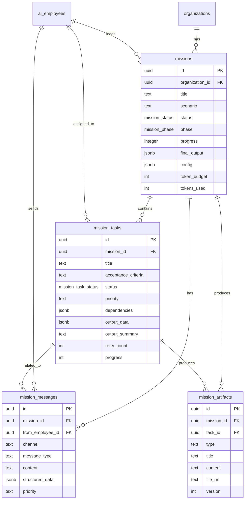
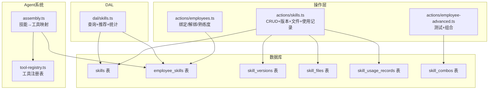
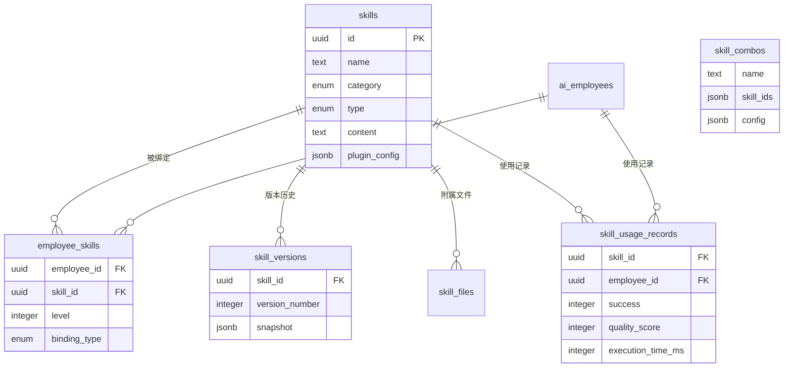

# VibeTide  · 核心模块统一技术方案

> **版本：** v1.0 | **日期：** 2026-03-22
> **范围：** 任务中心（Missions）· AI员工市场（Employee Marketplace）· 技能管理（Skills Management）
> **性质：** 产品架构设计 + 技术实现方案（可落地）

---

## 目录

- [一、产品概述](#一产品概述)
- [二、系统整体架构](#二系统整体架构)
- [三、任务中心模块（Missions）](#三任务中心模块missions)
- [四、AI员工市场模块（Employee Marketplace）](#四ai员工市场模块employee-marketplace)
- [五、技能管理模块（Skills Management）](#五技能管理模块skills-management)
- [六、非功能性要求](#六非功能性要求)
- [七、风险点与优化路线](#七风险点与优化路线)
- [附录 A：预设场景模板详表](#附录-a预设场景模板详表)
- [附录 B：术语表](#附录-b术语表)

---

## 一、产品概述

### 1.1 产品定位

VibeTide（潮汐）是面向媒体内容生产的 **AI 多智能体协作平台**。核心模块——任务中心——是平台的多智能体协作引擎，将 AI 能力从单一助手模式升级为团队协作模式。

架构思想借鉴 Claude Code 的 Agent Team 模式：一个 Team Leader 主智能体负责统筹调度，多个子智能体（AI 员工）各自拥有独立执行上下文，在共享任务看板上自主执行、直接通信，最终由 Team Leader 汇总交付。

### 1.2 解决的核心问题

媒体内容生产的"策采编发审"链条天然是多角色、有依赖、需要协调的。当前 AI 产品的两种模式各有瓶颈：

| 模式 | 问题 |
|------|------|
| 单一 AI 助手串行执行 | 复杂任务耗时长，无法并行，单点上下文窗口容易溢出 |
| 用户手动调度多个 AI | 门槛高，用户需要自己拆任务、分配、协调、汇总 |

本系统将调度层自动化——用户只需选择场景、输入需求，系统自动完成 **组队→拆解→并行执行→协调→交付** 的全流程。用户角色从"操作者"变为"观察者/验收者"。

### 1.3 架构映射

| Claude Code 概念 | VibeTide 对应 | 说明 |
|---|---|---|
| Main conversation | Mission Session | 一次任务会话，承载 Team Leader 的主上下文 |
| Team Leader | 任务总监（或场景指定的主控角色） | 负责组队、拆解、协调、汇总 |
| Subagent (independent context) | AI Employee | 每个 AI 员工通过 assembleAgent 组装为独立执行单元 |
| Shared task list | mission_tasks 表 | 共享任务看板，所有子任务的单一事实来源 |
| Inter-agent messaging | mission_messages 表 | 点对点 + 广播 + 系统消息 |
| Task completion → notify leader | Inngest Event | 子任务完成事件驱动依赖检查与汇总 |

### 1.4 设计原则

1. **Leader 驱动，Worker 自治：** Team Leader 负责全局决策（拆解、分配、协调），AI 员工在自己的任务范围内完全自主。
2. **共享看板为单一事实来源：** 所有任务状态变更必须通过 mission_tasks 表，确保全局一致性。
3. **失败隔离：** 单个子智能体的失败不应导致整个任务崩溃，Leader 有能力重试或降级交付。
4. **资源有界：** 每次任务会话消耗的 Token 有预算上限，完成后重置员工状态。
5. **事件驱动：** 基于 Inngest 事件编排实现异步解耦，支持重试和取消。

---

## 二、系统整体架构

### 2.1 架构风格

采用 **事件驱动的多智能体协作架构**，基于 Next.js 16 App Router 的 Server Component / Client Component 分离模式，结合 Inngest 实现后台任务编排。

### 2.2 分层结构

```
┌───────────────────────────────────────────────────────────────────┐
│                    用户交互层 (Presentation)                        │
│   任务列表页 · 任务详情页（实时协作工作台）· 员工市场 · 员工详情       │
│   技术：Next.js 16 RSC + React 19 Client Components               │
├───────────────────────────────────────────────────────────────────┤
│                    操作层 (Server Actions)                          │
│   missions.ts · employees.ts · employee-advanced.ts · skills.ts    │
│   API Routes: /api/scenarios/execute (SSE) · /api/missions/events  │
├───────────────────────────────────────────────────────────────────┤
│                    业务编排层 (Orchestration)                        │
│   ┌──────────────┐  ┌──────────────┐  ┌────────────────────────┐  │
│   │ Mission      │  │ Lifecycle    │  │ Scenario Template      │  │
│   │ Manager      │  │ State Machine│  │ Engine                 │  │
│   │ (actions/    │  │ (5 Phase)    │  │ (场景→团队→DAG)         │  │
│   │  missions.ts)│  │              │  │                        │  │
│   └──────────────┘  └──────────────┘  └────────────────────────┘  │
├───────────────────────────────────────────────────────────────────┤
│                    调度与通信层 (Core Engine)                        │
│   ┌──────────────┐  ┌──────────────┐  ┌────────────────────────┐  │
│   │ Task         │  │ Message      │  │ Agent Assembly         │  │
│   │ Scheduler    │  │ Router       │  │ Pipeline               │  │
│   │ (DAG Engine) │  │ (3 Channel)  │  │ (7-Layer Prompt)       │  │
│   │ Inngest Fns  │  │              │  │ assembly.ts            │  │
│   └──────────────┘  └──────────────┘  └────────────────────────┘  │
├───────────────────────────────────────────────────────────────────┤
│                    数据访问层 (DAL)                                  │
│   dal/missions.ts · dal/employees.ts · dal/skills.ts               │
│   dal/scenarios.ts · dal/performance.ts                            │
├───────────────────────────────────────────────────────────────────┤
│                    智能体运行层 (Agent Runtime)                      │
│   ┌──────────┐ ┌──────────┐ ┌──────────┐ ┌──────────┐           │
│   │ Leader   │ │ 小雷     │ │ 小资     │ │ 小文     │ ...       │
│   │ Agent    │ │ (Worker) │ │ (Worker) │ │ (Worker) │           │
│   └──────────┘ └──────────┘ └──────────┘ └──────────┘           │
│   AI SDK v6 generateText + tool-registry + model-router           │
├───────────────────────────────────────────────────────────────────┤
│                    基础设施层 (Infrastructure)                       │
│   Supabase PostgreSQL · Inngest Event Queue · LLM API · Blob      │
└───────────────────────────────────────────────────────────────────┘
```

### 2.3 技术栈选型

| 技术 | 版本 | 选型理由 |
|------|------|---------|
| Next.js | 16.1.6 | RSC 天然适合数据密集型页面，SSR + Streaming |
| React | 19 | Server Component 支持 |
| Drizzle ORM | 0.45.1 | 类型安全 SQL，`prepare: false` 适配 PgBouncer |
| Supabase | PostgreSQL | 托管数据库 + Auth + 实时能力 |
| AI SDK | v6 | `generateText` + `stopWhen: stepCountIs(N)` + `inputSchema` |
| Inngest | - | 事件驱动后台任务，支持 cancelOn/retries/step |
| DeepSeek | OpenAI兼容 | 通过 `@ai-sdk/openai` 连接，成本优化 |
| shadcn/ui | - | Glass UI 毛玻璃设计系统 |
| Framer Motion | - | 动画过渡 |

### 2.4 系统架构图

```mermaid
graph TB
    subgraph 用户界面
        MP[员工市场页]
        ML[任务列表页]
        MD[任务详情页<br>实时协作工作台]
        EP[员工详情页]
        SW[场景工作台]
    end

    subgraph 操作层
        SA_M[missions.ts<br>Server Actions]
        SA_E[employees.ts<br>Server Actions]
        SA_S[skills.ts<br>Server Actions]
        SA_EA[employee-advanced.ts<br>Server Actions]
        API_S[/api/scenarios/execute<br>SSE]
        API_M[/api/missions/events<br>SSE 实时推送]
    end

    subgraph 数据访问层
        DAL_M[dal/missions.ts]
        DAL_E[dal/employees.ts]
        DAL_S[dal/skills.ts]
        DAL_SC[dal/scenarios.ts]
    end

    subgraph 执行引擎 - Inngest
        LP[leader-plan<br>Phase 1+2: 组队与拆解]
        ET[execute-mission-task<br>Phase 3: 并行执行]
        CD[check-task-dependencies<br>DAG 依赖检查]
        HF[handle-task-failure<br>Phase 4: 协调与重试]
        LC[leader-consolidate<br>Phase 5: 汇总交付]
    end

    subgraph Agent系统
        ASM[assembly.ts<br>7层系统提示词]
        TR[tool-registry.ts<br>技能→工具映射]
        MR[model-router.ts<br>模型路由]
        PT[prompt-templates.ts]
    end

    subgraph 数据层
        DB[(PostgreSQL / Supabase)]
    end

    MP --> DAL_E --> DB
    ML --> DAL_M --> DB
    MD --> DAL_M
    MD -.->|SSE订阅| API_M
    EP --> DAL_E
    EP --> DAL_S --> DB
    EP --> DAL_SC --> DB

    SA_M --> LP
    SA_E --> DB
    SA_S --> DB
    SA_EA --> ASM
    API_S --> ASM

    LP -->|创建tasks| ET
    ET -->|成功| CD
    CD -->|新任务就绪| ET
    CD -->|全部完成| LC
    ET -->|失败| HF
    HF -->|重试| ET
    HF -->|不可恢复| LC

    ASM --> TR
    ASM --> MR
    ASM --> PT

    LP --> DB
    ET --> DB
    LC --> DB
```

### 2.5 数据流概览

```
用户选择场景 + 输入需求
        ↓
Mission Manager 创建会话（status=planning）
        ↓
Inngest: leader-plan
  ├─ Phase 1 (Assembling): 加载可用员工 → 组建团队
  └─ Phase 2 (Decomposing): Leader Agent 拆解任务 → 写入 Task Board（DAG）
        ↓
Inngest: execute-mission-task（并行触发）
  Phase 3 (Executing): Worker 认领 → assembleAgent → 独立执行 → 产出 Artifact
        ↓                                    ↑
Inngest: check-task-dependencies      Inngest: handle-task-failure
  解锁下游任务 → 触发新执行            Phase 4 (Coordinating): 重试/降级/跳过
        ↓
Inngest: leader-consolidate
  Phase 5 (Delivering): Leader 汇总所有 Artifact → 最终交付物 → Mission COMPLETED
        ↓
资源清理：重置员工状态 → 触发员工学习事件
```

---

## 三、任务中心模块（Missions）

### 3.1 模块概述

任务中心是取代旧"团队工作台+线性工作流"的新一代多智能体协作引擎，实现"Leader 组队拆解→多员工 DAG 并行执行→Leader 汇总交付"的完整任务管线。

### 3.2 五阶段生命周期状态机

#### 3.2.1 状态机总览

```
QUEUED → ASSEMBLING → DECOMPOSING → EXECUTING ⇄ COORDINATING → DELIVERING → COMPLETED
           Phase 1      Phase 2      Phase 3      Phase 4        Phase 5

  任何阶段均可进入：PAUSED / FAILED / CANCELLED
```

> **关键设计**：Phase 3 和 Phase 4 之间是**双向循环**关系——执行过程中随时可能触发协调，协调完成后继续执行。

#### 3.2.2 Mission 状态枚举

```typescript
// src/db/schema/enums.ts
enum MissionStatus {
  QUEUED       = "queued",        // 排队等待
  PLANNING     = "planning",      // Phase 1+2: 组队与拆解
  EXECUTING    = "executing",     // Phase 3: 并行执行中
  COORDINATING = "coordinating",  // Phase 4: 协调收口（子状态）
  CONSOLIDATING= "consolidating", // Phase 5: 汇总交付
  COMPLETED    = "completed",     // 成功完成
  FAILED       = "failed",        // 失败终止
  CANCELLED    = "cancelled"      // 用户取消
}

enum MissionPhase {
  ASSEMBLING   = "assembling",    // Phase 1: 组队
  DECOMPOSING  = "decomposing",   // Phase 2: 拆解
  EXECUTING    = "executing",     // Phase 3: 并行执行
  COORDINATING = "coordinating",  // Phase 4: 协调收口
  DELIVERING   = "delivering"     // Phase 5: 汇总交付
}
```

#### 3.2.3 各阶段详细设计

**Phase 1：组队 (ASSEMBLING)**

- **触发条件：** startMission → 异步触发 leader-plan Inngest 函数
- **内部逻辑：**
  1. 根据场景模板查找 `required_roles` 列表
  2. 从组织的 ai_employees 中匹配可用员工（非 disabled，非 working）
  3. 创建 Leader 实例（自动查找或创建任务总监角色）
  4. 记录 team_members jsonb 数组
- **退出条件：** 所有必需角色匹配成功 → 进入 Phase 2
- **超时：** 10 秒
- **失败处理：** 必需角色缺失 → Mission 进入 FAILED，提示缺失角色

**Phase 2：拆解 (DECOMPOSING)**

- **触发条件：** Phase 1 完成
- **内部逻辑：**
  1. 组装 Leader Agent（assembleAgent + 7层系统提示词）
  2. 向 Leader 发送结构化 prompt，注入场景模板的 task_template 作为参考
  3. Leader 输出 JSON 格式的子任务列表（使用 AI SDK 结构化输出确保格式可靠）
  4. **DAG 校验**：拓扑排序验证无环，计算关键路径与最大并行度
  5. 写入 mission_tasks 表，无依赖任务标记为 `ready`
- **退出条件：** 子任务列表通过 DAG 校验并写入 → 进入 Phase 3
- **超时：** 60 秒
- **Leader 拆解输出格式：**

```json
{
  "tasks": [
    {
      "title": "全网素材搜集与整理",
      "description": "在主流媒体、行业报告网站搜集相关素材...",
      "acceptance_criteria": "至少覆盖30篇行业报告、100条相关新闻",
      "assigned_role": "xiaolei",
      "depends_on": [],
      "priority": "P1",
      "expected_output": "结构化素材清单（含来源、摘要、相关度评分）"
    }
  ]
}
```

**Phase 3：并行执行 (EXECUTING)**

- **触发条件：** Phase 2 完成，Task Board 上存在 READY 状态的任务
- **核心调度循环：**
  1. 每个 READY 任务触发 `execute-mission-task` Inngest 函数
  2. 加载任务并验证 status=ready
  3. 标记为 in_progress，更新员工状态为 working
  4. 加载依赖任务的 outputData 作为上下文注入
  5. 组装员工 Agent（assembleAgent）
  6. 调用 generateText 执行
  7. 生成产出物（Artifact），保存 output_data
  8. 标记 completed，重置员工状态
  9. 触发 `mission/task-completed` → check-task-dependencies
- **退出条件：** 所有非 CANCELLED/SKIPPED 的任务为 COMPLETED → 进入 Phase 5
- **单任务超时：** 300 秒

**Phase 4：协调收口 (COORDINATING)**

Phase 4 不是独立的顺序阶段，而是 Phase 3 执行过程中随时触发的**协调子流程**。

| 触发场景 | 处理逻辑 |
|----------|----------|
| 子任务 FAILED 且不可自动重试 | handle-task-failure 评估：重试/跳过/降级/上报 Leader |
| 进度严重滞后（超预估200%） | Leader 主动分析瓶颈，拆分任务或降低标准 |
| 依赖死锁 | Leader 重新评估依赖关系，修改或强制跳过 |

**Leader 协调动作清单：**

| 动作 | 说明 |
|------|------|
| RETRY_TASK | 重试失败任务（retry_count++） |
| SKIP_TASK | 标记非关键任务为跳过 |
| MODIFY_TASK | 修改任务描述后重新启动 |
| REASSIGN_TASK | 将任务重新分配给其他可用员工 |
| ESCALATE_TO_USER | 极端情况，通知用户界面 |

**Phase 5：汇总交付 (DELIVERING)**

- **触发条件：** 所有任务完成 → `mission/all-tasks-done` 事件
- **内部逻辑：**
  1. Leader Agent 收集所有子任务的 Artifact 和 output_data
  2. 执行汇总：整合产出物为最终交付物
  3. 文稿类任务进行通篇统稿，确保风格一致
  4. 保存 final_output，标记 Mission COMPLETED
  5. 重置所有参与员工状态，触发员工学习事件
- **超时：** 120 秒
- **失败降级：** Leader 汇总失败时，直接将各子任务 Artifact 打包交付

### 3.3 降级交付策略

当 Mission 无法完全正常完成时，系统按以下优先级降级：

```
Level 1（正常交付）：所有任务完成，Leader 汇总后交付完整产出物
Level 2（部分交付）：核心任务完成，非核心任务失败/跳过，Leader 汇总已有产出物
Level 3（原始交付）：Leader 汇总失败，直接将各子任务 Artifact 打包交付
Level 4（失败报告）：核心任务失败，生成错误报告说明哪些步骤失败及原因
```

### 3.4 数据库设计

#### missions 表

| 字段 | 类型 | 含义 | 约束 |
|------|------|------|------|
| id | uuid | 主键 | PK, defaultRandom |
| organization_id | uuid | 所属组织 | FK → organizations, NOT NULL |
| title | text | 任务标题 | NOT NULL |
| description | text | 用户需求描述 | nullable |
| scenario | text | 场景类型 | NOT NULL |
| user_instruction | text | 用户指令 | NOT NULL |
| leader_employee_id | uuid | 队长 | FK → ai_employees, NOT NULL |
| team_members | jsonb | 团队成员ID数组 | default [] |
| status | mission_status | 当前状态 | queued/planning/executing/coordinating/consolidating/completed/failed/cancelled |
| phase | mission_phase | 当前生命周期阶段 | assembling/decomposing/executing/coordinating/delivering |
| progress | integer | 综合进度 0-100 | default 0 |
| final_output | jsonb | 最终交付物 | nullable |
| token_budget | integer | Token预算 | default 200000 |
| tokens_used | integer | 已使用Token | default 0 |
| config | jsonb | 运行配置 | default {"max_retries": 3, "task_timeout": 300, "max_agents": 8} |
| created_at | timestamptz | 创建时间 | NOT NULL |
| started_at | timestamptz | 执行开始时间 | nullable |
| completed_at | timestamptz | 完成时间 | nullable |

#### mission_tasks 表

| 字段 | 类型 | 含义 | 约束 |
|------|------|------|------|
| id | uuid | 主键 | PK |
| mission_id | uuid | 所属任务 | FK → missions(CASCADE) |
| title | text | 子任务标题 | NOT NULL |
| description | text | 详细描述 | NOT NULL |
| acceptance_criteria | text | 验收标准 | nullable |
| expected_output | text | 期望输出描述 | nullable |
| assigned_employee_id | uuid | 执行人 | FK → ai_employees |
| assigned_role | text | 期望角色类型 | nullable |
| status | mission_task_status | 状态 | pending/ready/claimed/in_progress/in_review/completed/failed/cancelled/blocked |
| priority | text | 优先级 | P0/P1/P2/P3, default "P2" |
| phase | integer | 所属阶段 | nullable |
| dependencies | jsonb | DAG依赖ID数组 | default [] |
| input_context | jsonb | 上游输出聚合 | nullable |
| output_data | jsonb | 执行结果 | nullable |
| output_summary | text | 完成摘要（Leader可读） | nullable |
| error_message | text | 错误信息 | nullable |
| error_recoverable | boolean | 是否可恢复 | default true |
| retry_count | integer | 重试次数 | default 0 |
| progress | integer | 任务进度 0-100 | default 0 |
| started_at | timestamptz | 开始执行时间 | nullable |
| completed_at | timestamptz | 完成时间 | nullable |
| created_at | timestamptz | 创建时间 | NOT NULL |

**子任务状态流转图：**

```
PENDING ──(依赖全部COMPLETED)──→ READY ──(Agent认领)──→ CLAIMED ──(开始执行)──→ IN_PROGRESS
                                                                                    │
                           ┌──────────(失败)───────────────────────────────────────┘
                           │                    │                    │
                           ▼                    ▼                    ▼
                        FAILED          IN_REVIEW (可选)         COMPLETED
                           │              Leader审核
                           │                 │ 通过
                           │                 ▼
                           │             COMPLETED
                           │
                    retry < max?
                    ├── 是 → READY (retry_count++)
                    └── 否 → FAILED (通知Leader介入)

特殊状态：
  BLOCKED ← 上游任务FAILED且不可恢复
  CANCELLED ← Mission取消
```

#### mission_messages 表

| 字段 | 类型 | 含义 | 约束 |
|------|------|------|------|
| id | uuid | 主键 | PK |
| mission_id | uuid | 所属任务 | FK → missions(CASCADE) |
| from_employee_id | uuid | 发送者 | FK → ai_employees |
| to_employee_id | uuid | 接收者（null=广播） | FK, nullable |
| channel | text | 消息通道 | direct/broadcast/system |
| message_type | text | 消息类型 | 见下表 |
| content | text | 自然语言内容 | NOT NULL |
| structured_data | jsonb | 结构化数据附件 | nullable |
| priority | text | 优先级 | normal/urgent, default "normal" |
| related_task_id | uuid | 关联子任务 | FK, nullable |
| reply_to | uuid | 回复消息ID | FK, nullable |
| created_at | timestamptz | 创建时间 | NOT NULL |

**消息类型（MessageType）：**

| 类型 | 分类 | 说明 |
|------|------|------|
| chat | 对话类 | 普通对话 |
| question | 对话类 | 提问（期望回复） |
| answer | 对话类 | 回答 |
| data_handoff | 协作类 | 数据交接（含 structured_data） |
| progress_update | 汇报类 | 进度更新 |
| task_completed | 汇报类 | 任务完成通知 |
| task_failed | 汇报类 | 任务失败通知 |
| help_request | 汇报类 | 请求 Leader 协助 |
| coordination | 系统类 | Leader 协调决策 |
| status_update | 系统类 | 全局任务状态更新 |

**消息路由规则：**

| 条件 | 路由行为 |
|------|----------|
| `to_employee_id` 非空 | 点对点：仅投递给目标 Agent |
| `to_employee_id` 为空，`channel` = broadcast | 投递给本 Mission 所有 Agent |
| `channel` = system | 写入 Mission 事件日志，前端可见 |
| `priority` = urgent | 额外：冒泡到用户界面通知 |

**结构化数据传递（DATA_HANDOFF）：**

当 message_type 为 `data_handoff` 时，`structured_data` 字段携带结构化数据，接收方 Agent 执行时自动注入上下文：

| structured_data 类型 | 说明 | 示例 |
|------|------|------|
| data_table | 表格数据 | 销量对比表、关键词列表 |
| key_findings | 关键发现 | 数据分析结论列表 |
| outline | 大纲结构 | 文章骨架 |
| review_feedback | 审核意见 | 逐条修改建议 |

#### mission_artifacts 表（新增）

| 字段 | 类型 | 含义 | 约束 |
|------|------|------|------|
| id | uuid | 主键 | PK |
| mission_id | uuid | 所属任务 | FK → missions(CASCADE) |
| task_id | uuid | 产出的子任务（null=汇总产出） | FK → mission_tasks, nullable |
| produced_by | uuid | 产出的员工 | FK → ai_employees |
| type | text | 产出物类型 | text/data_table/chart/image/video_script/report/publish_plan |
| title | text | 标题 | NOT NULL |
| content | text | 文本内容 | nullable |
| file_url | text | 文件存储路径 | nullable |
| metadata | jsonb | 额外元数据 | default {} |
| version | integer | 版本号 | default 1 |
| created_at | timestamptz | 创建时间 | NOT NULL |

#### ER 图



### 3.5 异常处理机制

#### 3.5.1 三级异常分类

**子任务级异常：**

| 异常类型 | 检测方式 | 处理策略 |
|----------|----------|----------|
| Agent 输出格式错误 | JSON 解析失败 | 使用 AI SDK 结构化输出（Output.object），从源头杜绝 |
| Agent 调用工具失败 | 工具返回错误 | error_recoverable = true，自动重试 |
| Agent 上下文溢出 | token 计数超限 | 压缩上下文后重试；仍超限则向 Leader 报告 |
| 单任务执行超时 | 计时器触发 | 标记 FAILED，由调度器决定重试或升级 |
| Agent 输出质量不达标 | Leader 审核不通过（可选） | 将审核意见注入上下文，要求修改 |

**协调级异常：**

| 异常类型 | 检测方式 | 处理策略 |
|----------|----------|----------|
| 依赖死锁 | 所有叶子节点 PENDING/BLOCKED | Leader 拆解死锁任务或强制跳过 |
| 关键任务反复失败 | retry_count >= max_retries | Leader 评估：降级处理 / 修改范围 / 标记部分完成 |
| 进度严重滞后 | 已用时间 > 预估 × 2 | Leader 主动分析瓶颈，拆分任务 |

**系统级异常：**

| 异常类型 | 检测方式 | 处理策略 |
|----------|----------|----------|
| LLM API 不可用 | 5xx / 超时 | Inngest 内置指数退避重试 |
| Token 预算耗尽 | tokens_used >= token_budget | 强制进入 Phase 5，汇总已有产出 |
| Mission 总超时 | 全局计时器（600s） | 降级交付 Level 2 或 Level 3 |

### 3.6 DAG 依赖模型

#### 3.6.1 示例 DAG

```
示例 DAG（深度报道场景）:

    t1(选题策划)
      ↙      ↘
  t2(素材搜集)  t3(数据分析)    ← 可并行
      ↘      ↙
    t4(稿件撰写)               ← 等待 t2 + t3
        ↓
    t5(质量审核)
        ↓
    t6(多渠道分发)
```

#### 3.6.2 依赖解析算法

```python
def resolve_dependencies(task_board):
    """
    扫描 Task Board，解锁所有依赖已满足的任务。
    调用时机：
    - Phase 2 完成后首次调用
    - 每次有任务变为 COMPLETED 时调用（check-task-dependencies）
    """
    for task in task_board.get_tasks(status=PENDING):
        deps = task.depends_on
        if all(task_board.get(dep_id).status == COMPLETED for dep_id in deps):
            task.status = READY
            # 聚合依赖任务的 output_data 写入 input_context
            task.input_context = aggregate_outputs(deps)
            emit_event("mission/task-ready", task.id)
```

#### 3.6.3 并行度与关键路径

```
最大并行度 = DAG 中同一层级（无依赖关系）的任务数量最大值
关键路径 = DAG 中从入口到出口的最长路径（按预估时间加权）

示例：
  t1(2min) → t2(3min) → t4(5min) → t5(2min) → t6(1min)
            → t3(4min) ↗
  关键路径 = t1 + t3 + t4 + t5 + t6 = 14min
  最大并行度 = 2（t2 和 t3 可并行）
```

#### 3.6.4 进度计算

```
mission_progress = Σ(task_progress × task_weight) / Σ(task_weight)

其中：
- task_weight 由 Priority 决定：P0=4, P1=3, P2=2, P3=1
- task_progress: COMPLETED=100, IN_PROGRESS=实际值, 其他=0
```

### 3.7 Inngest 事件与调度策略

| 事件 | 消费者 | retries | cancelOn | 说明 |
|------|--------|---------|----------|------|
| `mission/created` | leader-plan | 1 | mission/cancelled | Phase 1+2 |
| `mission/task-ready` | execute-mission-task | 2 | mission/cancelled | Phase 3 单任务 |
| `mission/task-completed` | check-task-dependencies | 2 | 无 | DAG 解锁 |
| `mission/task-failed` | handle-task-failure | 1 | 无 | Phase 4 协调 |
| `mission/all-tasks-done` | leader-consolidate | 1 | 无 | Phase 5 |
| `mission/cancelled` | — | — | — | 取消信号，cancelOn 级联终止 |

### 3.8 前端实时推送

前端通过 SSE 订阅任务事件流（`/api/missions/[id]/events`），替代 5 秒轮询：

| 事件 | 推送时机 | 前端行为 |
|------|----------|----------|
| `PHASE_CHANGED` | 阶段切换时 | 更新顶栏阶段流程指示器 |
| `TASK_STATUS_CHANGED` | 每次状态变更 | 更新任务卡片状态 |
| `TASK_PROGRESS_UPDATED` | 有变化时 | 更新进度条 |
| `NEW_MESSAGE` | 每条新消息 | 插入消息流 |
| `ARTIFACT_CREATED` | 有新产出物 | 更新任务卡片产出物区域 |
| `MISSION_COMPLETED` | Mission 完成 | 展示交付物，切换完成状态 |
| `MISSION_FAILED` | Mission 失败 | 展示错误信息和降级产出 |

> **降级方案**：SSE 连接断开时，自动降级为 5 秒 router.refresh() 轮询。

### 3.9 接口文档

#### Server Actions

| Action | 签名 | 描述 |
|--------|------|------|
| `startMission` | `(data: {title, scenario, userInstruction, description?}) → MissionRow` | 创建任务并异步触发执行管线 |
| `cancelMission` | `(missionId: string) → void` | 取消运行中的任务 |
| `pauseMission` | `(missionId: string) → void` | 暂停任务（暂存当前状态） |
| `resumeMission` | `(missionId: string) → void` | 恢复暂停的任务 |

#### DAL 查询

| 函数 | 返回值 | 描述 |
|------|--------|------|
| `getMissions` | `Mission[]` | 获取组织所有任务 |
| `getMissionById` | `MissionWithDetails` | 任务详情（含tasks/messages/artifacts/team） |
| `getMissionsWithActiveTasks` | `MissionSummary[]` | 富化查询，含进度/活跃任务/最新动态 |
| `getReadyTasks` | `MissionTask[]` | 就绪待执行的子任务 |
| `getMissionMessages` | `MissionMessage[]` | 消息列表（可按接收者/通道过滤） |
| `getMissionArtifacts` | `MissionArtifact[]` | 产出物列表 |
| `getEmployeeTaskLoad` | `EmployeeLoad[]` | 员工活跃任务数 |
| `getEmployeeActivitySummary` | `EmployeeActivity[]` | 员工活动状态 |

### 3.10 页面功能

**任务列表页 (`/missions`)**

- 5个统计指标卡片（总任务/执行中/已完成/异常/排队中）
- 状态筛选 + 关键词搜索 + 场景过滤
- 表格布局含9列，行展开显示阶段流水线和子任务分布
- SSE 实时更新（降级方案：IntersectionObserver 无限滚动 + 5秒轮询）
- Sheet 表单创建新任务（场景卡片选择→填写详情→提交）

**任务详情页 (`/missions/[id]` — 实时协作工作台)**

- **PhaseBar**：5阶段流程指示器（组队→拆解→执行→协调→交付）
- **三标签页**：
  - 任务看板：三列 Kanban（待执行/进行中/已完成），实时状态更新
  - 协作消息：全部消息流，支持按 Agent 过滤，urgent 消息高亮
  - 产出物：Artifact 列表，按任务分组，支持预览和下载
- **右侧实时动态面板**：最近 5-8 条消息摘要
- **团队面板**：参与员工列表，实时状态（idle/working/error）
- 取消按钮（仅活跃任务可见）

### 3.11 场景模板系统

```typescript
interface ScenarioTemplate {
  id: string;                    // e.g. "deep_report"
  name: string;                  // e.g. "深度报道"
  description: string;
  icon: string;                  // e.g. "📰"
  category: string;              // e.g. "内容生产"

  // 团队配置
  required_roles: {
    role_id: string;             // e.g. "xiaolei"
    required: boolean;           // 是否必需
  }[];
  leader_role: string;           // 指定谁当 Leader

  // 任务参考结构（给 Leader 参考，非强制）
  task_template: {
    title_pattern: string;
    role_id: string;
    phase: number;
    depends_on_indices: number[];
    description_hint: string;
  }[];

  // 约束
  estimated_duration: number;    // 预估总耗时（秒）
  max_tasks: number;             // 最大子任务数

  // 用户输入要求
  input_schema: {
    required_fields: string[];   // e.g. ["topic"]
    optional_fields: string[];   // e.g. ["reference_urls", "tone"]
  };
}
```

**预设场景列表：**

| 场景 ID | 名称 | 团队组合 | 预估耗时 | 子任务参考数 |
|---------|------|----------|----------|------------|
| deep_report | 深度报道 | 小策 + 小雷 + 小资 + 小文 + 小审 + 小发 | 8-15min | 5-7 |
| breaking_news | 舆情快报 | 小策 + 小雷 + 小数 + 小文 | 3-5min | 3-4 |
| topic_planning | 专题策划 | 小策 + 小雷 + 小文 + 小审 | 10-20min | 4-6 |
| short_video_batch | 短视频矩阵 | 小策 + 小文 + 小剪 + 小发 | 10-15min | 6-10 |
| graphic_article | 图文创作 | 小策 + 小雷 + 小文 | 5-8min | 3-5 |
| data_report | 数据专题 | 小策 + 小资 + 小文 + 频道顾问 | 12-20min | 5-8 |
| competitor_monitor | 竞品监控 | 小策 + 小雷 + 小数 + 小审 | 8-12min | 4-6 |
| channel_operation | 渠道运营方案 | 小策 + 小发 + 小数 + 小文 | 10-15min | 5-7 |
| content_review | 内容审核复盘 | 小策 + 小审 + 小数 | 5-8min | 3-4 |
| emergency_response | 突发事件响应 | 小策 + 小雷 + 小文 + 小发 | 3-5min | 3-4 |

### 3.12 关键文件索引

| 文件 | 路径 |
|------|------|
| Schema | `src/db/schema/missions.ts` |
| DAL | `src/lib/dal/missions.ts` |
| Server Actions | `src/app/actions/missions.ts` |
| 直连执行器 | `src/lib/mission-executor.ts` |
| 列表页 | `src/app/(dashboard)/missions/page.tsx` + `missions-client.tsx` |
| 详情页 | `src/app/(dashboard)/missions/[id]/page.tsx` + `mission-console-client.tsx` |
| SSE 事件推送 | `src/app/api/missions/[id]/events/route.ts` （待实现） |
| Inngest 函数 | `src/inngest/functions/leader-plan.ts` |
| | `src/inngest/functions/execute-mission-task.ts` |
| | `src/inngest/functions/check-task-dependencies.ts` |
| | `src/inngest/functions/handle-task-failure.ts` |
| | `src/inngest/functions/leader-consolidate.ts` |

---

## 四、AI员工市场模块（Employee Marketplace）

### 4.1 模块概述

AI员工市场是管理 AI 智能员工的核心界面，涵盖员工浏览、创建、配置、克隆、场景测试等全生命周期管理。

### 4.2 核心架构

```mermaid
graph TD
    subgraph 页面层
        MP[employee-marketplace/page.tsx]
        EP[employee/[id]/page.tsx]
    end

    subgraph 交互层
        MPC[EmployeeMarketplaceClient]
        EPC[EmployeeProfileClient]
        SW[ScenarioWorkbench]
        SCS[ScenarioChatSheet]
        ECD[EmployeeCreateDialog]
    end

    subgraph 操作层
        AE[actions/employees.ts]
        AAD[actions/employee-advanced.ts]
    end

    subgraph API层
        API[api/scenarios/execute SSE]
    end

    subgraph Agent层
        ASM[assembly.ts<br>7层系统提示词]
        TR[tool-registry.ts]
    end

    MP --> MPC --> AE
    EP --> EPC --> AE
    EP --> EPC --> AAD
    EPC --> SW --> SCS -->|fetch SSE| API --> ASM --> TR
```

### 4.3 核心功能

#### 4.3.1 员工市场浏览

- 卡片网格展示所有AI员工，支持状态筛选
- 15秒超时降级，SSR空数据时自动客户端重试3次
- 支持创建自定义员工和删除非预置员工

#### 4.3.2 员工详情与配置管理

8个Tab面板：

| Tab | 功能 | 关键操作 |
|-----|------|----------|
| 技能配置 | 绑定/解绑技能 | 兼容性校验，核心技能保护，熟练度0-100 |
| 知识库 | 绑定/解绑知识库 | 防重复绑定 |
| 工作偏好 | 主动性/汇报频率/自主等级/沟通风格 | JSON 更新 |
| 权限设置 | observer/advisor/executor/coordinator | 四级权限 |
| 绩效看板 | 任务完成数/准确率/响应时长/满意度 | 30天趋势图 |
| 进化学习 | 进化曲线、反馈统计、学习模式 | 学习模式管理 |
| 版本历史 | 配置版本快照 | 回滚操作 |
| 场景工作台 | 预设场景卡片 | 与AI员工实时对话 |

#### 4.3.3 场景工作台

- 场景数据存储在 `employee_scenarios` 表
- 支持 `{{var}}` 变量模板替换
- SSE 流式执行：thinking → source → text-delta → done
- 保留最近10条对话历史支持追问

#### 4.3.4 员工生命周期管理

| 操作 | 说明 |
|------|------|
| 创建 | 自定义 slug/名称/角色/权限 |
| 克隆 | 复制员工配置 + 技能绑定 |
| 启停 | toggle disabled |
| 导出/导入 | JSON 格式，技能按名称匹配 |

### 4.4 8个AI员工定义

| Slug | 角色 | 昵称 | 默认权限 | 核心技能类别 | 可任Leader |
|------|------|------|---------|-------------|-----------|
| xiaolei | 热点猎手 | 小雷 | advisor | perception | 否 |
| xiaoce | 选题策划师 | 小策 | advisor | generation+analysis | 是 |
| xiaozi | 素材管家 | 小资 | executor | knowledge | 否 |
| xiaowen | 内容创作师 | 小文 | executor | generation | 否 |
| xiaojian | 视频制片人 | 小剪 | executor | production | 否 |
| xiaoshen | 质量审核官 | 小审 | advisor | analysis+management | 否 |
| xiaofa | 渠道运营师 | 小发 | executor | management | 否 |
| xiaoshu | 数据分析师 | 小数 | advisor | analysis | 否 |
| advisor | 频道顾问 | 顾问 | advisor | 策略咨询 | 是 |

### 4.5 Agent 组装管线

```
assembleAgent(employeeId)
 ├─ 1. 加载员工档案 → ai_employees
 ├─ 2. 加载技能 → employee_skills JOIN skills
 ├─ 3. 加载上下文 → 知识库 + top-10记忆 + 平均熟练度
 ├─ 4. 构建工具 → resolveTools() → 按权限过滤
 │    observer: 无工具 | advisor: 只读 | executor: 全部
 ├─ 5. 路由模型 → resolveModelConfig(skillCategories)
 └─ 6. 构建系统提示词 → 7层
      L1: 身份 → L2: 技能+熟练度 → L3: 权限
      L4: 敏感话题 → L5: 知识 → L6: 记忆 → L7: 输出+质量自评
```

**Mission 执行时的额外上下文注入（5层扩展）：**

```
标准 7 层 Agent 系统提示词
 + Layer 8: 任务背景 ← Mission.title + description + user_instruction
 + Layer 9: 团队信息 ← 当前团队成员清单、各自角色
 + Layer 10: 上游依赖数据 ← input_context（来自依赖任务的 output_data 聚合）
 + Layer 11: 工作协议 ← 任务完成后汇报格式、工具使用规范
 + Layer 12: （仅Leader）全局调度指令 ← 拆解规范、协调策略、异常处理流程
```

### 4.6 数据库设计

#### ai_employees 表（核心字段）

| 字段 | 类型 | 含义 |
|------|------|------|
| id | uuid | 主键 |
| organization_id | uuid | 所属组织 |
| slug | text | 标识符（如 xiaolei） |
| name | text | 角色名 |
| nickname | text | 昵称 |
| role_type | text | 角色类型 |
| authority_level | enum | 权限等级 |
| status | enum | working/idle/learning/reviewing |
| work_preferences | jsonb | 工作偏好 |
| learned_patterns | jsonb | 学习模式 |
| is_preset | integer | 1=预置, 0=自定义 |
| disabled | integer | 1=停用 |

#### employee_scenarios 表

| 字段 | 类型 | 含义 |
|------|------|------|
| id | uuid | 主键 |
| employee_slug | text | 员工标识 |
| name | text | 场景名称 |
| system_instruction | text | 系统指令模板 |
| input_fields | jsonb | 输入字段定义 |
| tools_hint | jsonb | 工具提示列表 |

### 4.7 接口文档

#### Server Actions（employees.ts — 16个函数）

| Action | 描述 |
|--------|------|
| `createEmployee` | 创建自定义员工 |
| `deleteEmployee` | 删除员工（预置不可删） |
| `cloneEmployee` | 克隆员工含技能 |
| `bindSkillToEmployee` | 绑定技能（含兼容性检查） |
| `unbindSkillFromEmployee` | 解绑技能（核心不可解绑） |
| `updateSkillLevel` | 调整熟练度0-100 |
| `updateEmployeeProfile` | 更新基本信息 |
| `updateWorkPreferences` | 更新工作偏好 |
| `updateAuthorityLevel` | 更新权限等级 |
| `updateAutoActions` | 更新操作权限 |
| `updateEmployeeStatus` | 切换状态 |
| `toggleEmployeeDisabled` | 启停 |
| `exportEmployee` / `importEmployee` | 导出/导入 |
| `bindKnowledgeBaseToEmployee` / `unbindKnowledgeBaseFromEmployee` | 知识库管理 |

#### Server Actions（employee-advanced.ts — 8个函数）

| Action | 描述 |
|--------|------|
| `testSkillExecution` | 真实LLM测试技能 |
| `previewSystemPrompt` | 预览Agent系统提示词 |
| `adjustAuthorityByPerformance` | 绩效自动升降级 |
| `rollbackEmployeeConfig` | 回滚配置版本 |
| `createSkillCombo` / `deleteSkillCombo` / `applySkillCombo` | 技能组合管理 |
| `saveEmployeeConfigVersion` | 保存配置快照 |

#### API 路由

| 路由 | 方法 | 描述 |
|------|------|------|
| `/api/scenarios/execute` | POST | SSE流式场景执行 |

SSE 事件类型：`thinking` / `source` / `text-delta` / `done` / `error`

### 4.8 关键文件索引

| 文件 | 路径 |
|------|------|
| 市场页 | `src/app/(dashboard)/employee-marketplace/` |
| 详情页 | `src/app/(dashboard)/employee/[id]/` |
| Server Actions | `src/app/actions/employees.ts`, `employee-advanced.ts` |
| DAL | `src/lib/dal/employees.ts`, `scenarios.ts` |
| Schema | `src/db/schema/ai-employees.ts`, `employee-scenarios.ts` |
| 场景API | `src/app/api/scenarios/execute/route.ts` |
| Agent | `src/lib/agent/assembly.ts`, `tool-registry.ts`, `model-router.ts` |

---

## 五、技能管理模块（Skills Management）

### 5.1 模块概述

技能管理涵盖技能库 CRUD、版本管理、插件接入、技能组合、使用记录与评估等完整的技能生命周期管理。

### 5.2 核心架构



### 5.3 核心功能

#### 5.3.1 技能 CRUD

- **创建**：支持 custom（自定义）和 plugin（插件）两种类型
- **更新**：事务中先创建版本快照，再更新技能表
- **删除**：内置技能(builtin)不可删除，级联删除关联数据

#### 5.3.2 技能分类体系

| 分类 | 枚举值 | 内置技能数 | 代表技能 |
|------|--------|------------|----------|
| 感知 | perception | 6 | 全网搜索、热榜聚合、趋势监控 |
| 分析 | analysis | 6 | 情感分析、竞品分析、事实核查 |
| 生成 | generation | 7 | 内容生成、标题生成、脚本生成 |
| 制作 | production | 4 | 视频剪辑方案、缩略图生成 |
| 管理 | management | 4 | 质量审核、合规检查、发布策略 |
| 知识 | knowledge | 4 | 知识检索、媒资搜索、数据报告 |

共 **29 个内置技能**，每个包含完整的 SKILL.md 文档、inputSchema、outputSchema、runtimeConfig。

#### 5.3.3 技能与员工关联

| 绑定类型 | 含义 | 可否解绑 |
|----------|------|----------|
| core | 角色定义技能 | 不可解绑 |
| extended | 手动绑定 | 可解绑 |
| knowledge | 知识库驱动 | 可解绑 |

兼容性检查：`skill.compatibleRoles` 包含员工 `roleType` 才可绑定。

推荐算法：基于角色兼容匹配(+40)、能力范围扩展(+20)、内置优先(+10)评分，Top 10。

#### 5.3.4 版本管理

- 每次 updateSkill 自动创建版本快照
- 快照包含完整 Schema（name, description, content, category, schemas, config, roles）
- 支持回滚到指定版本（事务：创建当前快照→用目标快照覆盖）

#### 5.3.5 插件技能

- `pluginConfig` 定义 HTTP API 调用（endpoint, method, headers, auth）
- 支持 none/api_key/bearer 认证
- `createPluginTool()` 在 Agent 执行时发起实际 HTTP 调用

#### 5.3.6 技能组合（Combo）

- 选择 ≥2 个技能，排列执行顺序
- 配置：sequential（顺序/并行）、passOutput（传递输出）
- `applySkillCombo` 一键批量绑定到员工

#### 5.3.7 使用记录

- 记录每次执行：成功/失败、质量分、执行时间、token用量
- 按技能维度和员工维度聚合统计

#### 5.3.8 工具注册表

技能执行引擎通过 `resolveTools(skillNames)` 将技能名映射为 AI SDK tool 实例：

| 工具名 | 技能 | 能力 |
|--------|------|------|
| web_search | 全网搜索 | Tavily + Google/Bing RSS |
| deep_read | 深度阅读 | Jina Reader + Cheerio |
| trending_topics | 全网热榜 | TopHub API 三模式 |
| media_search | 媒资检索 | DB模糊搜索 |
| data_report | 数据报告 | 格式化报告生成 |
| content_generate | 内容生成 | LLM文案生成 |
| fact_check | 事实核查 | 信息验证 |

### 5.4 数据库设计

#### skills 表

| 字段 | 类型 | 含义 |
|------|------|------|
| id | uuid | 主键 |
| organization_id | uuid | 所属组织（NULL=全局内置） |
| name | text | 技能名称 |
| category | enum | perception/analysis/generation/production/management/knowledge |
| type | enum | builtin/custom/plugin |
| content | text | SKILL.md 文档 |
| input_schema | jsonb | 输入参数定义 |
| output_schema | jsonb | 输出结构定义 |
| runtime_config | jsonb | 运行时配置 |
| compatible_roles | jsonb | 兼容角色列表 |
| plugin_config | jsonb | 插件配置（仅plugin类型） |

#### ER 图



### 5.5 接口文档

#### Server Actions（skills.ts）

| Action | 描述 |
|--------|------|
| `createSkill` | 创建自定义技能 |
| `registerPluginSkill` | 注册插件技能 |
| `updateSkill` | 更新技能（自动版本快照） |
| `updatePluginConfig` | 更新插件配置 |
| `deleteSkill` | 删除技能（内置不可删） |
| `rollbackSkillVersion` | 回滚到指定版本 |
| `importSkillPackage` | 导入技能包 |
| `addSkillFile` / `updateSkillFile` / `deleteSkillFile` | 技能文件管理 |
| `recordSkillUsage` | 记录使用数据 |
| `getSkillUsageStats` / `getEmployeeSkillUsageStats` | 使用统计 |

#### DAL 查询

| 函数 | 描述 |
|------|------|
| `getSkills` | 技能列表（支持分类过滤，组织覆盖全局） |
| `getSkillsWithBindCount` | 含绑定员工计数 |
| `getSkillDetail` / `getSkillDetailWithFiles` | 技能详情 |
| `getSkillDetailPageData` | 详情页一次性查询 |
| `getSkillsNotBoundToEmployee` | 未绑定技能 |
| `getSkillRecommendations` | 智能推荐 |
| `getSkillVersionHistory` | 版本历史 |

### 5.6 关键文件索引

| 文件 | 路径 |
|------|------|
| Server Actions | `src/app/actions/skills.ts` |
| DAL | `src/lib/dal/skills.ts` |
| Schema | `src/db/schema/skills.ts`, `skill-versions.ts`, `skill-files.ts`, `skill-usage-records.ts`, `skill-combos.ts` |
| 测试脚本 | `scripts/test-skills.ts` |
| 工具注册 | `src/lib/agent/tool-registry.ts` |

---

## 六、非功能性要求

### 6.1 性能要求

| 指标 | 目标值 |
|------|--------|
| Mission 创建到 Phase 1 完成 | < 10 秒 |
| 单个子任务平均执行时间 | < 60 秒 |
| 消息投递延迟（Mission内） | < 500ms |
| 前端 SSE 事件推送延迟 | < 1 秒 |
| 同时运行的 Mission 数 | ≥ 5（首期）/ ≥ 10（目标） |
| 单 Mission 最大参与 Agent 数 | 8 |

### 6.2 可观测性

- 每个 Mission 的完整事件日志可回放（mission_messages 含 system channel）
- 每个 Agent 的 LLM API 调用日志（含 token 消耗统计）
- 每个子任务的执行时间、重试次数
- 系统级：Inngest 函数执行监控、API 调用错误率

### 6.3 安全与隔离

- 不同 Mission 之间完全隔离，不共享上下文
- 所有 Server Action 通过 `requireAuth()` 校验身份
- 所有 DAL 查询强制 `WHERE organization_id = ?` 多租户隔离
- Agent tool 调用受权限等级控制（observer/advisor/executor/coordinator）
- Agent 输出经过基础的安全过滤（敏感信息、不当内容）

### 6.4 成本控制

- 每个 Mission 设置 token_budget（默认 200K tokens）
- 超过预算时自动触发降级交付
- Leader 使用较强模型（如 DeepSeek-V3），Worker 根据任务复杂度可路由到更轻量模型
- model-router 基于技能类别自动选择最优模型

---

## 七、风险点与优化路线

### 7.1 高优先级（首期必须解决）

| 风险 | 模块 | 描述 | 解决方案 |
|------|------|------|----------|
| 进程保活 | 任务中心 | `executeMissionDirect()` 通过 `.then()` 异步执行，Next.js 可能提前终止 | 使用 `after()` API 或完全切回 Inngest 事件驱动 |
| JSON解析脆弱 | 任务中心 | Leader 输出通过正则提取JSON | 使用 AI SDK 结构化输出（`Output.object()` + `inputSchema`） |
| DAG循环 | 任务中心 | 依赖关系无图论验证 | 添加拓扑排序验证，拒绝含环的任务图 |
| 跨组织校验 | 员工市场 | API Route 缺少 employeeDbId 的组织归属校验 | 增加 `WHERE organization_id = orgId` |
| Token预算 | 任务中心 | tokenBudget 仅记录不检查 | 每次 Agent 执行前检查剩余预算，超限则降级 |

### 7.2 中优先级（首期后续迭代）

| 风险 | 模块 | 描述 | 解决方案 |
|------|------|------|----------|
| 代码重复 | 任务中心 | Inngest 函数和直连执行器约150行重复 | 提取共享核心逻辑为纯函数 |
| 轮询刷新 | 任务中心 | 5秒 router.refresh() | 实现 SSE `/api/missions/[id]/events` 替代 |
| 悬空引用 | 技能管理 | skill_combos.skill_ids 无FK约束 | 删技能时清理组合 |
| 插件安全 | 技能管理 | pluginConfig authKey明文 | 加密存储 + URL白名单 |
| 使用记录断层 | 技能管理 | recordSkillUsage 需用户session但Agent执行无session | 改为内部函数，Mission执行时自动记录 |

### 7.3 低优先级（长期优化）

| 风险 | 模块 | 描述 | 解决方案 |
|------|------|------|----------|
| 大文件组件 | 员工市场 | scenario-chat-sheet ~900行 | 拆分为 hook + 动画 + 消息组件 |
| slug关联 | 员工市场 | employee_scenarios 用TEXT非FK | 添加约束或改用UUID FK |
| 类型重复 | 技能管理 | SkillUsageStats 在两个文件定义 | 提取到 types.ts |
| Agent 实例池 | 任务中心 | 当前无实例复用概念 | 未来引入 AgentInstancePool 实现实例复用和资源管控 |
| 检查点机制 | 任务中心 | 当前无检查点恢复 | 在 Phase 切换和任务完成时保存快照，支持异常恢复 |
| WebSocket 通信 | 任务中心 | SSE 是单向的 | 未来需要双向通信时升级为 WebSocket |

### 7.4 演进路线图

```
Phase A（当前）：基础 Mission 管线
  ✅ Inngest 事件驱动
  ✅ Leader 拆解 + Worker 执行 + DAG
  ✅ 基础重试
  🔧 结构化输出替代正则
  🔧 拓扑排序 DAG 校验
  🔧 Token 预算强校验

Phase B（V1.1）：实时体验升级
  📋 SSE 事件推送替代轮询
  📋 mission_artifacts 表落地
  📋 降级交付策略完整实现
  📋 5阶段 PhaseBar 完整展示

Phase C（V1.2）：协调能力增强
  📋 Leader 动态协调（REASSIGN/MODIFY/SKIP）
  📋 消息通道与结构化数据传递
  📋 Worker 间直接通信
  📋 上下文压缩策略

Phase D（V2.0）：高级特性
  📋 Agent 实例池与资源管控
  📋 检查点与异常恢复
  📋 Mission 暂停/恢复
  📋 用户干预（人工审核节点）
  📋 自定义场景模板创建
```

---

## 附录 A：预设场景模板详表

### A.1 深度报道 (deep_report)

```yaml
id: deep_report
name: 深度报道
leader_role: xiaoce
required_roles:
  - { role: xiaoce,   required: true }   # 策划总控
  - { role: xiaolei,  required: true }   # 素材采集
  - { role: xiaozi,   required: true }   # 数据分析
  - { role: xiaowen,  required: true }   # 内容撰写
  - { role: xiaoshen, required: true }   # 质量审核
  - { role: xiaofa,   required: false }  # 分发运营（可选）

task_template:
  - title: 选题策划与任务拆解
    role: xiaoce
    phase: 1
    depends_on: []

  - title: 全网素材搜集与整理
    role: xiaolei
    phase: 2
    depends_on: [0]

  - title: 行业数据深度分析
    role: xiaozi
    phase: 2
    depends_on: [0]

  - title: 深度报道稿件撰写
    role: xiaowen
    phase: 3
    depends_on: [1, 2]

  - title: 内容质量审核
    role: xiaoshen
    phase: 4
    depends_on: [3]

  - title: 多渠道分发准备
    role: xiaofa
    phase: 5
    depends_on: [4]

estimated_duration: 480  # 8分钟
max_tasks: 8
```

### A.2 舆情快报 (breaking_news)

```yaml
id: breaking_news
name: 舆情快报
leader_role: xiaoce
required_roles:
  - { role: xiaoce,   required: true }
  - { role: xiaolei,  required: true }
  - { role: xiaoshu,  required: true }
  - { role: xiaowen,  required: true }

task_template:
  - title: 事件定性与任务分配
    role: xiaoce
    phase: 1
    depends_on: []

  - title: 多源信息快速采集
    role: xiaolei
    phase: 2
    depends_on: [0]

  - title: 舆情数据分析
    role: xiaoshu
    phase: 2
    depends_on: [0]

  - title: 快报稿件生成
    role: xiaowen
    phase: 3
    depends_on: [1, 2]

estimated_duration: 300  # 5分钟
max_tasks: 5
```

### A.3 短视频矩阵 (short_video_batch)

```yaml
id: short_video_batch
name: 短视频矩阵
leader_role: xiaoce
required_roles:
  - { role: xiaoce,   required: true }
  - { role: xiaowen,  required: true }
  - { role: xiaojian, required: true }
  - { role: xiaofa,   required: true }

task_template:
  - title: 选题策划与角度拆分
    role: xiaoce
    phase: 1
    depends_on: []

  - title: 各条视频脚本撰写
    role: xiaowen
    phase: 2
    depends_on: [0]

  - title: 分镜规划与字幕生成
    role: xiaojian
    phase: 3
    depends_on: [1]

  - title: 多平台适配与发布策略
    role: xiaofa
    phase: 4
    depends_on: [2]

estimated_duration: 600  # 10分钟
max_tasks: 10
```

---

## 附录 B：术语表

| 术语 | 定义 |
|------|------|
| **Mission** | 一次完整的多智能体协作任务，从用户发起到产出物交付的全过程 |
| **Team Leader** | 主智能体，负责任务拆解、全局协调、汇总交付。通常由"小策"担任 |
| **AI Employee / Worker** | 子智能体，通过 assembleAgent 组装为独立执行单元 |
| **Task Board** | 共享任务看板（mission_tasks 表），所有子任务状态的单一事实来源 |
| **Message Router** | 消息路由（mission_messages 表），支持 direct/broadcast/system 三种通道 |
| **DAG** | 有向无环图，描述子任务之间的依赖关系 |
| **Phase** | 任务生命周期的阶段（组队→拆解→执行→协调→交付） |
| **Artifact** | 产出物，由智能体执行任务后产生的文件或数据（mission_artifacts 表） |
| **Scenario Template** | 场景模板，预定义了特定媒体生产场景的团队组合和任务结构 |
| **Degradation** | 降级交付，当 Mission 无法完全正常完成时按 Level 1-4 递降处理 |
| **assembleAgent** | Agent 组装管线，将员工档案+技能+知识+记忆+权限组装为可执行的 AI Agent |
| **Inngest** | 事件驱动的后台任务编排引擎，驱动 Mission 的全生命周期 |

---

*文档结束*
